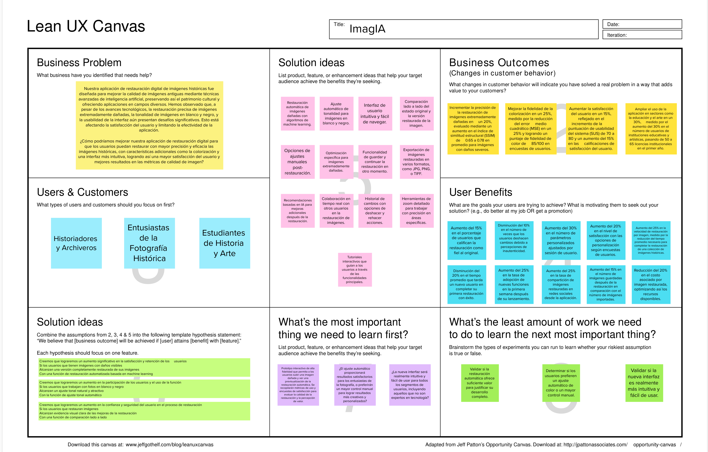

# Capítulo I: Introducción

## 1.1. Startup Profile

### 1.1.1. Descripción de la Startup

En un mundo donde el pasado nos conecta con el presente y el futuro, PictorIA te invita a explorar un universo de posibilidades a través de las imágenes. Somos más que una simple herramienta de restauración; somos tu compañero en un viaje a través del tiempo y el espacio, donde cada imagen cuenta una historia.  
Nuestra misión es democratizar el acceso al patrimonio visual, permitiendo a todos, desde amantes del arte hasta investigadores, descubrir y preservar la belleza y la historia que se esconden en cada fotografía y pintura. Queremos que cada imagen sea una puerta abierta a nuevas interpretaciones y emociones.  
Nuestra visión es crear un mundo donde el patrimonio visual sea valorado, protegido y accesible para todos. Aspiramos a ser líderes en la preservación digital, empoderando a individuos e instituciones para que cuiden y compartan su historia visual.

### 1.1.2. Perfiles de integrantes del equipo

| Imagen                                                                                                                                                                                                                                                                                                                                                                                                               | Descripción                                                                                                                                                                                                                                                                                                                                                                                                                                                              |
| -------------------------------------------------------------------------------------------------------------------------------------------------------------------------------------------------------------------------------------------------------------------------------------------------------------------------------------------------------------------------------------------------------------------- | ------------------------------------------------------------------------------------------------------------------------------------------------------------------------------------------------------------------------------------------------------------------------------------------------------------------------------------------------------------------------------------------------------------------------------------------------------------------------ |
|                                                                                                                                                                                                                                                                                                                                                                                                                      |                                                                                                                                                                                                                                                                                                                                                                                                                                                                          |
|                                                                                                                                                                                                                                                                                                                                                                                                                      |                                                                                                                                                                                                                                                                                                                                                                                                                                                                          |
| 

                                                                                                                                                                                                                                                                                     | Mi nombre es Diego Merino, tengo 21 años y tengo especial interés en el sector cloud. Me motiva enfrentar y superar desafíos que requieran soluciones creativas. Durante el desarrollo de mi carrera he enfrentado diversas situaciones en los trabajos lo cual ha mejorado mi resiliencia y capacidad de trabajo colaborativo. Soy consciente de que el mundo nunca se detiene, y por eso el aprendizaje continuo es una de mis fortalezas para mantenerme actualizado. |
| 

 | Mi nombre es Rafael Primo Estrada y estudio la carrera de Ingeniería de Software, poseo un alto interés por el desarrollo móvil. Mis principales hobbies son los videojuegos y conocer nuevas tecnologías. Además, poseo un alto grado de responsabilidad y compromiso para el trabajo en equipo.                                                                                                                                                                        |
| 

 | Soy Antonella Frida Gonzales Gomez, como estudiante de la carrera de Ingeniería de Software, contribuiré al equipo con mis conocimientos fundamentales en algunos lenguajes de programación. Estos conocimientos me permitirán participar activamente en la creación y desarrollo de proyectos, además tengo un enfoque responsable hacia mi trabajo y tareas asignadas. Entiendo la importancia de cumplir con plazos y metas establecidas, lo que contribuye al flujo de trabajo del equipo y al éxito general del proyecto. |

## 1.2. Solution Profile

### 1.2.1 Antecedentes y problemática

##### Antecedentes:

#### **The 5W's y 2H's:**

- What? (¿Qué?)

La problemática de la preservación del patrimonio visual en Perú afecta a múltiples sectores y se manifiesta en una serie de deficiencias que impactan negativamente la conservación de la historia y cultura del país. Los ciudadanos, investigadores e instituciones culturales enfrentan desafíos para acceder, restaurar y preservar imágenes históricas debido a la falta de tecnologías avanzadas y accesibles. La degradación de fotografías y pinturas antiguas, junto con la falta de recursos para su restauración, amenaza con la pérdida irreparable de valiosa información visual histórica.

- When? (¿Cuándo?)

El problema es constante y se agrava con el paso del tiempo. La degradación de las imágenes es un proceso continuo, y cada día que pasa sin una solución adecuada aumenta el riesgo de pérdida permanente de patrimonio visual. La urgencia es particularmente alta para colecciones antiguas y materiales fotográficos del siglo XIX y principios del XX.

- Where? (¿Dónde?)

El problema ocurre en todo Perú, con énfasis en regiones con rico patrimonio cultural como Cusco, Lima, Arequipa, y otras áreas con importante legado histórico. Afecta a museos, bibliotecas, archivos históricos, universidades y colecciones privadas en todo el país.

- Who? (¿Quién?)

Los principales afectados son historiadores, investigadores, conservadores de museos, bibliotecarios, archivistas, estudiantes de historia y arte, y el público en general interesado en el patrimonio cultural. También se ven afectadas las instituciones culturales y educativas que custodian estas colecciones, así como el sector turístico que depende de la riqueza visual histórica del país.

- Why? (¿Por qué?)

La problemática se origina en la falta de tecnologías accesibles y eficientes para la restauración y preservación de imágenes históricas. La falta de herramientas de inteligencia artificial diseñadas para el contexto peruano dificulta la conservación del patrimonio visual. Además, la falta de recursos económicos y técnicos en muchas instituciones culturales agrava el problema, limitando la capacidad de preservar y restaurar imágenes importantes.

- How? (¿Cómo?)

El problema se manifiesta en la degradación progresiva de imágenes históricas, la dificultad para acceder y compartir este patrimonio visual, y la pérdida potencial de información histórica valiosa. La falta de herramientas tecnológicas avanzadas resulta en procesos de restauración lentos, costosos y a menudo inaccesibles para muchas instituciones e individuos.

- How much? (¿Cuánto?)

El impacto es significativo tanto en el ámbito cultural como económico. Según el Ministerio de Cultura del Perú, existen más de 100,000 bienes culturales en riesgo de deterioro, incluyendo un gran número de imágenes históricas. Solo el 24% de los museos peruanos tienen catálogos digitales de sus colecciones, lo que limita el acceso y la preservación digital. Considerando que el turismo cultural representa el 40% de los ingresos turísticos en Perú, la pérdida o degradación del patrimonio visual podría tener un impacto económico sustancial en el sector turístico y cultural del país.

### 1.2.2 Lean UX Process

#### 1.2.2.1. Lean UX Problem Statements

**Business Problem Statement:**
Nuestra aplicación de restauración digital de imágenes históricas fue diseñada para mejorar la calidad de imágenes antiguas mediante técnicas avanzadas de inteligencia artificial, preservando así el patrimonio cultural y ofreciendo aplicaciones en campos diversos. Hemos observado que, a pesar de los avances tecnológicos, la restauración precisa de imágenes extremadamente dañadas, la tonalidad de imágenes en blanco y negro, y la usabilidad de la interfaz aún presentan desafíos significativos. Esto está afectando la satisfacción del usuario y limitando la efectividad de la aplicación.

¿Cómo podríamos mejorar nuestra aplicación de restauración digital para que los usuarios puedan restaurar con mayor precisión y eficacia las imágenes históricas, con características adicionales como la colorización y una interfaz más intuitiva, logrando así una mayor satisfacción del usuario y mejores resultados en las métricas de calidad de imagen?

#### 1.2.2.2. Lean UX Assumptions

**Business Outcomes Assumptions:**

- **Mejora de la precisión en la restauración de imágenes dañadas:**
  Incrementar la precisión de la restauración de imágenes extremadamente dañadas en un 20%, evaluado mediante un aumento en el índice de similitud estructural (SSIM) de 0.65 a 0.78 en promedio para imágenes con daños severos.
- **Aumento en la fidelidad de la colorización de imágenes en blanco y negro:**
  Mejorar la fidelidad de la colorización en un 25%, medido por la reducción del error medio cuadrático (MSE) en un 25% y logrando un puntaje de fidelidad de color de 85/100 en encuestas de usuarios.
- **Incremento en la satisfacción del usuario a través de una interfaz más intuitiva:**
  Aumentar la satisfacción del usuario en un 15%, reflejado en el incremento de la puntuación de usabilidad del sistema (SUS) de 70 a 80 y un aumento del 15% en las calificaciones de satisfacción del usuario.
- **Expansión del uso de la aplicación en campos diversos:**
  Aumento del 25% en la tasa de adopción de nuevas funciones en la primera semana después de su lanzamiento.
  Ampliar el uso de la aplicación en sectores como la educación y el arte en un 30%, medido por el aumento del 30% en el número de usuarios de instituciones educativas y artísticas, pasando de 50 a 65 licencias institucionales en el primer año.

**User Assumptions:**

- **Segmento 1: Historiadores y Archiveros**
  Este grupo de usuarios se compone de profesionales que valoran altamente la precisión en la restauración de imágenes históricas, ya que su principal objetivo es preservar la autenticidad y el valor histórico de las fotografías. Buscan herramientas que puedan mejorar la calidad de las imágenes sin comprometer su contenido original. Debido a que su enfoque no es la tecnología, requieren una aplicación con una interfaz intuitiva y fácil de usar, que les permita acceder rápidamente a las funciones avanzadas de restauración sin necesidad de una curva de aprendizaje significativa.
- **Segmento 2: Entusiastas de la Fotografía Histórica**
  Este segmento está formado por usuarios apasionados por la fotografía histórica, que ven en la colorización de imágenes en blanco y negro una oportunidad para revitalizar y dar nueva vida a fotos antiguas. Son creativos y buscan personalizar sus proyectos, por lo que prefieren una aplicación que ofrezca opciones configurables para ajustar los niveles de restauración y colorización según sus preferencias personales. Su objetivo es lograr resultados únicos que reflejen su estilo y visión personal, haciendo que las fotos históricas sean más atractivas visualmente.
- **Segmento 3: Estudiantes de Historia y Arte**
  Este segmento está compuesto por jóvenes que están cursando estudios universitarios en historia, arte, o disciplinas relacionadas. Estos estudiantes tienen un profundo interés en la preservación del patrimonio cultural y en el análisis de imágenes históricas como parte de su formación académica. Están en busca de herramientas que les permitan realizar investigaciones, proyectos académicos y creativos, a la vez que desarrollan habilidades prácticas en la restauración y conservación digital de imágenes históricas. Su enfoque es aprender y aplicar conocimientos que complementen su formación teórica con experiencias prácticas en el manejo de materiales históricos.

**User Outcomes Assumptions:**

- **Historiadores y Archiveros**
  - **User Outcome 1: Preservación de la Autenticidad Histórica**
    Aumento del 15% en el porcentaje de usuarios que califican la restauración como fiel al original.
    Disminución del 10% en el número de veces que los usuarios deshacen cambios debido a percepciones de inautenticidad.
  - **User Outcome 2: Interfaz Intuitiva y Fácil de Usar**
    Disminución del 20% en el tiempo promedio que tarda un nuevo usuario en completar su primera restauración con éxito.
- **Entusiastas de la Fotografía Histórica**
  - **User Outcome 1: Personalización de la Colorización**
    Aumento del 30% en el número de parámetros personalizados ajustados por sesión de usuario.
    Aumento del 20% en el nivel de satisfacción con las opciones de personalización según encuestas de usuarios.
  - **User Outcome 2: Mejora Creativa y Visual de Imágenes**
    Aumento del 25% en la tasa de compartición de imágenes restauradas en redes sociales desde la aplicación.
    Aumento del 15% en el número de imágenes guardadas después de la restauración en comparación con el número de imágenes importadas.
- **Estudiantes de Historia y Arte**
  - **User Outcome 1: Aprendizaje Práctico en Restauración Digital**
    Aumento del 25% en el número de estudiantes que completan restauraciones de imágenes históricas como parte de sus proyectos académicos.
    Reducción del 15% en el tiempo promedio requerido para que los estudiantes realicen su primera restauración digital completa.
  - **User Outcome 2: Mejora de Habilidades Técnicas y Creativas**
    Incremento del 30% en el número de estudiantes que reportan haber mejorado sus habilidades en restauración digital después de usar la plataforma durante un semestre académico.
    Aumento del 20% en la cantidad de proyectos académicos que integran técnicas de restauración digital avanzadas proporcionadas por la plataforma.

**Features Assumptions:**

- Restauración automática de imágenes dañadas con algoritmos de machine learning.
- Ajuste automático de tonalidad para imágenes en blanco y negro.
- Interfaz de usuario intuitiva y fácil de navegar.
- Comparación lado a lado del estado original y la versión restaurada de la imagen.
- Opciones de ajustes manuales post-restauración.
- Optimización específica para imágenes extremadamente dañadas.
- Funcionalidad de guardar y continuar la restauración en otro momento.
- Exportación de imágenes restauradas en varios formatos, como JPG, PNG, o TIFF.
- Recomendaciones basadas en IA para mejoras adicionales después de la restauración.
- Colaboración en tiempo real con otros usuarios en la restauración de imágenes.
- Historial de cambios con opciones de deshacer y rehacer acciones.
- Herramientas de zoom detallado para trabajar con precisión en áreas específicas.
- Tutoriales interactivos que guían a los usuarios a través de las funcionalidades principales.

#### 1.2.2.3. Lean UX Hypothesis Statements

- **Restauración automática de imágenes dañadas con algoritmos de machine learning:**
  Creemos que lograremos un aumento significativo en la satisfacción y retención de los usuarios si los usuarios que tienen imágenes con daños visibles alcanzan una versión completamente restaurada de sus imágenes con una función de restauración automatizada basada en machine learning.
- **Ajuste automático de tonalidad para imágenes en blanco y negro:**
  Creemos que lograremos un aumento en la participación de los usuarios y el uso de la función si los usuarios que trabajan con fotos en blanco y negro alcanzan un ajuste tonal natural y atractivo con la función de ajuste tonal automático.
- **Interfaz de usuario intuitiva y fácil de navegar:**
  Creemos que lograremos una reducción en las tasas de abandono de usuarios si los usuarios nuevos y recurrentes alcanzan una experiencia de usuario fluida y eficiente con una interfaz intuitiva y fácil de navegar.
- **Comparación lado a lado del estado original y la versión restaurada de la imagen:**
  Creemos que lograremos un aumento en la confianza y seguridad del usuario en el proceso de restauración si los usuarios que restauran imágenes alcanzan evidencia visual clara de las mejoras de la restauración con una función de comparación lado a lado.
- **Opciones de ajustes manuales post-restauración:**
  Creemos que lograremos una mayor satisfacción del usuario y una experiencia personalizada si los usuarios que prefieren más control sobre el proceso de restauración alcanzan la capacidad de ajustar las imágenes restauradas según sus preferencias con opciones de ajustes manuales después de la restauración.
- **Optimización específica para imágenes extremadamente dañadas:**
  Creemos que lograremos mayores tasas de éxito en la restauración de imágenes gravemente dañadas si los usuarios con imágenes severamente dañadas alcanzan un resultado de restauración de mayor calidad con optimizaciones específicas para imágenes extremadamente dañadas.
- **Funcionalidad de guardar y continuar la restauración en otro momento:**
  Creemos que lograremos una reducción en el abandono del usuario durante el proceso de restauración si los usuarios que necesitan pausar su trabajo alcanzan la capacidad de guardar y reanudar su progreso de restauración con una funcionalidad de guardar y continuar.
- **Exportación de imágenes restauradas en varios formatos:**
  Creemos que lograremos un aumento en la satisfacción y adaptabilidad de los usuarios si los usuarios que necesitan sus imágenes restauradas en formatos específicos alcanzan flexibilidad en la exportación de sus imágenes con la opción de exportar imágenes en múltiples formatos.
- **Recomendaciones basadas en IA para mejoras adicionales después de la restauración:**
  Creemos que lograremos mayor participación y una mejor calidad de imagen si los usuarios que han completado la restauración inicial alcanzan sugerencias personalizadas para mejoras adicionales con recomendaciones basadas en IA para mejoras post-restauración.
- **Colaboración en tiempo real con otros usuarios en la restauración de imágenes:**
  Creemos que lograremos una mayor interacción entre usuarios y trabajo colaborativo si los usuarios que desean colaborar con otros alcanzan la capacidad de trabajar juntos en la restauración de imágenes en tiempo real con una función de colaboración en tiempo real.
- **Historial de cambios con opciones de deshacer y rehacer acciones:**
  Creemos que lograremos mayor confianza del usuario y una mejor gestión del flujo de trabajo si los usuarios que frecuentemente realizan ajustes alcanzan la capacidad de rastrear y revertir cambios según sea necesario con un historial de cambios completo con opciones de deshacer y rehacer.
- **Herramientas de zoom detallado para trabajar con precisión en áreas específicas:**
  Creemos que lograremos una mayor precisión y exactitud en las tareas de restauración si los usuarios que trabajan en áreas detalladas de una imagen alcanzan un control mejorado sobre partes específicas de sus imágenes con herramientas de zoom detallado para trabajos enfocados.
- **Tutoriales interactivos que guían a los usuarios a través de las funcionalidades principales:**
  Creemos que lograremos una mejor integración de usuarios y una curva de aprendizaje reducida si los usuarios nuevos que no están familiarizados con el software alcanzan una comprensión completa de las funciones clave con tutoriales interactivos que los guían a través de las funcionalidades principales.

#### 1.2.2.3. Lean UX Canvas

## 1.3. Segmentos objetivo.

Nuestra solución se enfoca principalmente en 3 públicos objetivo.

### Ciudadanos Aficionados al arte:

Personas con interés genuino en el arte, sea como hobby o como especialidad. PictorIA ofrece una plataforma para descubrir y apreciar piezas únicas restauradas a su máximo esplendor.

### Historiadores e Investigadores:

Profesionales interesados en el estudio del pasado, sea a través de documentos históricos, fotografías, pinturas o arte en general. PictorIA se ofrece como herramienta que les permita analizar, restaurar y documentar imágenes antiguas que podrán usar para sus investigaciones o registros.

### Estudiantes de Historia y Arte:

Este segmento está compuesto por jóvenes que están cursando estudios universitarios en historia, arte, o disciplinas relacionadas. Estos estudiantes tienen un profundo interés en la preservación del patrimonio cultural y en el análisis de imágenes históricas como parte de su formación académica. Están en busca de herramientas que les permitan realizar investigaciones, proyectos académicos y creativos, a la vez que desarrollan habilidades prácticas en la restauración y conservación digital de imágenes históricas. Su enfoque es aprender y aplicar conocimientos que complementen su formación teórica con experiencias prácticas en el manejo de materiales históricos.
