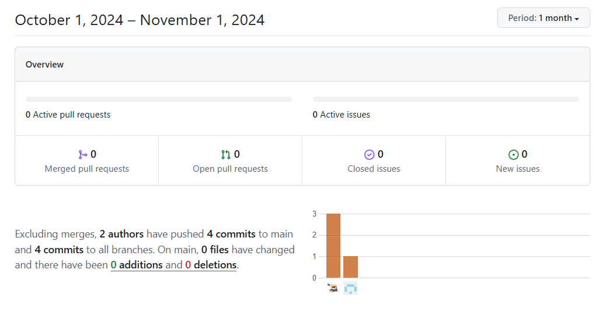
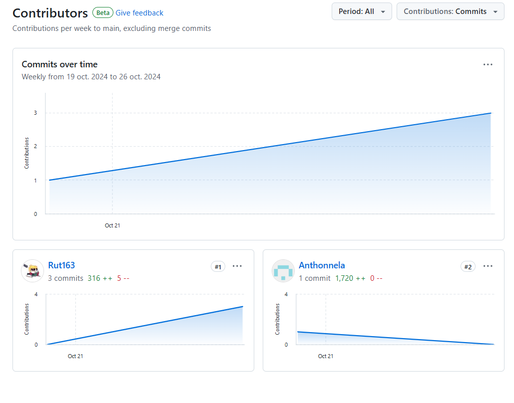

# Chapter VII: Product Implementation, Validation & Deployment

## 7.1 Software Configuration Management

### 7.1.1 Software Development Environment Configuration

#### Project Management

Usamos **GitHub** como el repositorio principal para organizar las tareas. **Trello** facilita la gestión de hitos y pendientes, permitiendo establecer límites claros en los plazos. Las reuniones grupales se realizan en **Discord** cuando hay dudas o consultas.

#### Requirements Management

Cada entrega es revisada y discutida por el equipo para reducir errores en la fase de presentación. **Figma** es nuestra referencia para visualización de requisitos.

#### Product UX/UI Design

El diseño de UX/UI se realiza en **Figma**, desde wireframes hasta prototipos de alta fidelidad para Mobile Apps. Referencia: [Figma](https://www.figma.com/).

#### Software Development

Para la app móvil, utilizamos **Flutter** y **Dart** con **Android Studio** como entorno de desarrollo, ajustado para garantizar una experiencia óptima en dispositivos móviles.

#### Software Deployment

La landing page y otras partes del frontend están alojadas en **GitHub**, proporcionando una integración ágil. El backend está implementado en **Azure**, mientras que la app móvil utiliza **Firebase**.

#### Software Documentation

Usamos **GitHub** para documentar y gestionar la colaboración del equipo, permitiendo un control efectivo de versiones y una estructura modular.

### 7.1.2 Source Code Management

Cada componente tiene su propio repositorio en GitHub:

- **Report**: [https://github.com/ImagIA-2024-02/Report](https://github.com/ImagIA-2024-02/Report)
- **Backend**: [https://github.com/ImagIA-2024-02/backend-Imagia](https://github.com/ImagIA-2024-02/backend-Imagia)
- **App Móvil**: [https://github.com/ImagIA-2024-02/frontend-app](https://github.com/ImagIA-2024-02/frontend-app)

### 7.1.3 Source Code Style Guide & Conventions

### HTML Conventions

- Usa nombres en minúsculas para elementos y atributos.
- Asegúrate de cerrar todos los elementos y especificar `alt`, `width`, y `height` en imágenes.

### CSS Conventions

- Nombres significativos y concisos en IDs y clases.
- Orden alfabético en declaraciones, y propiedades shorthand donde sea posible.

Referencias:

- [HTML Style Guide](https://www.w3schools.com/html/html5_syntax.asp)
- [CSS Style Guide](https://google.github.io/styleguide/htmlcssguide.html#CSS)

### 7.1.4 Software Deployment Configuration

**GitHub** es nuestra herramienta para el control de versiones y gestión de ciclo de vida, permitiendo una colaboración estructurada en el backend y frontend del proyecto.

- **Report**: [https://github.com/ImagIA-2024-02/Report](https://github.com/ImagIA-2024-02/Report)
- **Backend**: [https://github.com/ImagIA-2024-02/backend-Imagia](https://github.com/ImagIA-2024-02/backend-Imagia)
- **App Móvil**: [https://github.com/ImagIA-2024-02/frontend-app](https://github.com/ImagIA-2024-02/frontend-app)

## 7.2. Solution Implementation.

### 7.2.1. Sprint 1

#### 7.2.1.1. Sprint Planning 1.

<table border="2">
    <tr>
        <td>
           
<b>Sprint #</b>

        </td>
        <td>
          
Sprint 1

        </td>
    </tr>
    <tr>
        <td colspan="2">
           
<b>Sprint Planning Background</b>

        </td>
    </tr>
    <tr>
        <td>
           
Date

        </td>
        <td>
          
27-10-2024

        </td>
    </tr>
    <tr>
        <td>
           
Time

        </td>
        <td>
          
08:00

        </td>
    </tr>
    <tr>
        <td>
           
Location

        </td>
        <td>
          
Reunión virtual vía Discord

        </td>
    </tr>
    <tr>
        <td>
           
Prepared By

        </td>
        <td>
          
Antonella Gonzales

        </td>
    </tr>
    <tr>
        <td>
           
Attendees

        </td>
        <td>
          
Antonella Frida Gonzales Gomez, Jesica Rut Jaramillo Almora, Diego Martin Merino Mas, Rafael Wimmer Primo Estrada

        </td>
    </tr>
    <tr>
        <td>
           
Sprint 0 Review Summary

        </td>
        <td>
          
[-]

        </td>
    </tr>
    <tr>
        <td>
           
Sprint 0 Retrospective Summary

        </td>
        <td>
          
[-]

        </td>
    </tr>
    <tr>
        <td colspan="2">
           
<b>Sprint Goal & User Stories</b>

        </td>
    </tr>
    <tr>
        <td>
           
Sprint 1 Goal

        </td>
        <td>
          
Desarrollar la landing page, unos primeros modelos funcionales e integrarlos en una primera versión de la aplicación móvil y desplegarlas

        </td>
    </tr>
    <tr>
        <td>
           
Sprint 1 Velocity

        </td>
        <td>
          
80

        </td>
    </tr>
    <tr>
        <td>
           
Sum of Story Points

        </td>
        <td>
          
21

        </td>
    </tr>
</table>

#### 7.2.1.2. Sprint Backlog 1.

El Sprint 1 tiene como objetivo establecer los cimientos fundamentales del proyecto de restauración digital de obras de arte famosas, enfocándose en cuatro pilares principales:

**Landing Page** 
Desarrollo de una landing page responsive y funcional que sirva como punto de entrada al proyecto. Esta incluirá una hero section impactante, información clara sobre las características del producto, y enlaces de redirección a las tiendas de aplicaciones, proporcionando así una presencia web profesional y efectiva.  

**Infraestructura Backend** 
Implementación del sistema base de autenticación y gestión de usuarios, estableciendo la infraestructura necesaria para el manejo seguro de cuentas de usuario mediante JWT, sentando las bases para futuras funcionalidades.  

**Aplicación Móvil Base** 
Desarrollo de la primera versión de la aplicación móvil con una interfaz de usuario intuitiva, incluyendo las funcionalidades esenciales de navegación, registro/login de usuarios, y la capacidad de escanear obras de arte mediante la cámara del dispositivo.  

**Modelos de IA Fundamentales** 
Implementación de las primeras versiones de los modelos de inteligencia artificial necesarios para: 

- Reconocimiento de obras de arte famosas
- Restauración digital básica de imágenes
- Visualización comparativa del antes y después de la restauración  

Este sprint sienta las bases tecnológicas y funcionales del proyecto, permitiendo validar el concepto principal y obtener feedback temprano de usuarios sobre las funcionalidades core del producto.  

**Métricas de Éxito** 

- Landing page funcional y responsive
- Sistema de autenticación operativo
- Capacidad de escanear y reconocer al menos 5 obras famosas predefinidas
- Generar una versión restaurada básica de las obras escaneadas  

Asimismo, se presenta la tabla de nuestro primer sprint con las respectivas user stories a trabajar:

| Sprint #   | Sprint 1                                                 |     |                                                     |                                                                                                                                                                                                                                                                                  |                    |                                |         |
| ---------- | -------------------------------------------------------- | --- | --------------------------------------------------- | -------------------------------------------------------------------------------------------------------------------------------------------------------------------------------------------------------------------------------------------------------------------------------- | ------------------ | ------------------------------ | ------- |
| User Story | Work-Item/Task                                           |     |                                                     |                                                                                                                                                                                                                                                                                  |                    |                                |         |
| Id         | Title                                                    | Id  | Title                                               | Description                                                                                                                                                                                                                                                                      | Estimation (Hours) | Assigned To                    | Status  |
| US08       | Sección de Inicio de la Landing Page                     | 1   | Diseño inicial de hero section                      | Implementar la estructura HTML y estilos CSS de la hero section con contenido impactante y llamadas a la acción                                                                                                                                                                  | 4                  | Diego Martin Merino Mas        | Pending |
| US07       | Sección de Características del producto                  | 2   | Implementación de sección de características        | Desarrollar la sección que muestra las funcionalidades principales de la app de restauración de obras famosas                                                                                                                                                                    | 4                  | Diego Martin Merino Mas        | Pending |
| US05       | Diseño Responsivo de la Landing Page                     | 3   | Adaptación responsive del diseño                    | Implementar media queries y ajustes necesarios para garantizar la correcta visualización en todos los dispositivos                                                                                                                                                               | 6                  | Jesica Rut Jaramillo Almora    | Pending |
| US01       | Redirección de la landing Page a tiendas de aplicaciones | 4   | Configuración de enlaces a tiendas                  | Implementar la lógica de redirección a App Store o Play Store según el dispositivo del usuario                                                                                                                                                                                   | 3                  | Diego Martin Merino Mas        | Pending |
| US04       | Navegación y Contenido Informativo en el Footer          | 5   | Desarrollo del footer informativo                   | Crear el footer con links relevantes, información de contacto y navegación secundaria                                                                                                                                                                                            | 3                  | Diego Martin Merino Mas        | Pending |
| TS06       | Gestión de Usuarios y Autenticación                      | 6   | Implementación del sistema de autenticación         | Desarrollar el backend para registro y login de usuarios con JWT                                                                                                                                                                                                                 | 8                  | Antonella Frida Gonzales Gomez | Done    |
| US16       | Interfaz de usuario intuitiva                            | 7   | Desarrollo de UI móvil principal                    | Implementar las pantallas principales de la app móvil con navegación básica, incluyendo pantallas de login, registro, galería y visualización de obras                                                                                                                           | 10                 | Rafael Wimmer Primo Estrada    | Done    |
| US10       | Escaneo y reconocimiento de obras de arte                | 8   | Integración de cámara y reconocimiento              | Desarrollar la funcionalidad de escaneo de obras de arte usando la cámara del dispositivo, incluyendo la integración con los modelos de IA y manejo de errores                                                                                                                   | 16                 | Rafael Wimmer Primo Estrada    | Done    |
| TS02       | Escaneo y Reconocimiento de Obras de Arte                | 9   | Implementación del modelo de reconocimiento         | Investigación y pruebas de diferentes arquitecturas de ML para reconocimiento de obras famosas. Incluye recopilación de dataset, entrenamiento del modelo inicial, pruebas de precisión y optimización. Desarrollo de API endpoints para el procesamiento de imágenes            | 12                 | Jesica Rut Jaramillo Almora    | Done    |
| US11       | Visualización de restauración digital                    | 10  | Implementación del sistema de restauración completo | Desarrollo de la interfaz de visualización de restauración y modelo de IA inicial. Incluye investigación de técnicas de restauración digital, pruebas con diferentes algoritmos, implementación del modelo seleccionado y desarrollo de la interfaz de comparación antes/después | 14                 | Jesica Rut Jaramillo Almora    | Done    |

#### 7.2.1.3. Development Evidence for Sprint Review.

| Repository  | Branch        | Commit ID | Commit Message | Commit Message Body | Commited on (Date) |
| ----------- | ------------- | --------- | -------------- | ------------------- | ------------------ |
| frontend-app | main | 0288fdbe14851461b6f22a70ee0eb82116fb5120 | Merge pull request | ... | 02-11-2024 |
| frontend-app | develop | 5ed08b9ea6234ef610f3fb48116b9da2336f5d6b| added little details | ... | 02-11-2024 |
| frontend-app | develop | a2829ac15f58c6f6c6e163fbf4e887b07a61ee2b | added icons personalized and optimized models | ... | 01-11-2024 |
| frontend-app | develop | 3edcb3a0b3810e2423ef6871763c6fa54c613272 | added save gallery and improve UI | ... | 01-11-2024 |
| frontend-app | develop | 6225f7df6625c098a25425b77d88606f8aa8d06a | updated comments unnecessary | ... | 30-10-2024 |
| frontend-app | develop | d5cc592668753952afbb539149ed367d2236f0c2 | added configuration android and ios | ... | 30-10-2024 |
| frontend-app | develop | c374afd9b3ac2ad0b4e08a9a470e633803a8414c | added models from firebase and basic ui | ... | 30-10-2024|
| backend-Imagia | main | 33a2161b3e72a949ec8cc39c138fc5eb7bd92775 | Merge branch 'develop' | ... | 29-10-2024 |
| backend-Imagia | develop | ef4b82ecb407de40101fa9c137bd0d88d0c1c412 | Add conection to remote database | ... | 29-10-2024 |
| backend-Imagia | main | d6d760642e903426e61b176fdefa4900ac316f80 | Add or update the Azure App Service build and deployment workflow config | ... | 28-10-2024 |
| backend-Imagia | develop | 17cab8b883054f41ba580528b953e43556760ad6 | add registro de obras de arte | ... | 27-10-2024 |
| backend-Imagia | develop | efa7f6db11de6c2c9994477fd89075c80fadf808 | first commit | ... | 22-10-2024 |
| LandingPage | main | d1f4cb4f5d29b42bf03d31ba38de5f819378b1bf | Primer commit - Landing page de PictorIA | ... | 02-11-2024 |
| AI-models | main | 60f9200eba13f0eda947cfd83ab2871e5aea169e | add description for restoration model | ... | 02-11-2024 |
| AI-models | main | 462a4fd6cf847e6b998971b84d77284b52d5fbb0 | add description for recognition model and notebooks | ... | 02-11-2024 |

**Network**  
Frontend:  

     

  
Backend:  

     

  
AI-models:

     

 

#### 7.2.1.4. Testing Suite Evidence for Sprint Review.

| Repository  | Branch   | Commit ID | Commit Message | Commit Message Body | Commited on (Date) |
| ----------- | -------- | --------- | -------------- | ------------------- | ------------------ |
| Gherkin | main | e355caf03b659878a50591af018235adea7ca34e | add core US Guerkin | ... | 02-11-2024 |

##### Estrategia de Testing
La estrategia de testing utilizada para estas historias de usuario se basa en pruebas funcionales utilizando el formato BDD (Behavior-Driven Development), empleando el lenguaje Gherkin para definir escenarios de prueba en un lenguaje claro y comprensible tanto para el equipo técnico como para los stakeholders. Esta estrategia se centra en validar que cada funcionalidad cumpla con los requisitos especificados en las historias de usuario, asegurando así una alta calidad en la experiencia de usuario final.

###### Justificación
- Claridad y Comunicación: El uso de Gherkin facilita la comprensión de los requisitos y pruebas, ya que permite que todos los involucrados (desarrolladores, testers y stakeholders) puedan leer y entender los casos de prueba sin necesidad de conocimientos técnicos avanzados.

- Orientación a la Funcionalidad: Al estar basada en pruebas funcionales, esta estrategia se enfoca en validar que cada funcionalidad cumpla con las expectativas del usuario final, alineándose con los objetivos de cada historia de usuario.

- Cobertura de Casos Positivos y Negativos: Los escenarios incluyen tanto casos exitosos como el manejo de errores, asegurando que la aplicación responde adecuadamente tanto en condiciones óptimas como en situaciones adversas.

- Mejora Continua y Automatización: Al emplear Gherkin, los casos de prueba son fácilmente automatizables con herramientas como Cucumber, lo que permite ejecutar pruebas de manera continua e integrarlas en un flujo de CI/CD, reduciendo el tiempo de feedback y mejorando la eficiencia del proceso de desarrollo.

- Esta estrategia garantiza que las funcionalidades clave del sistema se prueben exhaustivamente y que el usuario reciba una experiencia coherente y confiable.

    

**Enlace del repositorio:** [[https://github.com/ImagIA-2024-02/Gherkin](https://github.com/ImagIA-2024-02/Gherkin)]

#### 7.2.1.5. Execution Evidence for Sprint Review.

- **Landing Page**

Para el Sprint 1, se completó exitosamente el desarrollo de la landing page, cumpliendo con todos los objetivos establecidos. Se implementó una hero section impactante, una sección clara de características del producto y un footer informativo. La página es completamente responsive y se integró correctamente la redirección a las tiendas de aplicaciones. Se realizaron pruebas exhaustivas en diferentes dispositivos y navegadores para garantizar una experiencia consistente.

    

- **Modelos de IA**

El desarrollo de los modelos de IA representó uno de los mayores desafíos del sprint, requiriendo un proceso iterativo de investigación y pruebas.  
Se exploraron dos aproximaciones en paralelo para encontrar la solución óptima. La primera aproximación involucró el uso de Azure Cognitive Services, realizando pruebas iniciales con sus servicios cognitivos para el reconocimiento de imágenes y evaluando su precisión con un conjunto selecto de obras de arte famosas. Paralelamente, se trabajó en el desarrollo y entrenamiento de modelos personalizados utilizando TensorFlow, enfocándose tanto en el reconocimiento de obras de arte como en la restauración digital básica.  
Durante el proceso de desarrollo, se evaluó cuidadosamente el balance entre precisión y tamaño de los modelos, considerando dos alternativas de implementación: la integración directa en la aplicación móvil o el despliegue en un servicio separado con llamadas API. Las pruebas de rendimiento y precisión se realizaron sistemáticamente para determinar la mejor aproximación final para el proyecto.

   
    

- **Aplicación móvil**

Se alcanzó un progreso sustancial en el desarrollo de la aplicación móvil utilizando Flutter, estableciendo las funcionalidades fundamentales del sistema. El desarrollo se centró en la implementación del sistema de autenticación de usuarios robusto y seguro. Se logró desarrollar una interfaz de usuario principal con una navegación fluida e intuitiva, junto con la integración exitosa del módulo de cámara para el escaneo de obras. También se implementó la visualización básica de los resultados de reconocimiento y restauración. La arquitectura de la aplicación se diseñó considerando la potencial integración de los modelos de IA, manteniendo la flexibilidad necesaria para adaptarse tanto a una implementación on-device como a llamadas API.

    

- **Web Service (Backend)**

Se estableció exitosamente la infraestructura básica del backend del sistema, implementando los componentes esenciales para el funcionamiento de la aplicación. El desarrollo incluyó la implementación de un sistema de autenticación robusto utilizando JWT para garantizar la seguridad de las sesiones de usuario. Se crearon los endpoints básicos necesarios para la gestión completa de usuarios, incluyendo registro, autenticación y administración de perfiles. Adicionalmente, se estableció la estructura inicial necesaria para la futura integración con los modelos de IA, preparando el terreno para la incorporación de las capacidades de procesamiento de imágenes. El servicio se desplegó exitosamente en un ambiente de desarrollo, permitiendo realizar las primeras pruebas de integración con la aplicación móvil y validar el funcionamiento del sistema completo.

    

#### 7.2.1.6. Services Documentation Evidence for Sprint Review.

Durante el Sprint 1, se establecieron dos componentes principales de servicios que soportan la funcionalidad core de la aplicación:

**Servicios de IA para Reconocimiento y Restauración**

Se implementaron dos aproximaciones paralelas para los servicios de procesamiento de imágenes:

Los modelos de IA se desarrollaron utilizando TensorFlow, creando servicios especializados para:

- Reconocimiento de obras de arte famosas
- Restauración digital de imágenes

Para optimizar el rendimiento y reducir el tamaño de la aplicación móvil, se implementó una arquitectura que utiliza Cloud Functions para el procesamiento de los modelos de IA. Esta decisión permitió mantener los modelos en la nube, reduciendo significativamente el tamaño de la aplicación mientras se mantiene la capacidad de procesamiento necesaria.

**API de Gestión de Usuarios**

Se desplegó exitosamente en Microsoft Azure una API RESTful que gestiona toda la funcionalidad relacionada con usuarios. Esta API incluye:

- Endpoints para registro y autenticación de usuarios
- Sistema de autenticación implementado con JWT
- Gestión de perfiles de usuario
- Control de acceso y autorización

La integración entre los servicios de IA en la nube y la API de usuarios permite un flujo de trabajo eficiente mientras se mantiene la aplicación móvil ligera y performante.

  

#### 7.2.1.7. Software Deployment Evidence for Sprint Review.

Para el Sprint 1, se han conseguido desplegar exitosamente los siguientes componentes del sistema:

**Landing Page**

La landing page del proyecto se encuentra desplegada y accesible públicamente a través de GitHub Pages. La página web está alojada en el repositorio principal del proyecto y se actualiza automáticamente con cada push a la rama main.

URL de acceso: [[https://imagia-2024-02.github.io/LandingPage/](https://imagia-2024-02.github.io/LandingPage/)]

El despliegue incluye todos los elementos planificados para el primer sprint:

- Hero section con presentación del producto
- Sección de características principales de la aplicación
- Información sobre la tecnología de restauración de obras
- Footer con enlaces de contacto y navegación
- Diseño completamente responsive
- Enlaces de redirección a futura publicación en tiendas de aplicaciones

El sitio ha sido verificado y probado en múltiples navegadores (Chrome, Firefox, Safari) y dispositivos para garantizar su correcta visualización y funcionamiento.

 

**Aplicación Móvil**

La aplicación móvil desarrollada en Flutter se encuentra actualmente en fase de desarrollo y pruebas. Para este primer sprint, se ha configurado un ambiente de pruebas utilizando Firebase

La aplicación aún no está disponible online, se terminara desplegando en firebase mas no en tiendas como google play.

 

#### 7.2.1.8. Team Collaboration Insights during Sprint.

- **SE NECESITA DE LANDING, API, COLAB, MOVIL: HACERLOS PUBLICOS**

**_Pulse_**

App movil:

 

 
 

Backend:

 

 
 

Modelos de IA:

 

 
 

Landing page:

 

 
 

**_Contributors_**

App movil:

 

 
 

Backend:

 

 
 

Modelos de IA:

 

 
 

Landing page:

 

 
 

## 7.3. Validation Interviews.

### 7.3.1. Diseño de Entrevistas.

A continuación, se presenta el diseño de las entrevistas de validación para los diferentes segmentos de usuarios de la aplicación móvil de restauración de obras de arte famosas.  

**Preguntas Generales (para todos los segmentos)** 

- ¿Qué opinas de la interfaz principal de la aplicación?
- ¿Qué tan intuitivo te resultó el proceso de registro y login?
- ¿Cómo evalúas la funcionalidad de escaneo de obras de arte?
- ¿Qué te parece la calidad de las restauraciones generadas?
- ¿Te resultó fácil comparar la obra original con la versión restaurada?
- ¿Encontraste algún aspecto confuso o difícil de usar en la aplicación?
- ¿Qué características adicionales te gustaría ver en la aplicación?  

**Preguntas para Turistas** 

- ¿Con qué frecuencia visitas museos durante tus viajes?
- ¿Qué te pareció el proceso de reconocimiento de obras famosas?
- ¿Te resultó útil la información proporcionada sobre las obras reconocidas?
- ¿Utilizarías esta aplicación en futuros viajes a museos?
- ¿Compartirías las obras restauradas en tus redes sociales?
- ¿Qué información adicional sobre las obras te gustaría ver?  

**Preguntas para Estudiantes** 

- ¿Cómo utilizarías esta aplicación en tus estudios de arte?
- ¿Qué te parece la precisión del reconocimiento de obras famosas?
- ¿Te resulta útil la funcionalidad de restauración para estudiar detalles de las obras?
- ¿Considerarías usar la aplicación para proyectos académicos?
- ¿Qué herramientas adicionales necesitarías para tus estudios?
- ¿Te gustaría poder exportar o compartir las restauraciones de alguna manera específica?  

**Preguntas para Aficionados al Arte** 

- ¿Qué aspectos de la restauración digital te parecen más interesantes?
- ¿Cómo evalúas la calidad del proceso de restauración?
- ¿Te gustaría tener más control sobre los parámetros de restauración?
- ¿Qué opinas de la biblioteca de obras famosas reconocibles?
- ¿Utilizarías esta aplicación para explorar obras en diferentes museos?
- ¿Qué funcionalidades adicionales te ayudarían a apreciar mejor las obras?  

**Pregunta de Cierre (para todos los segmentos)** 

- Después de probar la aplicación, ¿la recomendarías a otras personas? ¿Por qué sí o por qué no?
- ¿Hay algún comentario adicional o sugerencia que quieras compartir sobre tu experiencia con la aplicación?

### 7.3.2. Registro de Entrevistas.

### 7.3.3. Evaluaciones según heurísticas.

## 7.4. Video About-the-Product.

