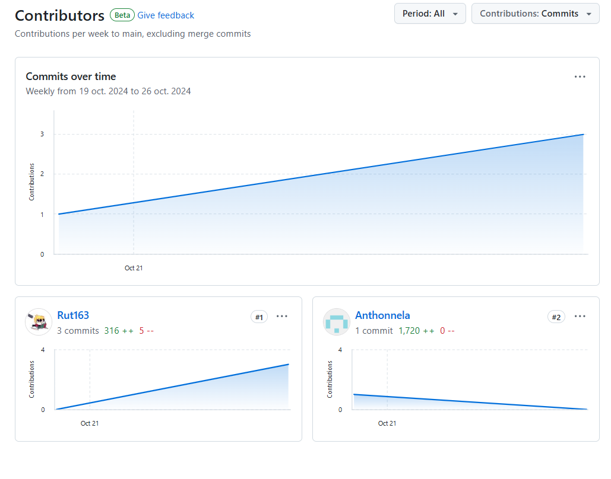

# Capítulo I: Introducción

## 1.1. Startup Profile

### 1.1.1. Descripción de la Startup

En un mundo donde el pasado nos conecta con el presente y el futuro, PictorIA te invita a explorar un universo de posibilidades a través de las imágenes. Somos más que una simple herramienta de restauración; somos tu compañero en un viaje a través del tiempo y el espacio, donde cada imagen cuenta una historia.  
Nuestra misión es democratizar el acceso al patrimonio visual, permitiendo a todos, desde amantes del arte hasta investigadores, descubrir y preservar la belleza y la historia que se esconden en cada fotografía y pintura. Queremos que cada imagen sea una puerta abierta a nuevas interpretaciones y emociones.  
Nuestra visión es crear un mundo donde el patrimonio visual sea valorado, protegido y accesible para todos. Aspiramos a ser líderes en la preservación digital, empoderando a individuos e instituciones para que cuiden y compartan su historia visual.

### 1.1.2. Perfiles de integrantes del equipo

| Imagen                                                                                                                                                                                                                                                                                                                                                                                                               | Descripción                                                                                                                                                                                                                                                                                                                                                                                                                                                                                                                                                                            |
| -------------------------------------------------------------------------------------------------------------------------------------------------------------------------------------------------------------------------------------------------------------------------------------------------------------------------------------------------------------------------------------------------------------------- | -------------------------------------------------------------------------------------------------------------------------------------------------------------------------------------------------------------------------------------------------------------------------------------------------------------------------------------------------------------------------------------------------------------------------------------------------------------------------------------------------------------------------------------------------------------------------------------- |
|                                                                                                                                                                                                                                                                                                                                      | Mi nombre es Jesica Rut Jaramillo Almora, soy estudiante de Ingeniería de Software y tengo un fuerte interés en el desarrollo de aplicaciones y tecnologías emergentes. Me emociona resolver problemas complejos y crear soluciones que generen un impacto real. A lo largo de mis estudios, he desarrollado habilidades clave en programación, trabajo en equipo y manejo de proyectos, lo que me ha permitido adaptarme a diferentes entornos y desafíos. Además, estoy bastante emocionada por contribuir en el proyecto y desarrollar mis conocimientos en tecnologías emergentes. |
| 

                                                                                                                                                                                                                                                                                | Mi nombre es Diego Merino, tengo 21 años y tengo especial interés en el sector cloud. Me motiva enfrentar y superar desafíos que requieran soluciones creativas. Durante el desarrollo de mi carrera he enfrentado diversas situaciones en los trabajos lo cual ha mejorado mi resiliencia y capacidad de trabajo colaborativo. Soy consciente de que el mundo nunca se detiene, y por eso el aprendizaje continuo es una de mis fortalezas para mantenerme actualizado.                                                                                                               |
| 

 | Mi nombre es Rafael Primo Estrada y estudio la carrera de Ingeniería de Software, poseo un alto interés por el desarrollo móvil. Mis principales hobbies son los videojuegos y conocer nuevas tecnologías. Además, poseo un alto grado de responsabilidad y compromiso para el trabajo en equipo.                                                                                                                                                                                                                                                                                      |
| 

                                                                                                                                                                                                                      | Soy Antonella Frida Gonzales Gomez, como estudiante de la carrera de Ingeniería de Software, contribuiré al equipo con mis conocimientos fundamentales en algunos lenguajes de programación. Estos conocimientos me permitirán participar activamente en la creación y desarrollo de proyectos, además tengo un enfoque responsable hacia mi trabajo y tareas asignadas. Entiendo la importancia de cumplir con plazos y metas establecidas, lo que contribuye al flujo de trabajo del equipo y al éxito general del proyecto.                                                         |

## 1.2. Solution Profile

### 1.2.1 Antecedentes y problemática

##### Antecedentes:

#### **The 5W's y 2H's:**

- What? (¿Qué?)

La problemática de la preservación del patrimonio visual en Perú afecta a múltiples sectores y se manifiesta en una serie de deficiencias que impactan negativamente la conservación de la historia y cultura del país. Los ciudadanos, investigadores e instituciones culturales enfrentan desafíos para acceder, restaurar y preservar imágenes históricas debido a la falta de tecnologías avanzadas y accesibles. La degradación de fotografías y pinturas antiguas, junto con la falta de recursos para su restauración, amenaza con la pérdida irreparable de valiosa información visual histórica.

- When? (¿Cuándo?)

El problema es constante y se agrava con el paso del tiempo. La degradación de las imágenes es un proceso continuo, y cada día que pasa sin una solución adecuada aumenta el riesgo de pérdida permanente de patrimonio visual. La urgencia es particularmente alta para colecciones antiguas y materiales fotográficos del siglo XIX y principios del XX.

- Where? (¿Dónde?)

El problema ocurre en todo Perú, con énfasis en regiones con rico patrimonio cultural como Cusco, Lima, Arequipa, y otras áreas con importante legado histórico. Afecta a museos, bibliotecas, archivos históricos, universidades y colecciones privadas en todo el país.

- Who? (¿Quién?)

Los principales afectados son historiadores, investigadores, conservadores de museos, bibliotecarios, archivistas, estudiantes de historia y arte, y el público en general interesado en el patrimonio cultural. También se ven afectadas las instituciones culturales y educativas que custodian estas colecciones, así como el sector turístico que depende de la riqueza visual histórica del país.

- Why? (¿Por qué?)

La problemática se origina en la falta de tecnologías accesibles y eficientes para la restauración y preservación de imágenes históricas. La falta de herramientas de inteligencia artificial diseñadas para el contexto peruano dificulta la conservación del patrimonio visual. Además, la falta de recursos económicos y técnicos en muchas instituciones culturales agrava el problema, limitando la capacidad de preservar y restaurar imágenes importantes.

- How? (¿Cómo?)

El problema se manifiesta en la degradación progresiva de imágenes históricas, la dificultad para acceder y compartir este patrimonio visual, y la pérdida potencial de información histórica valiosa. La falta de herramientas tecnológicas avanzadas resulta en procesos de restauración lentos, costosos y a menudo inaccesibles para muchas instituciones e individuos.

- How much? (¿Cuánto?)

El impacto es significativo tanto en el ámbito cultural como económico. Según el Ministerio de Cultura del Perú, existen más de 100,000 bienes culturales en riesgo de deterioro, incluyendo un gran número de imágenes históricas. Solo el 24% de los museos peruanos tienen catálogos digitales de sus colecciones, lo que limita el acceso y la preservación digital. Considerando que el turismo cultural representa el 40% de los ingresos turísticos en Perú, la pérdida o degradación del patrimonio visual podría tener un impacto económico sustancial en el sector turístico y cultural del país.

### 1.2.2 Lean UX Process

#### 1.2.2.1. Lean UX Problem Statements

**Business Problem Statement:**
Nuestra aplicación de restauración digital de imágenes históricas fue diseñada para mejorar la calidad de imágenes antiguas mediante técnicas avanzadas de inteligencia artificial, preservando así el patrimonio cultural y ofreciendo aplicaciones en campos diversos. Hemos observado que, a pesar de los avances tecnológicos, la restauración precisa de imágenes extremadamente dañadas, la tonalidad de imágenes en blanco y negro, y la usabilidad de la interfaz aún presentan desafíos significativos. Esto está afectando la satisfacción del usuario y limitando la efectividad de la aplicación.

¿Cómo podríamos mejorar nuestra aplicación de restauración digital para que los usuarios puedan restaurar con mayor precisión y eficacia las imágenes históricas, con características adicionales como la colorización y una interfaz más intuitiva, logrando así una mayor satisfacción del usuario y mejores resultados en las métricas de calidad de imagen?

#### 1.2.2.2. Lean UX Assumptions

**Business Outcomes Assumptions:**

- **Mejora de la precisión en la restauración de imágenes dañadas:**
  Incrementar la precisión de la restauración de imágenes extremadamente dañadas en un 20%, evaluado mediante un aumento en el índice de similitud estructural (SSIM) de 0.65 a 0.78 en promedio para imágenes con daños severos.
- **Aumento en la fidelidad de la colorización de imágenes en blanco y negro:**
  Mejorar la fidelidad de la colorización en un 25%, medido por la reducción del error medio cuadrático (MSE) en un 25% y logrando un puntaje de fidelidad de color de 85/100 en encuestas de usuarios.
- **Incremento en la satisfacción del usuario a través de una interfaz más intuitiva:**
  Aumentar la satisfacción del usuario en un 15%, reflejado en el incremento de la puntuación de usabilidad del sistema (SUS) de 70 a 80 y un aumento del 15% en las calificaciones de satisfacción del usuario.
- **Expansión del uso de la aplicación en campos diversos:**
  Aumento del 25% en la tasa de adopción de nuevas funciones en la primera semana después de su lanzamiento.
  Ampliar el uso de la aplicación en sectores como la educación y el arte en un 30%, medido por el aumento del 30% en el número de usuarios de instituciones educativas y artísticas, pasando de 50 a 65 licencias institucionales en el primer año.

**User Assumptions:**

- **Segmento 1: Historiadores y Archiveros**
  Este grupo de usuarios se compone de profesionales que valoran altamente la precisión en la restauración de imágenes históricas, ya que su principal objetivo es preservar la autenticidad y el valor histórico de las fotografías. Buscan herramientas que puedan mejorar la calidad de las imágenes sin comprometer su contenido original. Debido a que su enfoque no es la tecnología, requieren una aplicación con una interfaz intuitiva y fácil de usar, que les permita acceder rápidamente a las funciones avanzadas de restauración sin necesidad de una curva de aprendizaje significativa.
- **Segmento 2: Entusiastas de la Fotografía Histórica**
  Este segmento está formado por usuarios apasionados por la fotografía histórica, que ven en la colorización de imágenes en blanco y negro una oportunidad para revitalizar y dar nueva vida a fotos antiguas. Son creativos y buscan personalizar sus proyectos, por lo que prefieren una aplicación que ofrezca opciones configurables para ajustar los niveles de restauración y colorización según sus preferencias personales. Su objetivo es lograr resultados únicos que reflejen su estilo y visión personal, haciendo que las fotos históricas sean más atractivas visualmente.
- **Segmento 3: Estudiantes de Historia y Arte**
  Este segmento está compuesto por jóvenes que están cursando estudios universitarios en historia, arte, o disciplinas relacionadas. Estos estudiantes tienen un profundo interés en la preservación del patrimonio cultural y en el análisis de imágenes históricas como parte de su formación académica. Están en busca de herramientas que les permitan realizar investigaciones, proyectos académicos y creativos, a la vez que desarrollan habilidades prácticas en la restauración y conservación digital de imágenes históricas. Su enfoque es aprender y aplicar conocimientos que complementen su formación teórica con experiencias prácticas en el manejo de materiales históricos.

**User Outcomes Assumptions:**

- **Historiadores y Archiveros**
  - **User Outcome 1: Preservación de la Autenticidad Histórica**
    Aumento del 15% en el porcentaje de usuarios que califican la restauración como fiel al original.
    Disminución del 10% en el número de veces que los usuarios deshacen cambios debido a percepciones de inautenticidad.
  - **User Outcome 2: Interfaz Intuitiva y Fácil de Usar**
    Disminución del 20% en el tiempo promedio que tarda un nuevo usuario en completar su primera restauración con éxito.
- **Entusiastas de la Fotografía Histórica**
  - **User Outcome 1: Personalización de la Colorización**
    Aumento del 30% en el número de parámetros personalizados ajustados por sesión de usuario.
    Aumento del 20% en el nivel de satisfacción con las opciones de personalización según encuestas de usuarios.
  - **User Outcome 2: Mejora Creativa y Visual de Imágenes**
    Aumento del 25% en la tasa de compartición de imágenes restauradas en redes sociales desde la aplicación.
    Aumento del 15% en el número de imágenes guardadas después de la restauración en comparación con el número de imágenes importadas.
- **Estudiantes de Historia y Arte**
  - **User Outcome 1: Aprendizaje Práctico en Restauración Digital**
    Aumento del 25% en el número de estudiantes que completan restauraciones de imágenes históricas como parte de sus proyectos académicos.
    Reducción del 15% en el tiempo promedio requerido para que los estudiantes realicen su primera restauración digital completa.
  - **User Outcome 2: Mejora de Habilidades Técnicas y Creativas**
    Incremento del 30% en el número de estudiantes que reportan haber mejorado sus habilidades en restauración digital después de usar la plataforma durante un semestre académico.
    Aumento del 20% en la cantidad de proyectos académicos que integran técnicas de restauración digital avanzadas proporcionadas por la plataforma.

**Features Assumptions:**

- Restauración automática de imágenes dañadas con algoritmos de machine learning.
- Ajuste automático de tonalidad para imágenes en blanco y negro.
- Interfaz de usuario intuitiva y fácil de navegar.
- Comparación lado a lado del estado original y la versión restaurada de la imagen.
- Opciones de ajustes manuales post-restauración.
- Optimización específica para imágenes extremadamente dañadas.
- Funcionalidad de guardar y continuar la restauración en otro momento.
- Exportación de imágenes restauradas en varios formatos, como JPG, PNG, o TIFF.
- Recomendaciones basadas en IA para mejoras adicionales después de la restauración.
- Colaboración en tiempo real con otros usuarios en la restauración de imágenes.
- Historial de cambios con opciones de deshacer y rehacer acciones.
- Herramientas de zoom detallado para trabajar con precisión en áreas específicas.
- Tutoriales interactivos que guían a los usuarios a través de las funcionalidades principales.

#### 1.2.2.3. Lean UX Hypothesis Statements

- **Restauración automática de imágenes dañadas con algoritmos de machine learning:**
  Creemos que lograremos un aumento significativo en la satisfacción y retención de los usuarios si los usuarios que tienen imágenes con daños visibles alcanzan una versión completamente restaurada de sus imágenes con una función de restauración automatizada basada en machine learning.
- **Ajuste automático de tonalidad para imágenes en blanco y negro:**
  Creemos que lograremos un aumento en la participación de los usuarios y el uso de la función si los usuarios que trabajan con fotos en blanco y negro alcanzan un ajuste tonal natural y atractivo con la función de ajuste tonal automático.
- **Interfaz de usuario intuitiva y fácil de navegar:**
  Creemos que lograremos una reducción en las tasas de abandono de usuarios si los usuarios nuevos y recurrentes alcanzan una experiencia de usuario fluida y eficiente con una interfaz intuitiva y fácil de navegar.
- **Comparación lado a lado del estado original y la versión restaurada de la imagen:**
  Creemos que lograremos un aumento en la confianza y seguridad del usuario en el proceso de restauración si los usuarios que restauran imágenes alcanzan evidencia visual clara de las mejoras de la restauración con una función de comparación lado a lado.
- **Opciones de ajustes manuales post-restauración:**
  Creemos que lograremos una mayor satisfacción del usuario y una experiencia personalizada si los usuarios que prefieren más control sobre el proceso de restauración alcanzan la capacidad de ajustar las imágenes restauradas según sus preferencias con opciones de ajustes manuales después de la restauración.
- **Optimización específica para imágenes extremadamente dañadas:**
  Creemos que lograremos mayores tasas de éxito en la restauración de imágenes gravemente dañadas si los usuarios con imágenes severamente dañadas alcanzan un resultado de restauración de mayor calidad con optimizaciones específicas para imágenes extremadamente dañadas.
- **Funcionalidad de guardar y continuar la restauración en otro momento:**
  Creemos que lograremos una reducción en el abandono del usuario durante el proceso de restauración si los usuarios que necesitan pausar su trabajo alcanzan la capacidad de guardar y reanudar su progreso de restauración con una funcionalidad de guardar y continuar.
- **Exportación de imágenes restauradas en varios formatos:**
  Creemos que lograremos un aumento en la satisfacción y adaptabilidad de los usuarios si los usuarios que necesitan sus imágenes restauradas en formatos específicos alcanzan flexibilidad en la exportación de sus imágenes con la opción de exportar imágenes en múltiples formatos.
- **Recomendaciones basadas en IA para mejoras adicionales después de la restauración:**
  Creemos que lograremos mayor participación y una mejor calidad de imagen si los usuarios que han completado la restauración inicial alcanzan sugerencias personalizadas para mejoras adicionales con recomendaciones basadas en IA para mejoras post-restauración.
- **Colaboración en tiempo real con otros usuarios en la restauración de imágenes:**
  Creemos que lograremos una mayor interacción entre usuarios y trabajo colaborativo si los usuarios que desean colaborar con otros alcanzan la capacidad de trabajar juntos en la restauración de imágenes en tiempo real con una función de colaboración en tiempo real.
- **Historial de cambios con opciones de deshacer y rehacer acciones:**
  Creemos que lograremos mayor confianza del usuario y una mejor gestión del flujo de trabajo si los usuarios que frecuentemente realizan ajustes alcanzan la capacidad de rastrear y revertir cambios según sea necesario con un historial de cambios completo con opciones de deshacer y rehacer.
- **Herramientas de zoom detallado para trabajar con precisión en áreas específicas:**
  Creemos que lograremos una mayor precisión y exactitud en las tareas de restauración si los usuarios que trabajan en áreas detalladas de una imagen alcanzan un control mejorado sobre partes específicas de sus imágenes con herramientas de zoom detallado para trabajos enfocados.
- **Tutoriales interactivos que guían a los usuarios a través de las funcionalidades principales:**
  Creemos que lograremos una mejor integración de usuarios y una curva de aprendizaje reducida si los usuarios nuevos que no están familiarizados con el software alcanzan una comprensión completa de las funciones clave con tutoriales interactivos que los guían a través de las funcionalidades principales.

#### 1.2.2.3. Lean UX Canvas

## 1.3. Segmentos objetivo.

Nuestra solución se enfoca principalmente en 3 públicos objetivo.

### Ciudadanos Aficionados al arte:

Personas con interés genuino en el arte, sea como hobby o como especialidad. PictorIA ofrece una plataforma para descubrir y apreciar piezas únicas restauradas a su máximo esplendor.

### Historiadores e Investigadores:

Profesionales interesados en el estudio del pasado, sea a través de documentos históricos, fotografías, pinturas o arte en general. PictorIA se ofrece como herramienta que les permita analizar, restaurar y documentar imágenes antiguas que podrán usar para sus investigaciones o registros.

### Estudiantes de Historia y Arte:

Este segmento está compuesto por jóvenes que están cursando estudios universitarios en historia, arte, o disciplinas relacionadas. Estos estudiantes tienen un profundo interés en la preservación del patrimonio cultural y en el análisis de imágenes históricas como parte de su formación académica. Están en busca de herramientas que les permitan realizar investigaciones, proyectos académicos y creativos, a la vez que desarrollan habilidades prácticas en la restauración y conservación digital de imágenes históricas. Su enfoque es aprender y aplicar conocimientos que complementen su formación teórica con experiencias prácticas en el manejo de materiales históricos.

# Capítulo II: Requirements Elicitation & Analysis

### 2.1. Competidores.

<table><tr><th colspan="2" valign="top"> </th><th colspan="8" valign="top">Competitive Analysis Landscape </th></tr>
<tr><td rowspan="2" valign="top">¿Por qué llevar a cabo este análisis? </td><td colspan="3" valign="top"> </td><td colspan="6" valign="top">¿Quiénes son nuestros principales competidores y que nos diferencia de ellos? </td></tr>
<tr><td colspan="3" valign="top"> </td><td colspan="6" valign="top">Gracias al análisis de la competencia presente en el mercado podremos conocer las fortalezas y debilidades de nuestros principales competidores. Además, lograremos identificar las estrategias utilizadas por los competidores y su presencia dentro del mercado. A partir de la información recopilada en el análisis competitivo podremos plantear estrategias que nos permitan posicionarnos dentro del mercado. </td></tr>

<tr><td colspan="5" valign="top">
 

 
</td><td colspan="2" valign="top">
  

    
  

</td>
<td valign="top">
  

    
  

  
PixeLeap

</td>
<td valign="top">
  

    
  

  
YouCam Enhance

</td>
<td valign="top">
  

    
  

  
FixMyPics

</td></tr>

<tr><td colspan="3" rowspan="2" valign="top">Perfil  </td><td colspan="2" valign="top">Overview </td><td colspan="2" valign="top">ImagIA es una startup dedicada a la preservación y restauración de imágenes históricas, combinando tecnología avanzada con un profundo respeto por el patrimonio visual. Su misión es democratizar el acceso a la historia vidual, permitiendo a los usuarios, desde historiadores hasta aficionados del arte, restaurar y perseverar fotografías y pinturas que cuentan la historia del pasado. La plataforma esta diseñada para conectar el pasado con el presente, ofreciendo herramientas á mejorar la calidad de las imágenes y asegurar que las memorias visuales sean accesibles para las futuras generaciones .  </td><td valign="top">
PixeLeap 

es una aplicación móvil que permite a los usuarios restaurar y mejorar fotos antiguas o de baja calidad con un enfoque en la facilidad de uso y la accesibilidad. Utilizando tecnología de inteligencia artificial, PixeLeap ofrece herramientas para mejorar la claridad, corregir defectos y agregar color a imágenes en blanco y negro, haciéndola ideal para aquellos que desean revitalizar fotos familiares o personales. La aplicación está disponible principalmente en dispositivos iOS y utiliza un modelo de suscripción para acceder a funciones avanzadas 
</td><td valign="top">YouCam Enhance es una aplicación diseñada para mejorar la calidad de las fotos mediante tecnologías avanzadas de inteligencia artificial. Ofrece herramientas para corregir fotos borrosas, mejorar la resolución y restaurar imágenes antiguas. La aplicación está dirigida a usuarios de smartphones que desean mejorar la calidad de sus selfies y fotos personales. Además, YouCam Enhance está integrada con otras plataformas de redes sociales, lo que facilita compartir imágenes mejoradas en línea. Está disponible tanto en iOS como en Android y ofrece un modelo freemium con opciones de suscripción​ </td><td valign="top">FixMyPics es una aplicación móvil que se centra en la restauración de fotos antiguas, proporcionando una interfaz intuitiva y fácil de usar para ayudar a los usuarios a revivir sus recuerdos visuales. Ofrece funciones como la eliminación de arañazos y la mejora de la calidad de imágenes, lo que la convierte en una opción atractiva para aquellos que buscan preservar sus fotos familiares y personales. La aplicación está disponible en plataformas como GameLoop, dirigida a un mercado que valora la preservación de recuerdos fotográficos, con opciones de compra dentro de la aplicación para funciones premium </td></tr>
<tr><td colspan="2" valign="top">Ventaja competitiva ¿Qué valor ofrece a los clientes? </td><td colspan="2" valign="top">Especialización en la preservación y restauración de imágenes históricas. </td><td valign="top">Restauración y mejora de fotos antiguas con facilidad de uso y accesibilidad para usuarios generales. </td><td valign="top">Potente combinación de herramientas de mejora de fotos respaldadas por IA, corrección de fotos borrosas y restauración de imágenes. </td><td valign="top">FixMyPics se enfoca en la restauración de fotos antiguas con una interfaz fácil de usar, permitiendo a los usuarios revivir y preservar sus recuerdos familiares y personales de manera rápida y accesible. </td></tr>
<tr><td colspan="3" rowspan="2" valign="top">Perfil Marketing </td><td colspan="2" valign="top">Mercado Objetivo </td><td colspan="2" valign="top">Amantes del arte, historiadores, museos, y bibliotecas. </td><td valign="top">Usuarios generales interesados en mejorar fotos antiguas o de baja calidad. </td><td valign="top">
 

 

Usuarios de smartphones interesados en mejorar la calidad de sus fotos y selfies. 
</td><td valign="top">Familias, personas mayores, y cualquier persona que desee restaurar fotos antiguas o dañadas. </td></tr>
<tr><td colspan="2" valign="top">Estrategias de marketing </td><td colspan="2" valign="top">Colaboraciones con instituciones culturales, publicidad en medios especializados, presencia en redes sociales. </td><td valign="top">Presencia en la App Store, publicidad en redes sociales enfocada en la mejora de fotos familiares. </td><td valign="top">Colaboraciones con influencers, publicidad digital en plataformas sociales. </td><td valign="top">Presencia en tiendas de aplicaciones, marketing en redes sociales dirigido a personas que valoran la preservación de recuerdos fotográficos. </td></tr>
<tr><td colspan="3" rowspan="3" valign="top">Perfil de Producto </td><td colspan="2" valign="top">
productos &  

Servicios 
</td><td colspan="2" valign="top">Restauración digital, mejora de calidad de fotos históricas. </td><td valign="top">Mejora de fotos antiguas, restauración de imágenes, colorización. </td><td valign="top">
Mejora de fotos borrosas, restauración de fotos antiguas. 

 
</td><td valign="top">Restauración de fotos antiguas, eliminación de arañazos, mejora de calidad de imágenes. </td></tr>
<tr><td colspan="2" valign="top">Precios & Costos </td><td colspan="2" valign="top">El precio de restauración por imagen sería aproximadamente $30, con una suscripción mensual estimada de $15, que cubre servicios adicionales como acceso a herramientas avanzadas de edición y almacenamiento en la nube para la preservación de imágenes restauradas. </td><td valign="top">Suscripciones con diferentes planes (semanal, mensual, anual) para acceso a todas las funciones premium. </td><td valign="top">
 

 

Freemium con opciones de suscripción para acceso a funciones avanzadas. 
</td><td valign="top">Aplicación gratuita con opciones de compra dentro de la aplicación para acceder a funciones premium. </td></tr>
<tr><td colspan="2" valign="top">
Canales de  

distribución  

(Web y/o Móvil) 
</td><td colspan="2" valign="top">móvil. </td><td valign="top">Móvil (iOS). </td><td valign="top">Móvil (iOS y Android). </td><td valign="top">Móvil (disponible en GameLoop y otras plataformas de Android). </td></tr>
<tr><td colspan="3" rowspan="5" valign="top">Análisis SWOT </td><td colspan="3" valign="top"> </td><td colspan="4" valign="top">
Realice esto para su startup y sus competidores. Sus fortalezas deberían apoyar sus oportunidades y contribuir a lo que ustedes definen como su posible ventaja  

competitiva.   
</td></tr>
<tr><td colspan="2" valign="top">Fortalezas  </td><td colspan="2" valign="top">Especialización en patrimonio visual. </td><td valign="top">Fácil de usar, múltiples idiomas disponibles. </td><td valign="top">Tecnologías avanzadas de IA, integración con plataformas de redes sociales. </td><td valign="top">
Interfaz sencilla, accesibilidad para usuarios con pocos conocimientos técnicos. 

 
</td></tr>
<tr><td colspan="2" valign="top">Debilidades </td><td colspan="2" valign="top">Niche limitado. </td><td valign="top">Problemas reportados con la cancelación de suscripciones. </td><td valign="top">Depende mucho del segmento de embellecimiento y retoque fotográfico. </td><td valign="top">Funciones limitadas comparado con aplicaciones más avanzadas </td></tr>
<tr><td colspan="2" valign="top">Oportunidades </td><td colspan="2" valign="top">Creciente demanda de digitalización de archivos históricos. </td><td valign="top">Ampliación de funciones para incluir más herramientas de edición. </td><td valign="top">Expansión en mercados emergentes y nuevas integraciones con plataformas digitales. </td><td valign="top">Aumentar la base de usuarios mediante la expansión a más mercados y el desarrollo de nuevas funciones de restauración. </td></tr>
<tr><td colspan="2" valign="top">Amenazas </td><td colspan="2" valign="top">Avances tecnológicos de la competencia. </td><td valign="top">
 

Competencia de aplicaciones con IA avanzada y mejor reputación. 

 
</td><td valign="top">Saturación del mercado y rápida evolución de la tecnología en apps de fotos. </td><td valign="top">Competencia con aplicaciones que utilizan tecnologías más avanzadas de inteligencia artificial para la restauración de fotos. </td></tr>
</table>

### 2.1.1. Análisis competitivo.

### 2.1.2. Estrategias y tácticas frente a competidores.

Nuestra principal ventaja competitiva radica en la especialización en restauración digital de obras de arte y artefactos de museos. A diferencia de aplicaciones como PixeLeap o YouCam Enhance, que se centran en fotos personales o familiares, nuestro enfoque exclusivo en piezas de museo nos permite desarrollar algoritmos más precisos y adaptados a las necesidades específicas de la conservación del patrimonio cultural. Esta especialización nos permite ofrecer resultados de mayor calidad y autenticidad histórica, un aspecto crucial para nuestros usuarios principales: historiadores, archiveros y entusiastas de la fotografía histórica.

Aprovecharemos la limitación de ImagIA en cuanto a su nicho restringido, expandiendo nuestro alcance al incluir no solo fotografías, sino también pinturas, esculturas y otros artefactos históricos. Esto nos permitirá atraer a un público más amplio dentro del sector cultural y patrimonial. Además, al centrarnos en la experiencia in situ en museos, ofrecemos un valor añadido que las aplicaciones existentes no contemplan, mejorando la interacción de los visitantes con las obras de arte.

Una desventaja común entre nuestros competidores, como FixMyPics, es su dependencia de modelos de suscripción o compras dentro de la aplicación. Nosotros adoptaremos un enfoque diferente, ofreciendo la aplicación de forma gratuita a los museos colaboradores. Esta estrategia nos permitirá establecer relaciones sólidas con instituciones culturales, obteniendo acceso a colecciones valiosas para mejorar nuestros algoritmos y, al mismo tiempo, aumentar nuestra visibilidad entre los visitantes del museo.

Mientras que aplicaciones como YouCam Enhance se centran en la integración con redes sociales para compartir fotos personales mejoradas, nuestra aplicación se enfocará en proporcionar información educativa y contextual sobre las obras restauradas. Esta característica no solo mejorará la experiencia del usuario en el museo, sino que también nos diferenciará como una herramienta educativa y de preservación cultural, en lugar de ser simplemente otra aplicación de edición de fotos.

A diferencia de las aplicaciones existentes que ofrecen una amplia gama de herramientas de edición que pueden resultar abrumadoras para algunos usuarios, nuestra interfaz se diseñará con simplicidad y facilidad de uso en mente. Nos centraremos en ofrecer funciones específicas y relevantes para la visualización y comprensión de obras de arte restauradas, evitando la confusión que pueden generar las múltiples opciones de edición de apps como PixeLeap.

Finalmente, aprovecharemos la falta de enfoque en la realidad aumentada (RA) de nuestros competidores. Al incorporar tecnología de RA, permitiremos a los usuarios visualizar cómo se habrían visto las obras de arte en su estado original, directamente en el entorno del museo. Esta característica innovadora no solo nos diferenciará de la competencia, sino que también proporcionará una experiencia única y atractiva para los visitantes del museo, potenciando el aspecto educativo y emocional de la interacción con el arte.

## 2.2. Entrevistas.

### 2.2.1. Diseño de entrevistas.

#### Preguntas Generales (para todos los entrevistados):

- ¿Cuál es su nombre completo?

- ¿Qué edad tiene?

- ¿Con qué género se identifica?

- ¿Cuál es su estado civil?

- ¿En dónde reside actualmente?

- ¿Cuál es su ocupación actual?

- ¿Qué marca y modelo de teléfono celular utiliza?

- ¿Qué sistema operativo tiene su teléfono (iOS, Android, otro)?

- ¿Utiliza tablet? Si es así, ¿qué marca y modelo?

- ¿Con qué frecuencia cambia de dispositivo móvil?

- ¿Qué aplicaciones usa con más frecuencia en su día a día?

- ¿Ha usado alguna vez aplicaciones para editar o mejorar fotos? ¿Cuáles?

- ¿Con qué frecuencia visita museos o galerías de arte?

- ¿Tiene alguna afición relacionada con la fotografía o el arte?

- ¿Qué redes sociales utiliza más y con qué frecuencia?
- ¿Cómo prefiere aprender sobre nuevas tecnologías o aplicaciones?

#### Preguntas para Historiadores y Archiveros:

¿Cuántos años de experiencia tiene en su campo?

¿En qué tipo de institución trabaja (museo, archivo, universidad, etc.)?

¿Qué tipo de colecciones o materiales históricos maneja habitualmente?

¿Qué software o herramientas digitales utiliza actualmente para la preservación o restauración de imágenes?

¿Qué aspectos le gustan y cuáles no de las herramientas que usa?

¿Ha experimentado con tecnologías de IA para la restauración de imágenes? Si es así, ¿cuál ha sido su experiencia?

¿Cuáles son los mayores desafíos de la preservación digital de imágenes históricas

¿Qué tan importante es la precisión histórica en la restauración digital para usted y por qué?

¿Cómo equilibra la necesidad de mejorar la calidad de la imagen con la preservación de su autenticidad?

Si pudiera crear la herramienta perfecta para su trabajo, ¿qué características tendría?

¿Consideraría usar una aplicación móvil para la restauración de imágenes en su trabajo? ¿Por qué sí o por qué no?

¿Qué funcionalidades serían esenciales para usted en una aplicación móvil de este tipo?

#### Preguntas para Entusiastas de la Fotografía Histórica:

¿Cómo surgió su interés por la fotografía histórica?

¿Qué tipo de proyectos de restauración o colorización ha realizado?

¿Qué lo motiva a restaurar o colorizar fotografías históricas?

¿Qué software o aplicaciones utiliza actualmente para sus proyectos?

¿Qué aspectos le gustan y cuáles no de las herramientas que usa?

¿Cómo aprendió a usar estas herramientas?

¿Qué nivel de personalización busca en el proceso de restauración o colorización?

¿Prefiere trabajar en un dispositivo móvil o en una computadora de escritorio? ¿Por qué?

¿Qué características serían esenciales para usted en una aplicación móvil de restauración de fotos?

¿Cómo comparte o presenta sus proyectos de restauración?

¿Participa en comunidades en línea relacionadas con la fotografía histórica? Si es así, ¿cuáles?

¿Qué piensa sobre la posibilidad de usar realidad aumentada para visualizar fotografías restauradas en su contexto original?

Preguntas para Estudiantes de Historia y Arte:

¿Qué estás estudiando actualmente y en qué año de la carrera te encuentras?

¿Cuántos años de experiencia tienes en trabajos prácticos relacionados con la historia o el arte?

¿En qué área específica de la historia o el arte estás más interesado (preservación, restauración, investigación, etc.)?

¿Has utilizado algún software o herramienta para la restauración o edición de imágenes históricas? ¿Cuál es?

¿Cuáles son los principales desafíos que enfrentas al trabajar con imágenes históricas en tus proyectos académicos?

¿Cómo evaluas la precisión y efectividad de las herramientas digitales que has utilizado para la restauración de imágenes?

¿Qué tan importante es para ti mantener la autenticidad histórica cuando trabajas en la restauración digital de imágenes?

¿Has considerado o utilizado alguna vez tecnologías de inteligencia artificial para la restauración de imágenes? Si es así, ¿cómo ha sido tu experiencia?

¿Qué características consideras esenciales en una nueva herramienta digital que te ayude en la restauración y gestión de imágenes históricas para tus proyectos académicos?

Pregunta de Cierre:

¿Estarías interesado en probar una nueva aplicación móvil diseñada específicamente para la restauración y gestión de imágenes históricas en tus proyectos académicos? ¿Por qué sí o por qué no?

### 2.2.2. Registro de entrevistas.

**Segmento: Ciudadanos Aficionados al arte:**

Entrevistador: Diego Merino

Entrevistado: Wilmer Salinas

Edad: 20 años

Distrito: Los Olivos

    

Wilmer Salines, un joven de 20 años que estudia Arquitectura, representa un segmento objetivo clave para el proyecto PictorIA. Con un estilo de vida urbano en Los Olivos y una afinidad natural por la tecnología, Wilmer utiliza un Samsung A13 y prefiere aplicaciones como WhatsApp, Instagram y LinkedIn, que reflejan su conectividad y presencia en redes sociales. Además, es un usuario frecuente de Photoshop, lo que indica su interés y habilidades en la edición digital, una competencia relevante para su campo de estudio.

Wilmer muestra un interés profundo y arraigado por el arte y la historia, lo que lo lleva a visitar museos y galerías al menos una vez al mes. Su enfoque en observar maquetas y modelos arquitectónicos, más que en leer descripciones, resalta su preferencia por lo visual y lo tangible, elementos que podrían ser esenciales en la experiencia de usuario de PictorIA. La capacidad de visualizar modelos digitales de edificaciones, así como la posibilidad de interactuar con estas representaciones a través del tiempo o modificando aspectos como la paleta de colores, son características que Wilmer encontraría atractivas y útiles en una aplicación.

Su tendencia a compartir ocasionalmente sus visitas en redes sociales sugiere un potencial para la gamificación y la integración social, fomentando no solo la exploración del arte y la historia, sino también la difusión de estas experiencias entre sus contactos.

**Entrevista 2:**

Entrevistador: Diego Merino

Entrevistado:

Edad: 20 años

Distrito: Los Olivos

    

Carla Xiomara Valle Espinoza, una joven de 17 años que reside en Callao, Lima, y estudia Administración y Marketing, aporta una perspectiva valiosa para el desarrollo de PictorIA. Con un iPhone 13 y una tablet Samsung S7 Plus que prefiere usar en casa, Carla es una usuaria de tecnología que se mantiene actualizada, pero que cambia sus dispositivos con menor frecuencia, aproximadamente cada cinco años. Sus aplicaciones más utilizadas, como WhatsApp e Instagram, revelan su afinidad por las redes sociales y su inclinación hacia contenido visual y dinámico.

Hace unos dos o tres meses, Carla visitó un museo por primera vez hace un gran interés por el arte desde muy joven, especialmente por el dibujo. Este interés la llevó a disfrutar de una exhibición colorida en un espacio que estaba a punto de ser demolido, lo que resalta su aprecio por las experiencias artísticas que combinan creatividad con un elemento efímero y transformador.

Carla prefiere observar más que leer descripciones o seguir visitas guiadas, lo que indica una tendencia hacia el aprendizaje visual e interactivo. Le atrae la idea de una versión digital de las obras que le permita ver cómo eran en su estado original y cómo se han deteriorado con el tiempo y querría poder cambiar colores en las representaciones digitales para hacerlas más dinámicas. Además, Carla expresó un deseo por características inmersivas en la aplicación, como la posibilidad de ver movimientos en las imágenes, lo que sugiere que valora la interactividad y el dinamismo en sus experiencias visuales.

**Entrevista 3:**

Entrevistador: Diego Merino

Entrevistado: Manuel Rueda

Edad: 23 años

Distrito: Chorrillos

    

Manuel Rueda, un joven de 23 años que vive en Chorrillos y estudia Diseño Gráfico, ofrece una perspectiva interesante y detallada. Como usuario de Apple, incluyendo un iPhone y un iPad que utiliza principalmente en casa, Manuel se identifica con una generación que valora la tecnología de alta calidad, aunque no cambia sus dispositivos con frecuencia. Sus visitas regulares a museos y galerías, que realiza semanalmente, muestran un profundo interés por el arte y la historia, un interés que, según él, tiene raíces familiares.

Manuel aprecia una experiencia museística completa que combine la observación visual, la lectura de inscripciones y la guía narrativa, lo que sugiere que valora tanto la estética como el contexto educativo de las exhibiciones. Sin embargo, también expresa un deseo de modernizar estas experiencias, haciendo que las exposiciones sean más dinámicas e interactivas. Esto se alinea con su interés por el diseño gráfico, donde la interacción y la participación del usuario son fundamentales.

Manuel considera que las experiencias digitales pueden enriquecer las visitas físicas a museos, permitiendo a los usuarios ver versiones restauradas de obras en su mejor momento, así como cambiar elementos como la paleta de colores. También le gustaría ver una mayor integración de tecnología, como el uso de códigos QR que permitan a los visitantes recibir descripciones directamente de los autores, haciéndolo sentir más conectado con las obras.

Aunque comparte ocasionalmente sus visitas en redes sociales, Manuel no lo hace de manera constante.

**Segmento: Historiadores e Investigadores:**

**Entrevista 4:**

Entrevistador: Jesica Jaramillo

Entrevistado: Alcides Mariano Jaramillo Usno

Edad: 58

Distrito: Independencia

    

Resumen: Alcides Jaramillo es un técnico de profesión que, como trabajo voluntario, se encarga de hacer transcripciones de actas antiguas (indexar) en una aplicación web proporcionada por la institución “La Iglesia de Jesucristo de los Santos de los Últimos Días”. Utiliza un celular Samsung de sistema operativo Android que cambia cada 3 años. No utiliza Tablet para su actividad de transcripción, sino laptops o computadoras de escritorio, de sistema operativo Windows, porque el tamaño de la pantalla de ayuda a distinguir y transcribir mejor los escritos. Las aplicaciones que más utiliza para su labor son, dicha aplicación web [FamiliSearch](https://www.familysearch.org/es/), Microsoft Office y otros programas de edición como: Photoshop y CorelDraw. Visita museos y galerías con poca frecuencia ya que no son las entidades que mayor relevancia tienen en la actividad de recolección de archivos. Tiene afición por la fotografía que demuestra al mantener recuerdos familiares valiosos. Las redes sociales que utiliza normalmente son Whatsapp, Facebook, Instagram y TikTok. Prefiere aprender de nuevas tecnologías a través de tutoriales gratuitos en YouTube, libros guía o siguiendo instrucciones de Inteligencia Artificial.

Tiene 10 años trabajando como indexador en la herramienta FamilySearch para su iglesia. Los materiales históricos que maneja son actas de proporcionadas por municipalidades o cementerios que están a disposición de los miembros de la dicha iglesia. Utilizan la aplicación web FamilySearch para estas actividades. No le disgusta nada en específico en la herramienta, pero algo que le gustaría agregar es la posibilidad de agregar fotos además de los datos de las personas indexadas. No ha experimentado on IA para la restauración de los textos. Está de acuerdo con otros usuarios que el mayor desafío de la preservación es el deterioro de los archivos y entenderlos, ya que están borrosos, en otros idiomas o en letras difíciles de entender. La precisión histórica es importante para él, ya que trabajan con datos reales que se utilizarán después en actividades religiosas. Dicha iglesia equilibra la necesidad de mejorar la calidad de los textos y la preservación de su autenticidad al utilizar “un sistema de almacenamiento con microfilms”; realzar visitas a cementerios, municipalidades o personas longevas y haciendo una comparación de los textos guardados y los nuevos textos e historias encontradas en sus visitas. Considera que la herramienta que usa ya es perfecta y le molesta un poco el uso de un celular para la labor por la pantalla pequeña, además recalca que la aplicación FamilySearch (al ser una app web) ya funciona en dispositivos móviles. Sin embargo, sí está interesado en probar una aplicación móvil de este tipo.

**Segmento:** Estudiantes de Historia y Arte

**Entrevista 1:**

Entrevistador: Antonella Gonzales

Entrevistado: Elizabeth Cjupa

Edad: 23

Distrito: Breña

    

**Resumen:** Elizabeth es una estudiante de tercer año de Historia y Artes, apasionada por ambas áreas. Suele visitar museos y ha realizado trabajos de restauración de imágenes utilizando software como Adobe Photoshop y GIMP para la restauración digital, así como Pixlr. En su trabajo enfrenta retos importantes, como conservar los detalles originales de las imágenes y evitar distorsionar su autenticidad, algo que considera crucial.

Ha probado herramientas de inteligencia artificial para la restauración de imágenes, pero siente que aún no cumplen con sus expectativas, ya que les faltan características que permitan gestionar mejor la calidad de las imágenes restauradas. Elizabeth está interesada en una aplicación móvil para la restauración de imágenes, lo cual sería de gran ayuda para su trabajo académico y profesional.

**Entrevista 2:**

Entrevistador: Rafael Primo

Entrevistado: William Riega

Edad: 21

Distrito: San Martín de Porres

    

Resumen: William es un estudiante de 20 años, menciona que está cursando la carrera de Historia, enfocándose principalmente en la historia del Perú. Aunque no tiene experiencia laboral práctica en el área, ha realizado múltiples trabajos académicos, en su mayoría investigaciones sobre culturas y temas de antropología relacionados con la historia peruana.

William ha utilizado software como Photoshop para la edición de imágenes históricas, pero no ha trabajado con herramientas específicas para la restauración. Su principal desafío al trabajar con imágenes históricas es la accesibilidad de las mismas, así como la presencia de errores o manchas que dificultan el análisis visual. Además, menciona problemas comunes con imágenes familiares antiguas, como la baja resolución o secciones faltantes.

En cuanto a la precisión de las herramientas que ha usado, considera que las aplicaciones para mejorar la resolución son bastante precisas y fáciles de usar. Sin embargo, ha oído hablar de herramientas que usan inteligencia artificial para completar o mejorar imágenes, pero nunca las ha probado debido a su costo elevado o su inaccesibilidad en el país.

Para él, es crucial que una herramienta digital para restauración permita mejorar la calidad de las imágenes, especialmente en términos de resolución y eliminación de manchas o defectos. También considera importante que estas herramientas utilicen inteligencia artificial para completar áreas faltantes o dañadas en las imágenes.

Finalmente, William se interesa en probar una nueva aplicación diseñada para restaurar y gestionar imágenes históricas, ya que sería útil para sus proyectos académicos y también para preservar imágenes históricas que podrían perderse por daños irreparables.

### 2.2.3. Análisis de entrevistas.

**Segmento Ciudadanos Aficionados al Arte**

**¿Qué tecnologías utilizan con mayor frecuencia?**
Los entrevistados utilizan una variedad de dispositivos tecnológicos modernos, incluyendo teléfonos Samsung, iPhones y tabletas. Prefieren aplicaciones populares como WhatsApp, Instagram, y TikTok, lo que indica una inclinación por redes sociales visuales y dinámicas. Todos destacan el uso de dispositivos móviles en casa o durante sus visitas a museos. En cuanto a edición y similar con un interés por herramientas que puedan mejorar su experiencia interactiva, como Photoshop o herramientas para ver versiones restauradas de obras.

**¿Con qué frecuencia visitan museos y galerías de arte?**
Las visitas varían desde semanales hasta mensuales, pero hay una preferencia por experiencias que combinen lo visual y lo tangible, como modelos arquitectónicos, maquetas y obras de arte. Algunos buscan exposiciones que combinen creatividad e interactividad.

**¿Cómo interactúan con el arte y qué aspectos valoran más?**
Prefieren observar en lugar de leer descripciones o seguir visitas guiadas. Todos destacan el deseo de experiencias inmersivas, como versiones restauradas o interactuar con representaciones digitales. El dinamismo y la capacidad de personalizar la experiencia, como cambiar paletas de colores o visualizar movimientos en las imágenes.

**¿Qué elementos considerarían atractivos en una aplicación como PictorIA?**
Una aplicación que les permita interactuar con obras de arte de manera visual sería muy atractiva para este grupo. Las funcionalidades deseadas incluyen restauraciones digitales, visualizaciones de cómo las obras han cambiado al paso del tiempo y la capacidad de modificar o interactuar con las mismas.

**¿Cómo influye el entorno social en sus interacciones con el arte?**
Aunque no todos comparten sus experiencias artísticas regularmente en redes sociales, existe un potencial significativo para fomentar la difusión de arte entre sus contactos a través de plataformas como Instagram. Se podrían incluir funcionalidades que promuevan la socialización, como la integración con redes sociales, ya que los usuarios suelen compartir ocasionalmente sus visitas y experiencias.

**Análisis general del segmento**

muestra un interés profundo por experiencias artísticas visuales e interactivas, prefiriendo la personalización y el dinamismo sobre la pasividad. Valoran la tecnología moderna, tanto para capturar como para compartir experiencias, y buscan herramientas que enriquezcan su interacción con el arte, especialmente en entornos museísticos. PictorIA tiene la oportunidad de cubrir estas necesidades al ofrecer funciones inmersivas y personalizables, promoviendo la conexión social y el compromiso con el arte a través de plataformas digitales.

**Segmento: Historiadores e Investigadores**

**¿Qué dispositivos usan y cómo afectan sus hábitos?**

Los entrevistados prefieren dispositivos como laptops y computadoras de escritorio, debido a la necesidad de trabajar con pantallas más grandes que facilitan la visualización detallada de documentos. Esto difiere de otros segmentos más orientados hacia el arte que prefieren dispositivos móviles como smartphones y tablets para consumir contenido visual. Aunque son usuarios de celulares para redes sociales y comunicación, para su trabajo de transcripción y análisis de documentos, consideran que las pantallas de los móviles son inadecuadas.

**¿Cuáles son sus principales necesidades o problemas en el uso de tecnología?**

Se encuentran con problemas como el deterioro físico de los textos (por estar borrosos, en otros idiomas o en caligrafías difíciles de leer) y la falta de herramientas digitales más avanzadas que faciliten su interpretación o restauración. Algunos han usado softwares como Photoshop y CorelDraw, expresan interés en soluciones que incluyan inteligencia artificial para mejorar la restauración de estos textos sin comprometer su autenticidad.

**¿Cómo consumen contenido histórico y cultural?**

Este segmento consume contenido histórico de manera más profesional que recreativa. Sus visitas a museos y galerías son poco frecuentes, ya que el contenido expuesto no es necesariamente relevante para su investigación de documentos y archivos históricos. Sin embargo, cuando visitan estos espacios, su interés está más centrado en la exactitud histórica y en la posibilidad de obtener datos que en la experiencia visual o interactiva.

**¿Qué expectativas tienen en cuanto a nuevas herramientas digitales?**

Este grupo valora la precisión histórica y la preservación de la autenticidad en cualquier aplicación tecnológica. Si bien no han experimentado con herramientas avanzadas de inteligencia artificial para la restauración de documentos, muestran curiosidad y disposición a probar nuevas aplicaciones, siempre y cuando estas no comprometan la integridad de los documentos. Además, sugieren que las aplicaciones de este tipo incluyan características para agregar fotos a los datos indexados, lo cual enriquecería sus actividades de preservación histórica.

**Análisis general del segmento**

Utilizan principalmente WhatsApp, Facebook e Instagram aunque no lo hacen de manera activa para la difusión de su trabajo. En este contexto, podría destacarse al ofrecer herramientas que faciliten la restauración y preservación de documentos antiguos, permitiendo una integración con dispositivos móviles para consultas o visualizaciones rápidas. La funcionalidad más apreciada por este segmento sería la capacidad de mejorar la calidad de imágenes históricas o documentos antiguos sin comprometer su autenticidad. Sin embargo, no es un grupo orientado a la gamificación o la interacción visual, deberá enfocarse en características más prácticas y de valor académico.
\*\*

**Segmento: Estudiantes de Historia y Arte**

**¿Qué perfil general tienen los usuarios?**

Se encuentran en niveles intermedios de sus estudios universitarios y presentan una alta afinidad hacia el uso de herramientas tecnológicas. Frecuentemente requieren análisis, edición y restauración de estas imágenes, lo que los expone a la necesidad de software especializado. La mayoría ha utilizado programas como Photoshop, GIMP o Pixlr, aunque reconocen las limitaciones de estos en términos de la precisión y la conservación de los detalles originales.

**¿Cuáles son los principales desafíos y necesidades de este segmento?**

Uno de los retos más mencionados es la preservación de la autenticidad de las imágenes restauradas, que los detalles originales no se vean comprometidos durante el proceso. La manipulación manual que permiten programas como Photoshop es apreciada, pero resulta técnica y consume tiempo. El acceso a imágenes históricas de alta calidad también es problemático, ya que a menudo trabajan con imágenes de baja resolución, dañadas o incompletas. La posibilidad de acceder a una herramienta que permita mejorar la resolución, eliminar manchas o defectos, y restaurar secciones faltantes es muy valorada. Sin embargo, las barreras económicas y la falta de accesibilidad de las herramientas más avanzadas de inteligencia artificial limitan su uso.

**¿Qué soluciones han probado y cómo las evalúan?**

Han utilizado software de edición convencional (Photoshop, GIMP), donde destacan la personalización y control que estos ofrecen, pero mencionan que requieren habilidades avanzadas y son lentos para obtener resultados profesionales. Algunos han probado herramientas de IA para restauración, pero consideran que estas aún son insuficientes para sus expectativas. Los principales problemas que enfrentan son la falta de opciones de personalización y la dificultad para controlar la calidad del resultado. A nivel económico, las herramientas de IA más sofisticadas suelen tener un costo elevado o ser difíciles de acceder en su región, lo que ha limitado su adopción.

**¿Cuáles son sus expectativas y qué buscan en una nueva herramienta?**

Este segmento espera que una herramienta de restauración de imágenes con IA les permita **automatizar parte del proceso** sin comprometer los detalles ni la autenticidad de las imágenes. Buscan **facilidad de uso**, junto con la **posibilidad de personalización**, para ajustar los resultados de acuerdo con sus necesidades específicas. Además, una aplicación móvil accesible, económica y centrada en la **mejora de resolución** y **restauración de secciones faltantes** sería una solución muy atractiva. El interés en nuevas tecnologías es claro, y los estudiantes buscan innovaciones que puedan integrar tanto en su trabajo académico como en proyectos personales, como la preservación de imágenes familiares antiguas.

**Análisis General**

Los estudiantes de Historia y Arte tienen una necesidad crítica de herramientas que les permitan realizar restauraciones de imágenes de manera precisa y sin comprometer los detalles originales. Las soluciones actuales que utilizan son efectivas, pero requieren mucho tiempo y habilidades técnicas. Aunque hay interés en tecnologías de inteligencia artificial, la accesibilidad económica y la capacidad de personalización son barreras importantes. PictorIA tiene la oportunidad de llenar este vacío ofreciendo una herramienta accesible, fácil de usar, que combine automatización mediante IA con la flexibilidad necesaria para controlar los resultados finales. Una aplicación móvil que permita realizar restauraciones eficientes y conservar la autenticidad de las imágenes puede ser un recurso valioso para este segmento.

## 2.3. Needfinding.

### 2.3.1. User Personas.

**Segmento:** Ciudadanos Aficionados al arte

    

**Segmento:** Historiadores e Investigadores

    

**Segmento:** Estudiantes de Historia y Arte

    

### 2.3.2. User Task Matrix.

**Historiadores y Archiveros**

Este segmento se compone de profesionales que valoran la autenticidad y precisión en la restauración de imágenes históricas. Buscan herramientas que les permitan mantener la integridad de las fotografías sin necesidad de conocimientos técnicos avanzados.

| **User Task**                                                   | **Frecuencia** | **Importancia** |
| :-------------------------------------------------------------- | :------------- | :-------------- |
| Analizan documentos e imágenes históricas para investigación    | Alta           | Alta            |
| Corrigen manualmente imperfecciones en imágenes                 | Media          | Alta            |
| Realizan comparaciones entre diferentes versiones de documentos | Baja           | Media           |
| Consultan archivos físicos y digitales de difícil acceso        | Media          | Alta            |
| Colaboran con otros historiadores en proyectos conjuntos        | Baja           | Alta            |

### **Entusiastas de la Fotografía Histórica**

Los usuarios de este segmento son apasionados por la fotografía histórica y buscan personalizar imágenes antiguas a través de colorización y restauración. Valoran las opciones de edición creativa para revitalizar imágenes y darles un toque personal.

| **User Task**                                                 | **Frecuencia** | **Importancia** |
| :------------------------------------------------------------ | :------------- | :-------------- |
| Realizan trabajos de investigación sobre fotografía histórica | Media          | Media           |
| Editan y personalizan imágenes antiguas de forma manual       | Alta           | Media           |
| Publican y comparten imágenes históricas restauradas          | Alta           | Media           |
| Buscan imágenes históricas en archivos físicos o digitales    | Media          | Alta            |
| Participan en foros o comunidades sobre fotografía histórica  | Media          | Media           |

**Estudiantes de Historia y Arte**

Este segmento está compuesto por estudiantes universitarios interesados en la preservación del patrimonio cultural. Utilizan herramientas digitales para sus investigaciones académicas y proyectos creativos, buscando aprender y aplicar habilidades prácticas de restauración y conservación de imágenes.

| **User Task**                                                      | **Frecuencia** | **Importancia** |
| :----------------------------------------------------------------- | :------------- | :-------------- |
| Investigan imágenes históricas para proyectos académicos           | Alta           | Alta            |
| Escriben ensayos y análisis sobre las imágenes y documentos        | Alta           | Alta            |
| Realizan pequeños ajustes manuales a imágenes para mejorar calidad | Media          | Alta            |
| Consultan bibliotecas físicas y archivos para obtener imágenes     | Media          | Alta            |
| Presentan trabajos académicos con uso de imágenes históricas       | Baja           | Alta            |

### 2.3.3. Empathy Mapping.

#### Segmento: Ciudadanos Aficionados al arte

#### Segmento: Historiadores e Investigadores

#### Segmento: Estudiantes de Historia y Arte

### 2.3.4. As-is Scenario Mapping

#### Segmento: Ciudadanos Aficionados al arte

#### Segmento: Historiadores e Investigadores

#### Segmento: Estudiantes de Historia y Arte

## 2.4. Ubiquitous Language.

Temporal Wear (Desgaste Temporal): Referencia al deterioro natural de las imágenes debido al paso del tiempo, que debe ser corregido durante la restauración.  
Digital Restoration (Restauración Digital): Proceso de reparación y mejora de imágenes utilizando herramientas digitales y algoritmos.  
Damage Detection (Detección de Daños): Algoritmo o herramienta que identifica áreas dañadas en una imagen que requieren restauración.  
Historical Interpolation (Interpolación Histórica): Técnica que utiliza datos históricos para rellenar o corregir partes faltantes o dañadas de una imagen.  
Reconstruction (Reconstrucción): Proceso de rehacer partes de una imagen que están completamente destruidas o faltantes, basado en el contexto histórico.  
Fading (Desvanecimiento): Proceso por el cual los colores o detalles de una imagen han perdido intensidad y necesitan ser restaurados.  
Digital Patina (Patina Digital): Simulación de la pátina o capa de envejecimiento natural en obras de arte, preservada o restaurada digitalmente para mantener la autenticidad.  
Non-Invasive Restoration (Restauración No Invasiva): Métodos digitales que restauran sin alterar permanentemente la imagen original.  
Pigment Analysis (Análisis de Pigmentos): Herramienta que identifica y simula los pigmentos originales utilizados en imágenes o pinturas históricas.  
Digital Cleaning (Limpieza Digital): Eliminación de manchas, polvo, y otros defectos superficiales en la imagen digital.  
Digital Conservation (Conservación Digital): Proceso de preservar el estado actual de una imagen o artefacto mediante técnicas digitales.  
Authenticity (Autenticidad): Nivel en el cual la imagen restaurada refleja fielmente el arte original sin agregar elementos modernos o no históricos.  
Historical Interpretation (Interpretación Histórica): Contextualización y ajuste de una imagen basada en la época y estilo en que fue creada.  
Repainting (Repintado): Reaplicación digital de colores o detalles que se han perdido debido al desgaste.  
Perspective Correction (Corrección de Perspectiva): Ajuste de la perspectiva visual de una imagen para corregir deformaciones o ángulos incorrectos.  
Artistic Style (Estilo Artístico): Características visuales específicas de un período o artista, que deben ser respetadas durante la restauración.  
Digital Curation (Curaduría Digital): Proceso de seleccionar, organizar y presentar imágenes restauradas en un contexto expositivo virtual o físico.  
Iconography (Iconografía): Estudio y análisis de los símbolos y temas representados en la imagen, importante para asegurar una restauración fiel.  
Digital Texture (Textura Digital): Simulación o recuperación de texturas originales en la imagen restaurada.  
Digital Archive (Archivo Digital): Colección de imágenes restauradas y catalogadas para preservación y acceso.  
Virtual Exhibition (Exhibición Virtual): Presentación en línea de imágenes restauradas, simula una experiencia de museo.  
Interactive Catalog (Catálogo Interactivo): Herramienta digital que permite a los usuarios explorar y aprender sobre imágenes restauradas en un contexto de museo.  
Technical Sheet (Ficha Técnica): Información detallada sobre la imagen restaurada, incluyendo su proceso de restauración, similar a las descripciones en museos.  
Conservator (Conservador): Profesional encargado de supervisar la integridad y precisión de las restauraciones desde un punto de vista histórico y artístico.  
Collaborative Restoration (Restauración Colaborativa): Proceso en el cual múltiples expertos o instituciones trabajan juntos para restaurar una imagen o conjunto de imágenes.  
Historical Exhibit (Muestra Histórica): Exposición temporal o permanente de imágenes restauradas en un museo o galería.  
Contextual Visualization (Visualización Contextual): Técnica que muestra la imagen restaurada junto con información y artefactos históricos relacionados para mejorar la comprensión del espectador.  
Museum Cloud (Nube de Museos): Plataforma que permite a diversas instituciones culturales compartir y colaborar en la restauración y exhibición de imágenes digitales.

# Capítulo III: Requirements Specification

## 3.1. To-Be Scenario Mapping.

### Segmento: Ciudadanos Aficionados al arte

### Segmento: Historiadores e investigadores

### Segmento: Estudiantes de historia y arte

## 3.2. User Stories.

| **Epic/User Story ID** | **Título**                                                                                                                  | **Descripción**                                                                                                                                                                                                                                                                                                      | **Criterios de Aceptación**                                                                                                                                                                                                                                                                                                                                                                                                                                                                                                                                                                                                                                                                                                                                                                                                                                                                                                                                                                                                                                                                                                                                                                                                                                                                                                                                                                                                                                                                                                                                                                                                                                                                                                                                                                                                                                                                                                                         | **Se Relaciona con (Epic ID)** |
| :--------------------- | :-------------------------------------------------------------------------------------------------------------------------- | :------------------------------------------------------------------------------------------------------------------------------------------------------------------------------------------------------------------------------------------------------------------------------------------------------------------- | :-------------------------------------------------------------------------------------------------------------------------------------------------------------------------------------------------------------------------------------------------------------------------------------------------------------------------------------------------------------------------------------------------------------------------------------------------------------------------------------------------------------------------------------------------------------------------------------------------------------------------------------------------------------------------------------------------------------------------------------------------------------------------------------------------------------------------------------------------------------------------------------------------------------------------------------------------------------------------------------------------------------------------------------------------------------------------------------------------------------------------------------------------------------------------------------------------------------------------------------------------------------------------------------------------------------------------------------------------------------------------------------------------------------------------------------------------------------------------------------------------------------------------------------------------------------------------------------------------------------------------------------------------------------------------------------------------------------------------------------------------------------------------------------------------------------------------------------------------------------------------------------------------------------------------------------------------- | :----------------------------- |
| US01                   | Redirección de la landing Page a tiendas de aplicaciones                                                                    | Como visitante de cualquier segmento, deseo dirigirme a la aplicación móvil correspondiente para descargarla en mi dispositivo móvil                                                                                                                                                                                 | 
**Scenario 1: Aplicación publicada en Google Play**

Dado que el visitante de cualquier segmento se encuentra en la vista principal de la landing page  Cuando el visitante selecciona descargar la aplicación para Android Entonces el visitante es redirigido a la página de descarga de la aplicación en Google Play

 

**Scenario 2: Aplicación publicada en App Store**

Dado que el visitante de cualquier segmento se encuentra en la vista principal de la landing page Cuando el visitante selecciona descargar la aplicación para iOS Entonces el visitante es redirigido a la página de descarga de la aplicación en la App Store de iOS

 

**Scenario 3: Aplicación no publicada en las tiendas digitales**

Dado que el visitante se encuentra en la vista principal de la landing page Y la aplicación no se encuentra publicada  Cuando el visitante selecciona descargar la aplicación  Entonces es redirigido a la página principal de la respectiva tienda
                                                                                                                                                                                                                                                                                                                                                                                                                                                                                                                                                                                                                                                                                                                                                                                                                                                                                                       |                                |
| US02                   | Envío de mensaje a través de un formulario de contacto                                                                      | Como visitante de cualquier segmento, deseo enviar un mensaje a los desarrolladores para enviar sugerencias, quejas, mensajes u otro motivo que yo desee                                                                                                                                                             | 
**Scenario 1: Enviar el formulario con los campos correctamentes llenados**

Dado que el visitante ha completado los campos de nombre,apellido,correo electrónico y mensaje correctamente Cuando los campos son validados Y el visitante ordena enviar el formulario Entonces el formulario es enviado correctamente al correo electrónico 

 

**Scenario 2: Enviar el formulario con un correo electrónico no válido**

Dado El visitante se encuentra en el formulario de contacto Y ingresa un formato de coreo electrónico no válido Cuando el correo electrónico es revisado Y el visitante ordena enviar el formulario Entonces el formulario no es enviado Y se le muestra un mensaje de error indicando que el correo electrónico no es válido

 

**Scenario 3: Envío fallido por campos incompletos en el formulario**

Dado que el visitante se encuentra en la sección de contacto de la landing page Cuando el visitante completa parcialmente los campos requeridos en el formulario de contacto Y ordena enviar el formulario Entonces se muestra un mensaje de error indicando los campos que aún necesitan ser completados

**Scenario 4: Envío del formulario con información vacía**

Dado que el visitante se encuentra en la sección de contacto de la landing page Cuando el visitante deja en blanco uno o más campos del formulario de contacto Y ordena enviar el formulario Entonces se muestra un mensaje de error indicando que debe rellenar los campos vacíos

 

**Scenario 5: Redirección a otra sección tras el envío exitoso**

Dado que el visitante ha enviado con éxito el formulario de contacto Cuando el visitante recibe la confirmación del envío exitoso Entonces es redirigido automáticamente a una página de agradecimiento o a otra sección relevante de la landing page
  |                                |
| US03                   | Sección de Preguntas Frecuentes                                                                                             | Como visitante, deseo acceder a la sección de Preguntas Frecuentes para resolver mis inquietudes sobre el servicio ofrecido.                                                                                                                                                                                         | 
**Scenario 1: Navegación a la sección de Preguntas Frecuentes**

Dado que el visitante se encuentra en la página principal de la Landing Page Cuando el visitante se desplaza hasta la sección de Preguntas Frecuentes Entonces el visitante encuentra la sección de Preguntas Frecuentes.

 

**Scenario 2: Acceso a preguntas y respuestas específicas**

Dado que el visitante se encuentra en la sección de Preguntas Frecuentes Cuando el visitante selecciona una pregunta de la lista Entonces se despliega la respuesta correspondiente de manera clara y concisa.
                                                                                                                                                                                                                                                                                                                                                                                                                                                                                                                                                                                                                                                                                                                                                                                                                                                                                                                                                                                                                                                                                                                                                                                                                                                                                                                                   |                                |
| US04                   | Navegación y Contenido Informativo en el Footer                                                                             | Como visitante, deseo tener acceso fácil y claro a información relevante y enlaces útiles en el footer para acceder rápidamente a secciones importantes de la Landing Page.                                                                                                                                          | 
**Scenario 1: Acceso a información relevante en el footer**

Dado que el visitante se encuentra en cualquier página del sitio web Cuando el visitante desplaza hacia abajo hasta el footer Entonces el visitante encuentra información relevante y enlaces útiles claramente organizados y visibles.

 

**Scenario 2: Enlaces a secciones importantes en el footer**

Dado que el visitante está en el footer Cuando el visitante busca enlaces a secciones importantes como "Inicio", "Nosotros" y "Contacto" Entonces el visitante encuentra estos enlaces de forma clara y directa.

 

**Scenario 3: Acceso rápido a redes sociales**

Dado que el visitante está en el footer del sitio web Cuando el visitante selecciona algún ícono de las redes sociales disponibles Entonces el visitante es redirigido a la red social elegida
                                                                                                                                                                                                                                                                                                                                                                                                                                                                                                                                                                                                                                                                                                                                                                                                                                                                                                                                                                                                                                              |                                |
| US05                   | Diseño Responsivo de la Landing Page                                                                                        | Como visitante, deseo que la página se adapte correctamente a diferentes dispositivos y tamaños de pantalla (como móviles, tablets y desktops), para una experiencia de usuario óptima y consistente en cualquier dispositivo que utilice                                                                            | 
**Scenario 1: Visualización adecuada en dispositivos móviles**

Dado que el visitante accede a la landing page desde un dispositivo móvil Cuando el visitante visualiza la página Entonces la página se adapta correctamente al tamaño y resolución de pantalla del dispositivo móvil, manteniendo la legibilidad y la funcionalidad de todos los elementos.

 

**Scenario 2: Visualización adecuada en tablets** Dado que el visitante accede a la landing page desde una Tablet Cuando el visitante visualiza la página Entonces la página se adapta correctamente al tamaño y resolución de pantalla de la tablet, asegurando que todos los elementos y contenidos sean fácilmente accesibles y legibles.

 

**Scenario 3: Visualización adecuada en desktops**

Dado que el visitante accede a la landing page desde un ordenador de escritorio Cuando el visitante visualiza la página Entonces la página se presenta de forma óptima, aprovechando el espacio de la pantalla y manteniendo una distribución equilibrada de los elementos.

 

**Scenario 4: Consistencia en la experiencia de usuario**

Dado que el visitante navega por la landing page en diferentes dispositivos Cuando el visitante cambia entre dispositivos (móvil, tablet, desktop) Entonces la experiencia de usuario es consistente en todos ellos, con una navegación fluida y una presentación coherente de la información y diseño.

 

**Scenario 5: Funcionalidad de los elementos interactivos en todos los dispositivos**

Dado que el visitante interactúa con los elementos de la landing page Cuando el visitante realiza acciones como clics, desplazamientos o interacciones táctiles Entonces todos los elementos interactivos funcionan correctamente en todos los dispositivos, garantizando una experiencia de usuario sin errores ni fallos.
 |                                |
| US06                   | Incorporación de Testimonios en la Landing Page                                                                             | Como visitante, deseo tener acceso a testimonios reales de usuarios o clientes para conocer experiencias positivas y comentarios sobre el servicio ofrecido.                                                                                                                                                         | 
**Scenario 1: Visualización de testimonios en la landing page**

Dado que el visitante accede a la landing page Cuando se desplaza hasta la sección de testimonios Entonces se muestran testimonios reales de usuarios o clientes, con nombres, fotos (si están disponibles) y comentarios sobre su experiencia positiva con el servicio.

 

**Scenario 2: Navegación entre testimonios**

Dado que el visitante visualiza múltiples testimonios en la sección de testimonios Cuando el visitante utiliza controles de navegación Entonces el visitante puede desplazarse fácilmente entre diferentes testimonios para leer las experiencias de distintos usuarios o clientes.
                                                                                                                                                                                                                                                                                                                                                                                                                                                                                                                                                                                                                                                                                                                                                                                                                                                                                                                                                                                                                                                                                                                                                                                                                              |                                |
| US07                   | 
Sección de Características del producto

 | 
Como visitante, quiero tener una sección claramente definida que muestre las características principales del producto o servicio, para entender rápidamente sus funcionalidades y beneficios.

                                                                                                          | 
**Scenario 1: Visualización de la sección de características**

Dado que el visitante accede a la landing page Cuando el visitante busca la sección de características del producto Entonces se muestra una sección claramente definida con las características principales del producto o servicio, presentadas de forma organizada y fácil de leer.

 

**Scenario 2: Detalle de las características**

Dado que el visitante visualiza la sección de características del producto Cuando el visitante explora cada característica listada Entonces se proporciona una descripción detallada de cada característica, explicando sus funcionalidades y beneficios de manera comprensible.

 

**Scenario 3: Iconografía y diseño**

Dado que el visitante visualiza la sección de características del producto Cuando el visitante observa la presentación visual de las características (como iconos, imágenes o gráficos) Entonces la iconografía y el diseño utilizados son claros, coherentes y facilitan la comprensión rápida de las funcionalidades y beneficios del producto.
                                                                                                                                                                                                                                                                                                                                                                                                                                                                                                                                                                                                                                                                                                                                                                                                  |                                |
| US08                   | 
Sección de Inicio de la Landing Page

                  | Como visitante, deseo ser recibido con una Hero Section impactante y atractiva en la Landing Page, para que me proporcione una visión clara y concisa del valor y propósito del producto o servicio, capturando mi interés y motivándome a explorar más sobre lo que se ofrece.                                      | 
**Scenario 1: Visualización de la Hero Section**

Dado que el visitante accede a la landing page Cuando el visitante carga la página inicial Entonces se muestra una Hero Section impactante y atractiva que ocupa un lugar prominente en la página.

 

**Scenario 2: Contenido de la Hero Section**

Dado que el visitante visualiza la Hero Section Cuando el visitante lee el contenido presentado Entonces el contenido comunica claramente el valor y propósito del producto o servicio, proporcionando una visión concisa y atractiva de lo que se ofrece.
                                                                                                                                                                                                                                                                                                                                                                                                                                                                                                                                                                                                                                                                                                                                                                                                                                                                                                                                                                                                                                                                                                                                                                                                                                                                                                                                            |                                |
| US09                   | Detección automática de entrada al museo                                                                                    | Como visitante, quiero que la aplicación detecte automáticamente cuando entro a un museo participante para activar las funciones relevantes.                                                                                                                                                                         | 
**Scenario 1: Detección exitosa** 

Dado que tengo la aplicación instalada y el GPS activado  Cuando entro en un museo participante  Entonces la aplicación me notifica y activa el modo museo

**Scenario 2: Activación manual** 

Dado que estoy en un museo pero la detección automática falla Cuando selecciono manualmente el museo en la aplicación Entonces se activan las funciones del modo museo
                                                                                                                                                                                                                                                                                                                                                                                                                                                                                                                                                                                                                                                                                                                                                                                                                                                                                                                                                                                                                                                                                                                                                                                                                                                                                                                                                                                                                                                                                                       |                                |
| US10                   | Escaneo y reconocimiento de obras de arte                                                                                   | Como visitante del museo, quiero poder escanear obras de arte con mi dispositivo para obtener información adicional y ver restauraciones digitales.                                                                                                                                                                  | 
**Scenario 1: Escaneo exitoso** 

Dado que estoy frente a una obra de arte en el museo  Cuando enfoco la cámara de mi dispositivo hacia la obra Entonces la aplicación reconoce la obra y muestra opciones de interacción

**Scenario 2: Obra no reconocida** 

Dado que estoy escaneando una obra  Cuando la aplicación no puede reconocerla  Entonces se me ofrece la opción de buscar manualmente o reportar el problema
                                                                                                                                                                                                                                                                                                                                                                                                                                                                                                                                                                                                                                                                                                                                                                                                                                                                                                                                                                                                                                                                                                                                                                                                                                                                                                                                                                                                                                                                                   |                                |
| US11                   | Visualización de restauración digital                                                                                       | Como visitante, quiero ver una versión restaurada digitalmente de la obra de arte que estoy observando para apreciar cómo se veía originalmente.                                                                                                                                                                     | 
**Scenario 1: Visualización de restauración**  Dado que he escaneado una obra de arte  Cuando selecciono la opción "Ver restauración"  Entonces se muestra en mi pantalla una versión restaurada digitalmente de la obra

**Scenario 2: Comparación antes/después** 

Dado que estoy viendo una restauración digital  Cuando uso el control deslizante en la pantalla  Entonces puedo comparar dinámicamente la versión actual con la restaurada
                                                                                                                                                                                                                                                                                                                                                                                                                                                                                                                                                                                                                                                                                                                                                                                                                                                                                                                                                                                                                                                                                                                                                                                                                                                                                                                                                                                                                                                                    |                                |
| US12                   | Gamificación de la experiencia museística                                                                                   | Como visitante, quiero ganar puntos y logros por explorar el museo y completar desafíos para hacer mi visita más entretenida.                                                                                                                                                                                        | 
**Scenario 1: Obtención de puntos** 

Dado que he escaneado una obra de arte  Cuando completo la visualización de su información y restauración  Entonces recibo puntos que se añaden a mi perfil

**Scenario 2: Desbloqueo de logro** 

Dado que he completado un conjunto específico de acciones en el museo  Cuando alcanzo el objetivo de un logro  Entonces recibo una notificación y se desbloquea una insignia en mi perfil
                                                                                                                                                                                                                                                                                                                                                                                                                                                                                                                                                                                                                                                                                                                                                                                                                                                                                                                                                                                                                                                                                                                                                                                                                                                                                                                                                                                                                                                                         |                                |
| US13                   | Compartir experiencia en redes sociales                                                                                     | Como visitante, quiero compartir mi experiencia y las obras restauradas que he visto en mis redes sociales.                                                                                                                                                                                                          | 
**Scenario 1: Compartir obra restaurada** 

Dado que estoy viendo una restauración digital  Cuando selecciono la opción "Compartir"  Entonces puedo elegir la red social y publicar la imagen con un mensaje predeterminado

**Scenario 2: Compartir resumen de visita** 

Dado que he completado mi visita al museo  Cuando selecciono "Compartir resumen de visita"  Entonces la aplicación genera una tarjeta virtual con estadísticas y obras destacadas de mi visita para compartir
                                                                                                                                                                                                                                                                                                                                                                                                                                                                                                                                                                                                                                                                                                                                                                                                                                                                                                                                                                                                                                                                                                                                                                                                                                                                                                                                                                                                                   |                                |
| US14                   | Restauración automática y optimización de imágenes dañadas                                                                  | Como usuario, deseo restaurar automáticamente imágenes dañadas utilizando algoritmos avanzados de machine learning, para mejorar la calidad de imágenes históricas sin necesidad de ajustes manuales.                                                                                                                | 
**Scenario 1: Restauración Exitosa** Dado que el usuario ha cargado una imagen dañada, Cuando selecciona la opción de restauración automática, Entonces la imagen es restaurada y se muestra el resultado final con una comparación visual.

**Scenario 2: Restauración Parcial** Dado que el usuario ha cargado una imagen gravemente dañada, Cuando selecciona la opción de restauración automática, Entonces solo algunas áreas de la imagen se restauran correctamente, y el sistema sugiere una mejora manual adicional para corregir las áreas restantes.

**Scenario 3: Fallo en la Restauración** Dado que el usuario ha cargado una imagen con daños irreparables, Cuando intenta aplicar la restauración automática, Entonces el sistema notifica al usuario que la restauración no es posible y ofrece opciones de asistencia manual o consultar recursos externos.

**Scenario 4: Restauración Optimizada Exitosa** 

Dado que el usuario ha cargado una imagen severamente dañada, 

Cuando selecciona la opción de optimización, 

Entonces la imagen es restaurada con mayor detalle y precisión, mejorando áreas específicas que no fueron restauradas en la primera pasada. 

**Scenario 5: Restauración Iterativa** 

Dado que la imagen requiere múltiples etapas de restauración, 

Cuando el usuario aplica la optimización, 

Entonces el sistema sugiere una restauración iterativa en varios pasos, donde cada etapa mejora áreas específicas de la imagen. 

**Scenario 6: Comparación entre Restauraciones** 

Dado que el usuario ha realizado múltiples restauraciones en una imagen, 

Cuando selecciona la opción de comparación, 

Entonces el sistema le permite comparar la versión inicial con la optimización, mostrando las mejoras detalladas.
                                                         |                                |
| EP02 - US15            | Ajuste automático de tonalidad para imágenes en B/N                                                                         | Como usuario, deseo ajustar automáticamente la tonalidad de imágenes en blanco y negro, para mejorar su aspecto visual de manera rápida y eficiente.                                                                                                                                                                 | 
**Scenario 1: Ajuste Tonal Exitoso** Dado que el usuario ha cargado una imagen en blanco y negro, Cuando selecciona la opción de ajuste automático de tonalidad, Entonces la tonalidad de la imagen es ajustada automáticamente.

**Scenario 2: Ajuste Tonal Personalizado** Dado que el usuario no está satisfecho con el ajuste tonal automático, Cuando selecciona la opción de personalización, Entonces el sistema le permite ajustar manualmente los niveles de contraste, brillo y sombras de la imagen.

**Scenario 3: Falla en el Ajuste Tonal** Dado que el usuario ha cargado una imagen en muy mal estado, Cuando aplica el ajuste automático de tonalidad, Entonces el sistema no logra mejorar la imagen significativamente y muestra una advertencia indicando que es posible que se necesiten ajustes manuales.
                                                                                                                                                                                                                                                                                                                                                                                                                                                                                                                                                                                                                                                                                                                                                                                                                                                                                                                                                                                                                                                                         | EP0                            |
| EP02 - US16            | Interfaz de usuario intuitiva y fácil de navegar                                                                            | Como usuario, deseo una interfaz intuitiva y fácil de navegar, para poder utilizar las funcionalidades de la aplicación de manera fluida y sin complicaciones técnicas.                                                                                                                                              | 
**Scenario 1: Navegación Exitosa** Dado que el usuario inicia sesión en la aplicación, Cuando navega por las diferentes secciones, Entonces encuentra todas las funcionalidades claramente organizadas y de fácil acceso.

**Scenario 2: Personalización de la Interfaz** Dado que el usuario desea personalizar la disposición de las herramientas, Cuando selecciona la opción de personalización de interfaz, Entonces puede reorganizar los elementos de la interfaz para adaptarlos a sus necesidades, facilitando la navegación.

**Scenario 3: Accesibilidad en la Interfaz** Dado que el usuario tiene dificultades visuales, Cuando activa las opciones de accesibilidad, Entonces la interfaz ajusta el tamaño del texto y los contrastes para mejorar la legibilidad y facilidad de uso.
                                                                                                                                                                                                                                                                                                                                                                                                                                                                                                                                                                                                                                                                                                                                                                                                                                                                                                                                                                                                                                                                                                     | EP0                            |
| EP02 - US17            | Comparación y gestión de versiones con historial de cambios                                                                 | Como usuario, deseo comparar el estado original de una imagen con la versión restaurada, acceder a un historial de cambios, y tener opciones para deshacer y rehacer acciones, para gestionar mejor mi flujo de trabajo, corregir errores, y evaluar la efectividad de la restauración antes de guardar los cambios. | 
**Scenario 1: Comparación Exitosa** Dado que el usuario ha restaurado una imagen, Cuando selecciona la opción de comparación lado a lado, Entonces se muestra una vista comparativa clara entre la imagen original y la restaurada, con controles para ajustar el nivel de zoom en ambas.

**Scenario 2: Comparación con Deslizamiento** Dado que el usuario desea visualizar los detalles de la restauración, Cuando utiliza el control deslizante para comparar las dos versiones de la imagen, Entonces el sistema le permite deslizar de un lado a otro entre la imagen original y restaurada en tiempo real.

**Scenario 3: Alternar Comparación de Múltiples Versiones** Dado que el usuario ha restaurado la imagen varias veces, Cuando selecciona la opción de comparar diferentes versiones restauradas, Entonces el sistema le permite comparar hasta tres versiones restauradas lado a lado con la imagen original. **Scenario 4: Deshacer/Rehacer Exitoso**

Dado que el usuario ha realizado varios cambios en una imagen, Cuando utiliza las opciones de deshacer o rehacer, Entonces el sistema aplica los cambios solicitados sin afectar la calidad de la imagen.

**Scenario 5: Revisión de Historial**

Dado que el usuario desea revisar su flujo de trabajo, Cuando accede al historial de cambios, Entonces puede ver una lista detallada de todas las acciones realizadas, con la posibilidad de regresar a cualquier punto anterior en el proceso.

**Scenario 6: Guardado de Versiones**

Dado que el usuario desea guardar diferentes versiones de la imagen, Cuando selecciona una acción en el historial, Entonces el sistema le permite crear una nueva versión de la imagen en ese punto del flujo de trabajo sin perder el progreso anterior.
                                                                                               |                                |
| EP02 - US18            | 
Rendimiento de Restauración Automática

                                                                        | Como usuario, quiero que la aplicación procese restauraciones de imágenes de alta resolución de manera rápida y eficiente                                                                                                                                                                                            | 
**Scenario 1: Restauración rápida de imágenes** Dado que estoy utilizando la aplicación en un dispositivo móvil con recursos limitados, Cuando aplico la restauración automática a una imagen dañada de alta resolución, Entonces la imagen debe ser restaurada en menos de 5 segundos, con una notificación confirmando la finalización exitosa del proceso.

**Scenario 2: Restauración Optimizada para Recursos Limitados** Dado que el dispositivo móvil tiene poca memoria disponible, Cuando el sistema detecta que los recursos son insuficientes para una restauración de alta calidad, Entonces ofrece opciones de restauración con calidad optimizada para procesar la imagen sin comprometer significativamente el tiempo de respuesta.

                                                                                                                                                                                                                                                                                                                                                                                                                                                                                                                                                                                                                                                                                                                                                                                                                                                                                                                                                                                                                                                                                                                                                             |                                |
| EP02 - US19            | Seguridad en el Almacenamiento en la Nube                                                                                   | Como usuario, quiero que mis imágenes restauradas y almacenadas en la nube estén protegidas mediante cifrado.                                                                                                                                                                                                        | 
**Scenario 1: Cifrado de datos al almacenar en la nube** Dado que estoy almacenando imágenes restauradas en la nube, Cuando se inicia la transferencia de imágenes, Entonces los datos deben ser cifrados antes de ser enviados a la nube, asegurando que solo el usuario autorizado pueda acceder a ellos.

**Scenario 2: Notificación de Cifrado Exitoso** Dado que los datos están siendo transferidos a la nube, Cuando la transferencia y cifrado de la imagen se completan, Entonces el sistema muestra una notificación confirmando que el cifrado se realizó con éxito y los datos están seguros.
                                                                                                                                                                                                                                                                                                                                                                                                                                                                                                                                                                                                                                                                                                                                                                                                                                                                                                                                                                                                                                                                                                                                                                                                                                                                                                             |                                |
| EP02 – US20            | Usabilidad en el proceso de restauración                                                                                    | 
Como usuario nuevo, quiero poder completar una restauración básica sin dificultad.

                                                                                                                                                                                                                     | 
**Scenario 1: Restauración intuitiva para usuarios nuevos** Dado que soy un usuario nuevo sin experiencia previa en aplicaciones de restauración, Cuando intento restaurar una imagen por primera vez, Entonces debo poder completar la restauración en menos de 3 minutos sin necesidad de consultar documentación externa, con guías en la interfaz que me ayuden en cada paso.

**Scenario 2: Asistencia interactiva para nuevos usuarios** Dado que soy un usuario nuevo, Cuando inicio el proceso de restauración por primera vez, Entonces la aplicación me muestra un tutorial interactivo paso a paso, que puedo seguir o saltar según mi preferencia.
                                                                                                                                                                                                                                                                                                                                                                                                                                                                                                                                                                                                                                                                                                                                                                                                                                                                                                                                                                                                                                                                                                                                                                                                                                                        |                                |
| US21                   | Disponibilidad a lo largo del día                                                                                           | 
Como usuario, quiero que la aplicación esté disponible para su uso en cualquier momento del día.

                                                                                                                                                                                                       | 
**Scenario 1: Alta disponibilidad de la aplicación** Dado que intento acceder a la aplicación en cualquier momento del día, Cuando abro la aplicación en mi dispositivo móvil, Entonces la aplicación debe estar disponible el 90% del tiempo durante un período de 12 meses, garantizando un servicio confiable y estable.

**Scenario 2: Notificación de Mantenimiento Programado** Dado que intento usar la aplicación en un momento en que está programado un mantenimiento, Cuando intento acceder durante este periodo, Entonces el sistema me notifica con antelación sobre la ventana de mantenimiento y sugiere tiempos alternativos para su uso.
                                                                                                                                                                                                                                                                                                                                                                                                                                                                                                                                                                                                                                                                                                                                                                                                                                                                                                                                                                                                                                                                                                                                                                                                                                                            |                                |
| US22                   | Soporte durante picos de estrés                                                                                             | 
Como usuario, quiero que la aplicación funcione sin problemas durante picos de tráfico elevados.

                                                                                                                                                                                                       | 
**Scenario 1: Soporte de carga alta durante eventos promocionales** Dado que un evento promocional está atrayendo a muchos usuarios concurrentes, Cuando la carga de usuarios aumenta en un 200% de la carga usual, Entonces la aplicación debe mantener un rendimiento estable sin degradación significativa, asegurando que las imágenes se restauren y carguen sin retrasos notables.

**Scenario 2: Balanceo de Carga en Tiempos de Alto Tráfico** Dado que hay muchos usuarios activos en el sistema durante un evento de tráfico alto, Cuando el número de solicitudes concurrentes se incrementa, Entonces el sistema distribuye dinámicamente la carga a través de varios servidores para evitar sobrecarga, garantizando la estabilidad de la aplicación.
                                                                                                                                                                                                                                                                                                                                                                                                                                                                                                                                                                                                                                                                                                                                                                                                                                                                                                                                                                                                                                                                                                                                                    |                                |
| Technical Stories      |                                                                                                                             |                                                                                                                                                                                                                                                                                                                      |                                                                                                                                                                                                                                                                                                                                                                                                                                                                                                                                                                                                                                                                                                                                                                                                                                                                                                                                                                                                                                                                                                                                                                                                                                                                                                                                                                                                                                                                                                                                                                                                                                                                                                                                                                                                                                                                                                                                                     |                                |
| TS01                   | Detección Automática de Entrada al Museo                                                                                    | **Como desarrollador,** quiero implementar un servicio que detecte automáticamente la entrada de un usuario a un museo participante, para activar las funciones específicas de la aplicación.                                                                                                                        | 
**Endpoint:** POST /api/museums/{museumId}/enter

**Escenario 1: Detección automática exitosa**

Dado que el GPS del dispositivo está activado, Y el usuario está en la proximidad geográfica de un museo registrado, Cuando se envía una petición POST al endpoint con el {museumId}, Entonces se registra la entrada del usuario y se devuelve un 200 OK con un body que contiene {"status": "entry_detected", "museumId": "{museumId}"}.

**Escenario 2: Detección manual activada**

Dado que la detección automática falla, Y el usuario selecciona manualmente el museo desde la lista disponible, Cuando se envía una petición POST al endpoint con el {museumId} manualmente, Entonces se activa el modo museo y se devuelve un 200 OK con un body que contiene {"status": "manual_activation", "museumId": "{museumId}"}.

**Escenario 3: Error en la detección por falta de permisos de ubicación**

Dado que el GPS del dispositivo no está activado, Cuando se intenta hacer la detección automática, Entonces se devuelve un 403 Forbidden con un body que contiene {"error": "location_services_disabled"}.

                                                                                                                                                                                                                                                                                                                                                                                                                                                                                                                                                                                                                                                                                                                                                          |                                |
| TS02                   | Escaneo y Reconocimiento de Obras de Arte                                                                                   | **Como desarrollador,** quiero crear un servicio que permita escanear obras de arte mediante la cámara del dispositivo para reconocerlas y proporcionar información adicional.                                                                                                                                       | 
Endpoint: POST /api/artworks/recognize

Escenario 1: Reconocimiento exitoso de la obra

Dado que la obra de arte escaneada es reconocida, Y los datos de la obra existen en la base de datos, Cuando se envía una petición POST al endpoint con la imagen capturada,

Entonces se devuelve un 200 OK con un body que contiene los detalles de la obra, incluyendo su identificación, nombre, autor, y enlaces a opciones de interacción.

Escenario 2: Obra no reconocida

Dado que la obra escaneada no coincide con ninguna en la base de datos, Cuando se envía una petición POST al endpoint, Entonces se devuelve un 404 Not Found con un body que contiene {"error": "artwork_not_recognized"}.

Escenario 3: Error en el procesamiento de la imagen

Dado que hay un error en el procesamiento de la imagen (por ejemplo, formato no soportado),

Cuando se envía una petición POST con la imagen incorrecta,

Entonces se devuelve un 400 Bad Request con un body que contiene {"error": "invalid_image_format"}.
                                                                                                                                                                                                                                                                                                                                                                                                                                                                                                                                                                                                                                                                                                                                                                                                                                                  |                                |
| TS03                   | Visualización de Restauración Digital                                                                                       | **Como desarrollador,** quiero implementar un servicio que permita a los usuarios visualizar una versión restaurada digitalmente de una obra de arte.                                                                                                                                                                | 
Endpoint: GET /api/artworks/{artworkId}/restoration

Escenario 1: Visualización exitosa de restauración

Dado que el ID de la obra de arte es válido, Y la restauración digital está disponible, Cuando se envía una petición GET al endpoint con {artworkId}, Entonces se devuelve un 200 OK con un body que contiene la imagen restaurada. 

Escenario 2: Comparación dinámica antes/después

Dado que el usuario desea comparar la versión original y restaurada, Y ambas imágenes están disponibles, Cuando se envía una petición GET al endpoint con la opción de comparación activada, Entonces se devuelve un 200 OK con un body que contiene ambas imágenes y una interfaz para comparación dinámica.

Escenario 3: Restauración no disponible para la obra especificada

Dado que la restauración digital de la obra no está disponible, Cuando se envía una petición GET al endpoint con {artworkId}, Entonces se devuelve un 404 Not Found con un body que contiene {"error": "restoration_not_available"}.
                                                                                                                                                                                                                                                                                                                                                                                                                                                                                                                                                                                                                                                                                                                                                                                                                                                                    |                                |
| TS04                   | Gamificación de la Experiencia Museística                                                                                   | Como desarrollador, quiero implementar un sistema de gamificación que otorgue puntos y logros a los usuarios por explorar el museo y completar desafíos.                                                                                                                                                             | 
Endpoint: POST /api/museums/{museumId}/gamification

Escenario 1: Obtención de puntos al escanear una obra

Dado que el usuario ha escaneado una obra de arte reconocida, Y la gamificación está habilitada para el museo, Cuando se envía una petición POST al endpoint con {museumId}, Entonces se otorgan puntos al usuario y se devuelve un 200 OK con el nuevo total de puntos en el body. 

Escenario 2: Desbloqueo de logros al completar acciones específicas

Dado que el usuario ha completado un conjunto específico de acciones, Y se cumple un objetivo de gamificación, Cuando se envía una petición POST al endpoint,

Entonces se desbloquea un logro y se devuelve un 200 OK con detalles del logro desbloqueado en el body. 

Escenario 3: Error al intentar otorgar puntos por un problema en el servidor

Dado que el servidor de gamificación está temporalmente inactivo, Cuando se intenta enviar una petición POST al endpoint, Entonces se devuelve un 503 Service Unavailable con un body que contiene {"error": "gamification_service_unavailable"}.
                                                                                                                                                                                                                                                                                                                                                                                                                                                                                                                                                                                                                                                                                                                                                                                                      |                                |
| TS05                   | Restauración Automática de Imágenes Dañadas                                                                                 | Como desarrollador, quiero implementar un servicio que permita restaurar automáticamente imágenes dañadas utilizando algoritmos de machine learning.                                                                                                                                                                 | 
Endpoint: POST /api/images/restore

Escenario 1: Restauración exitosa de la imagen 

Dado que el usuario ha subido una imagen dañada, Y el algoritmo de restauración ha sido aplicado exitosamente, Cuando se envía una petición POST al endpoint con la imagen, Entonces se devuelve un 200 OK con la imagen restaurada y una comparación visual en el body.

Escenario 2: Manejar error en la restauración por formato de imagen no soportado

Dado que el usuario ha subido una imagen en un formato no soportado, Cuando se envía una petición POST al endpoint, Entonces se devuelve un 415 Unsupported Media Type con un body que contiene {"error": "unsupported_image_format"}.

Escenario 3: Restauración fallida por imágenes extremadamente dañadas

Dado que la imagen subida está severamente deteriorada, Y el algoritmo no puede restaurarla de manera efectiva, Cuando se envía una petición POST al endpoint, Entonces se devuelve un 422 Unprocessable Entity con un body que contiene {"error": "image_too_damaged"}.
                                                                                                                                                                                                                                                                                                                                                                                                                                                                                                                                                                                                                                                                                                                                                                                                                                                  |                                |
| TS06                   | Gestión de Usuarios y Autenticación                                                                                         | Como desarrollador, quiero implementar un sistema de gestión de usuarios que permita a los visitantes registrarse, iniciar sesión, y gestionar su perfil dentro de la aplicación.                                                                                                                                    | 
Endpoint: POST /api/users/register, POST /api/users/login, GET /api/users/profile

Escenario 1: Registro exitoso de un nuevo usuario

Dado que un nuevo usuario desea registrarse, Y proporciona datos válidos (email, password, etc.), Cuando se envía una petición POST al endpoint /api/users/register, Entonces se crea un nuevo usuario y se devuelve un 201 Created con un body que contiene {"userId": "{generatedId}"}.

Escenario 2: Error en el registro por email ya registrado

Dado que el email proporcionado ya está registrado en el sistema, Cuando se intenta registrar el mismo email nuevamente, Entonces se devuelve un 409 Conflict con un body que contiene {"error": "email_already_registered"}. 

Escenario 3: Inicio de sesión exitoso

Dado que un usuario registrado intenta iniciar sesión, Y las credenciales proporcionadas son correctas, Cuando se envía una petición POST al endpoint /api/users/login, Entonces se devuelve un 200 OK con un token de autenticación en el body.

Escenario 4: Error en el inicio de sesión por credenciales incorrectas

Dado que el usuario proporciona un email o password incorrectos, Cuando se envía una petición POST al endpoint /api/users/login, Entonces se devuelve un 401 Unauthorized con un body que contiene {"error": "invalid_credentials"}.
                                                                                                                                                                                                                                                                                                                                                                                                                                                                                                                                 |                                |
| TS07                   | Exportación de Datos Restaurados                                                                                            | Como desarrollador, quiero permitir que los usuarios exporten las imágenes restauradas a su dispositivo o a servicios de almacenamiento en la nube.                                                                                                                                                                  | 
Endpoint: GET /api/images/{imageId}/export

Escenario 1: Exportación exitosa al dispositivo

Dado que el usuario desea exportar una imagen restaurada, Y la imagen está disponible en el sistema, Cuando se envía una petición GET al endpoint con {imageId}, Entonces se devuelve un 200 OK con la imagen en un formato descargable. 

Escenario 2: Exportación a un servicio de almacenamiento en la nube

Dado que el usuario ha configurado una cuenta de almacenamiento en la nube (por ejemplo, Google Drive), Y la integración con el servicio está configurada,

Cuando se envía una petición GET al endpoint con la opción de exportar a la nube, Entonces se realiza la exportación y se devuelve un 200 OK con un enlace al archivo exportado.

**Escenario 3: Error en la exportación por falta de almacenamiento**

Dado que el usuario no tiene suficiente espacio en su dispositivo o cuenta en la nube, Cuando se intenta exportar la imagen, Entonces se devuelve un 507 Insufficient Storage con un body que contiene {"error": "insufficient_storage"}.
                                                                                                                                                                                                                                                                                                                                                                                                                                                                                                                                                                                                                                                                                                                                                                                                           |                                |
| TS08                   | Compartir Experiencia en Redes Sociales                                                                                     | Como desarrollador, quiero implementar una funcionalidad que permita a los usuarios compartir sus experiencias y obras restauradas en sus redes sociales favoritas, integrando las APIs de dichas plataformas.                                                                                                       | 
Endpoints:

POST /api/share/artwork

POST /api/share/visit-summary

**Escenario 1: Compartir una imagen restaurada en una red social**

Dado que el usuario está visualizando una imagen restaurada, Y ha autenticado su cuenta de red social (por ejemplo, Instagram), Cuando el usuario envía una petición POST al endpoint /api/share/artwork con el {artworkId} y la {socialPlatform}, Entonces la imagen restaurada se publica en la red social seleccionada, Y se devuelve un 200 OK con un body que contiene {"status": "shared_successfully", "platform": "{socialPlatform}"}.

**Escenario 2: Error al compartir debido a credenciales inválidas de la red social**

Dado que el usuario intenta compartir una imagen restaurada, Y las credenciales de la red social proporcionadas son inválidas o han expirado, Cuando se envía una petición POST al endpoint /api/share/artwork, Entonces se devuelve un 401 Unauthorized con un body que contiene {"error": "invalid_social_credentials"}. 

**Escenario 3: Compartir un resumen de visita en redes sociales**

Dado que el usuario ha completado una visita al museo, Y desea compartir un resumen de su visita, Cuando envía una petición POST al endpoint /api/share/visit-summary con los detalles de la visita, Entonces se genera una tarjeta virtual con estadísticas y obras destacadas, Y se publica en la red social seleccionada devolviendo un 200 OK con {"status": "summary_shared", "platform": "{socialPlatform}"}.
                                                                                                                                                                                                                                                                                                                                                                               |                                |
| TS09                   | 
Ajuste Automático de Tonalidad para Imágenes en Blanco y Negro

                                                | Como desarrollador, quiero crear un servicio que ajuste automáticamente la tonalidad de imágenes en blanco y negro utilizando técnicas avanzadas de procesamiento de imágenes.                                                                                                                                       | 
Endpoint: POST /api/images/adjust-tonality

**Escenario 1: Ajuste automático exitoso de tonalidad**

Dado que el usuario ha cargado una imagen en blanco y negro, Y el formato de la imagen es soportado, Cuando se envía una petición POST al endpoint /api/images/adjust-tonality con la {imageId}, Entonces el sistema procesa la imagen ajustando su tonalidad, Y devuelve un 200 OK con el body {"adjustedImageId": "{newImageId}", "status": "tonality_adjusted"}.

**Escenario 2: Error por formato de imagen no soportado**

Dado que el usuario intenta ajustar la tonalidad de una imagen en un formato no soportado, Cuando se envía una petición POST al endpoint /api/images/adjust-tonality con la {imageId}, Entonces se devuelve un 415 Unsupported Media Type con un body que contiene {"error": "unsupported_image_format"}.

**Escenario 3: Manejo de imágenes corruptas**

Dado que la imagen cargada está corrupta o dañada, Cuando se envía una petición POST al endpoint /api/images/adjust-tonality con la {imageId},

Entonces se devuelve un 422 Unprocessable Entity con un body que contiene {"error": "image_corrupted"}.
                                                                                                                                                                                                                                                                                                                                                                                                                                                                                                                                                                                                                                                                                                                               |                                |
| TS10                   | Comparación Lado a Lado de Imagen Original y Restaurada                                                                     | Como desarrollador, quiero implementar una funcionalidad que permita a los usuarios comparar la imagen original con la restaurada, mostrando ambas versiones simultáneamente para evaluar los cambios.                                                                                                               | 
Endpoint: GET /api/images/{imageId}/compare

**Escenario 1: Comparación exitosa de imágenes**

Dado que el usuario ha restaurado una imagen, Y tanto la versión original como la restaurada están disponibles, Cuando se envía una petición GET al endpoint /api/images/{imageId}/compare, Entonces el sistema devuelve un 200 OK con un body que contiene ambas imágenes en formato adecuado para la comparación en la interfaz de usuario.

**Escenario 2: Imágenes para comparar no disponibles**

Dado que la imagen restaurada no está disponible, Cuando se envía una petición GET al endpoint /api/images/{imageId}/compare, Entonces se devuelve un 404 Not Found con un body que contiene {"error": "comparison_images_not_available"}.

**Escenario 3: Error en la recuperación de una de las imágenes**

Dado que ocurre un error al recuperar la imagen original o restaurada, Cuando se envía una petición GET al endpoint /api/images/{imageId}/compare, Entonces se devuelve un 500 Internal Server Error con un body que contiene {"error": "image_retrieval_failure"}.
                                                                                                                                                                                                                                                                                                                                                                                                                                                                                                                                                                                                                                                                                                                                                                                                   |                                |
| TS11                   | Optimización para Imágenes Extremadamente Dañadas                                                                           | Como desarrollador, quiero optimizar los algoritmos de restauración para manejar imágenes dañadas, asegurando una alta calidad en el resultado final.                                                                                                                                                                | 
Endpoint: POST /api/images/{imageId}/optimize-restore

**Escenario 1: Optimización exitosa de la restauración**

Dado que el usuario ha cargado una imagen severamente dañada, Y el algoritmo de optimización está activo, Cuando se envía una petición POST al endpoint /api/images/{imageId}/optimize-restore, Entonces el sistema procesa la imagen utilizando algoritmos optimizados, Y devuelve un 200 OK con la imagen restaurada y detalles de la optimización en el body.

**Escenario 2: Error durante la optimización por límite de recursos**

Dado que el servidor ha alcanzado el límite de recursos (CPU, memoria) durante la optimización, Cuando se envía una petición POST al endpoint /api/images/{imageId}/optimize-restore, Entonces se devuelve un 503 Service Unavailable con un body que contiene {"error": "server_overloaded"}.

**Escenario 3: Formato de imagen no compatible para optimización**

Dado que la imagen cargada está en un formato no soportado para la optimización, Cuando se envía una petición POST al endpoint /api/images/{imageId}/optimize-restore, Entonces se devuelve un 415 Unsupported Media Type con un body que contiene {"error": "unsupported_image_format_for_optimization"}.
                                                                                                                                                                                                                                                                                                                                                                                                                                                                                                                                                                                                                                           |                                |
| TS12                   | Desarrollo de Sistema de Historial y Control de Versiones                                                                   | Como desarrollador, quiero implementar un sistema de historial y control de versiones que permita a los usuarios gestionar diferentes versiones de sus imágenes restauradas, así como deshacer y rehacer acciones                                                                                                    | 
**Escenario 1: Obtener historial de versiones** 

Dado que un usuario ha realizado múltiples ediciones en una imagen Cuando se envía una petición GET al endpoint /api/images/{imageId}/versions,  Entonces se devuelve un 200 OK con un body que contiene un array de objetos de versión, cada uno incluyendo un identificador único, timestamp, y descripción de los cambios.

**Escenario 2: Crear nueva versión** 

Dado que un usuario ha realizado cambios significativos en una imagen, Cuando se envía una petición POST al endpoint /api/images/{imageId}/versions con los detalles de la nueva versión, Entonces se crea una nueva entrada en el historial de versiones y se devuelve un 201 Created con un body que contiene el identificador de la nueva versión.

**Escenario 3: Deshacer última acción** 

Dado que un usuario desea revertir la última acción realizada, Cuando se envía una petición PUT al endpoint /api/images/{imageId}/undo, Entonces se revierte la última acción, se actualiza el estado de la imagen, y se devuelve un 200 OK con un body que contiene el estado actualizado de la imagen.

**Escenario 4: Rehacer acción previamente deshecha** 

Dado que un usuario ha deshecho una acción y desea rehacerla, Cuando se envía una petición PUT al endpoint /api/images/{imageId}/redo, Entonces se reaplica la acción previamente deshecha, se actualiza el estado de la imagen, y se devuelve un 200 OK con un body que contiene el estado actualizado de la imagen.

**Escenario 5: Error al deshacer/rehacer cuando no hay acciones disponibles** 

Dado que no hay más acciones para deshacer o rehacer, Cuando se envía una petición PUT a /api/images/{imageId}/undo o /api/images/{imageId}/redo, Entonces se devuelve un 400 Bad Request con un body que contiene {"error": "no_actions_available"}.
           |                                |
| TS13                   | Desarrollo de Sistema de Guías y Tutoriales para Usuarios Nuevos                                                            | Como desarrollador, quiero implementar un sistema de guías y tutoriales interactivos que ayuden a los nuevos usuarios a familiarizarse con las funcionalidades de la aplicación de manera eficiente.                                                                                                                 | 
**Escenario 1: Obtener lista de tutoriales disponibles** 

Dado que un nuevo usuario accede a la aplicación por primera vez, Cuando se envía una petición GET al endpoint /api/tutorials, Entonces se devuelve un 200 OK con un body que contiene un array de objetos de tutorial, cada uno incluyendo un identificador único, título, y breve descripción.

**Escenario 2: Obtener contenido de un tutorial específico** 

Dado que un usuario selecciona un tutorial específico, Cuando se envía una petición GET al endpoint /api/tutorials/{tutorialId}, Entonces se devuelve un 200 OK con un body que contiene el contenido detallado del tutorial, incluyendo pasos, imágenes o videos instructivos, y cualquier interacción requerida.

**Escenario 3: Registrar progreso del usuario en un tutorial** 

Dado que un usuario completa un paso o la totalidad de un tutorial, Cuando se envía una petición POST al endpoint /api/users/{userId}/tutorial-progress con el progreso actualizado, Entonces se registra el avance del usuario, y se devuelve un 200 OK con un body que contiene el estado actualizado del progreso del tutorial.

**Escenario 4: Sugerir tutorial basado en la actividad del usuario**

Dado que un usuario intenta usar una función avanzada por primera vez, Cuando el sistema detecta esta actividad y envía una petición GET a /api/tutorials con parámetros de consulta específicos, Entonces se devuelve un 200 OK con un body que contiene el tutorial más relevante para esa función.

**Escenario 5: Error al acceder a un tutorial no existente** 

Dado que un usuario intenta acceder a un tutorial que no existe, Cuando se envía una petición GET a /api/tutorials/{nonExistentTutorialId}, Entonces se devuelve un 404 Not Found con un body que contiene {"error": "tutorial_not_found"}.

                 |                                |

## 3.3. Impact Mapping.

    

    

    

## 3.4. Product Backlog.

| Order | Story Id | Título                                                    | Descripción                                                                                                                             | Story Points |
| ----- | -------- | --------------------------------------------------------- | --------------------------------------------------------------------------------------------------------------------------------------- | ------------ |
| 1     | US07     | Sección de Características del producto                   | Como visitante, quiero tener una sección claramente definida que muestre las características principales del producto o servicio.       | 1            |
| 2     | US08     | Sección de Inicio de la Landing Page                      | Como visitante, deseo ser recibido con una Hero Section impactante y atractiva en la Landing Page.                                      | 1            |
| 3     | US05     | Diseño Responsivo de la Landing Page                      | Como visitante, deseo que la página se adapte correctamente a diferentes dispositivos y tamaños de pantalla.                            | 2            |
| 4     | US01     | Redirección de la landing Page a tiendas de aplicaciones  | Como visitante de cualquier segmento, deseo dirigirme a la aplicación móvil correspondiente para descargarla en mi dispositivo móvil.   | 1            |
| 5     | US04     | Navegación y Contenido Informativo en el Footer           | Como visitante, deseo tener acceso fácil y claro a información relevante y enlaces útiles en el footer.                                 | 1            |
| 6     | US06     | Incorporación de Testimonios en la Landing Page           | Como visitante, deseo tener acceso a testimonios reales de usuarios o clientes.                                                         | 1            |
| 7     | US02     | Envío de mensaje a través de un formulario de contacto    | Como visitante de cualquier segmento, deseo enviar un mensaje a los desarrolladores.                                                    | 1            |
| 8     | US03     | Sección de Preguntas Frecuentes                           | Como visitante, deseo acceder a la sección de Preguntas Frecuentes para resolver mis inquietudes.                                       | 1            |
| 9     | US10     | Escaneo y reconocimiento de obras de arte                 | Como visitante del museo, quiero poder escanear obras de arte con mi dispositivo.                                                       | 3            |
| 10    | TS02     | Escaneo y Reconocimiento de Obras de Arte                 | Como desarrollador, quiero crear un servicio que permita escanear obras de arte mediante la cámara del dispositivo.                     | 4            |
| 11    | US11     | Visualización de restauración digital                     | Como visitante, quiero ver una versión restaurada digitalmente de la obra de arte que estoy observando.                                 | 4            |
| 12    | TS03     | Visualización de Restauración Digital                     | Como desarrollador, quiero implementar un servicio que permita a los usuarios visualizar una versión restaurada digitalmente.           | 4            |
| 13    | US14     | Restauración automática de imágenes dañadas               | Como usuario, deseo restaurar automáticamente imágenes dañadas utilizando algoritmos avanzados de machine learning.                     | 4            |
| 14    | TS05     | Restauración Automática de Imágenes Dañadas               | Como desarrollador, quiero implementar un servicio que permita restaurar automáticamente imágenes dañadas.                              | 4            |
| 15    | TS11     | Optimización para Imágenes Extremadamente Dañadas         | Como desarrollador, quiero optimizar los algoritmos de restauración para manejar imágenes dañadas.                                      | 3            |
| 16    | US15     | Ajuste automático de tonalidad para imágenes en B/N       | Como usuario, deseo ajustar automáticamente la tonalidad de imágenes en blanco y negro.                                                 | 2            |
| 17    | TS09     | Ajuste Automático de Tonalidad para Imágenes en B/N       | Como desarrollador, quiero crear un servicio que ajuste automáticamente la tonalidad de imágenes en blanco y negro.                     | 3            |
| 18    | US17     | Comparación y gestión de versiones con historial          | Como usuario, deseo comparar el estado original de una imagen con la versión restaurada.                                                | 3            |
| 19    | TS12     | Desarrollo de Sistema de Historial y Control de Versiones | Como desarrollador, quiero implementar un sistema de historial y control de versiones.                                                  | 3            |
| 20    | TS10     | Comparación Lado a Lado de Imagen Original y Restaurada   | Como desarrollador, quiero implementar una funcionalidad que permita comparar la imagen original con la restaurada.                     | 3            |
| 21    | US18     | Rendimiento de Restauración Automática                    | Como usuario, quiero que la aplicación procese restauraciones de imágenes de alta resolución de manera rápida y eficiente.              | 2            |
| 22    | US16     | Interfaz de usuario intuitiva                             | Como usuario, deseo una interfaz intuitiva y fácil de navegar.                                                                          | 2            |
| 23    | TS13     | Sistema de Guías y Tutoriales                             | Como desarrollador, quiero implementar un sistema de guías y tutoriales interactivos para nuevos usuarios.                              | 2            |
| 24    | US20     | Usabilidad en el proceso de restauración                  | Como usuario nuevo, quiero poder completar una restauración básica sin dificultad.                                                      | 2            |
| 25    | US09     | Detección automática de entrada al museo                  | Como visitante, quiero que la aplicación detecte automáticamente cuando entro a un museo participante.                                  | 1            |
| 26    | TS01     | Detección Automática de Entrada al Museo                  | Como desarrollador, quiero implementar un servicio que detecte automáticamente la entrada de un usuario a un museo.                     | 2            |
| 27    | US12     | Gamificación de la experiencia museística                 | Como visitante, quiero ganar puntos y logros por explorar el museo y completar desafíos.                                                | 2            |
| 28    | TS04     | Gamificación de la Experiencia Museística                 | Como desarrollador, quiero implementar un sistema de gamificación que otorgue puntos y logros a los usuarios.                           | 3            |
| 29    | US13     | Compartir experiencia en redes sociales                   | Como visitante, quiero compartir mi experiencia y las obras restauradas que he visto en redes sociales.                                 | 1            |
| 30    | TS08     | Compartir Experiencia en Redes Sociales                   | Como desarrollador, quiero implementar una funcionalidad que permita a los usuarios compartir sus experiencias en redes sociales.       | 2            |
| 31    | US19     | Seguridad en el Almacenamiento en la Nube                 | Como usuario, quiero que mis imágenes restauradas estén protegidas mediante cifrado.                                                    | 3            |
| 32    | US21     | Disponibilidad a lo largo del día                         | Como usuario, quiero que la aplicación esté disponible en cualquier momento del día.                                                    | 3            |
| 33    | TS06     | Gestión de Usuarios y Autenticación                       | Como desarrollador, quiero implementar un sistema de gestión de usuarios que permita registrarse, iniciar sesión, y gestionar perfiles. | 2            |
| 34    | TS07     | Exportación de Datos Restaurados                          | Como desarrollador, quiero permitir que los usuarios exporten las imágenes restauradas a su dispositivo o servicios en la nube.         | 2            |
| 35    | US22     | Soporte durante picos de estrés                           | Como usuario, quiero que la aplicación funcione sin problemas durante picos de tráfico elevados.                                        | 2            |

# Capítulo IV: Strategic-Level Software Design

## 4.1. Strategic-Level Attribute-Driven Design.

### 4.1.1. Design Purpose.

El propósito del diseño es facilitar a los usuarios el acceso a la restauración de arte o documentos históricos a través de una aplicación móvil con secuencia intuitiva y sencilla que sea y se vea confiable además de entretenida. Además, el uso de inteligencia artificial debe ser sobreentendido haciendo uso de elementos de diseño.

### 4.1.2. Attribute-Driven Design Inputs.

Esta sección aborda los tres tipos de inputs fundamentales para el proceso de diseño utilizando ADD: la Funcionalidad Principal, los Escenarios de Atributos de Calidad y las Restricciones. Cada uno de estos elementos se describe en detalle, proporcionando la base sobre la cual se construye la arquitectura de la solución.

#### 4.1.2.1. Primary Functionality (Primary User Stories).

En esta sección se especifica los Epics o User stories que tienen mayor relevancia en términos de requisitos funcionales y que tienen impacto sobre la arquitectura de la solución (landing page y aplicación móvil).  
| Epic / UserStory ID | Título | Descripción | Criterios de Aceptación | Relacionado con (Epic ID) |
|---------------------|------------------------------------------------------------------|-------------------------------------------------------------------------------------------------------------------------------------------------------------------------------------------------------|----------------------------------------------------------------------------------------------------------------------------------------------------------------------------------------------------------------------------------------------------------------------------------------------------------------------------------------------------------------------------------------------------------------------------------------------------------------------------------------------------------------------------------------------------------------------------------------------------------------------------------------------------------------------------------------------------------------------------------------------------------------------------------------------------------------------------------------------------------------------------------------------------------------------------------------------------------------------------------------------------------------------------------------------------------------------------------------------------------------------------------------------------------------------------------------------------------------------------------------------------------------------------------------------------------------------------------------------------------------------------------------------------------------------------------------------------------------------|---------------------------|
| US01 | Redirección de la Landing Page a tiendas de apps | Como visitante de cualquier segmento, deseo dirigirme a la aplicación móvil correspondiente para descargarla en mi dispositivo móvil | Scenario 1: Aplicación publicada en Google Play Dado que el visitante de cualquier segmento se encuentra en la vista principal de la landing page Cuando el visitante selecciona descargar la aplicación para Android Entonces el visitante es redirigido a la página de descarga de la aplicación en Google Play Scenario 2: Aplicación publicada en App Store Dado que el visitante de cualquier segmento se encuentra en la vista principal de la landing page Cuando el visitante selecciona descargar la aplicación para iOS Entonces el visitante es redirigido a la página de descarga de la aplicación en la App Store de iOS Scenario 3: Aplicación no publicada en las tiendas digitales Dado que el visitante se encuentra en la vista principal de la landing page Y la aplicación no se encuentra publicada Cuando el visitante selecciona descargar la aplicación Entonces es redirigido a la página principal de la respectiva tienda | |
| US03 | Envío de mensaje a través de un formulario de contacto | El sistema debe ofrecer un formulario de contacto que permita a los visitantes de cualquier segmento enviar mensajes a los desarrolladores para sugerencias, quejas, o cualquier otro propósito. | Scenario 1: Enviar el formulario con los campos correctamentes llenados Dado que el visitante ha completado los campos de nombre,apellido,correo electrónico y mensaje correctamente Cuando los campos son validados Y el visitante ordena enviar el formulario Entonces el formulario es enviado correctamente al correo electrónico Scenario 2: Enviar el formulario con un correo electrónico no válido Dado El visitante se encuentra en el formulario de contacto Y ingresa un formato de coreo electrónico no válido Cuando el correo electrónico es revisado Y el visitante ordena enviar el formulario Entonces el formulario no es enviado Y se le muestra un mensaje de error indicando que el correo electrónico no es válido Scenario 3: Envío fallido por campos incompletos en el formulario Dado que el visitante se encuentra en la sección de contacto de la landing page Cuando el visitante completa parcialmente los campos requeridos en el formulario de contacto Y ordena enviar el formulario Entonces se muestra un mensaje de error indicando los campos que aún necesitan ser completados Scenario 4: Envío del formulario con información vacía Dado que el visitante se encuentra en la sección de contacto de la landing page Cuando el visitante deja en blanco uno o más campos del formulario de contacto Y ordena enviar el formulario Entonces se muestra un mensaje de error indicando que debe rellenar los campos vacíos | |
| US04 | Sección de Preguntas Frecuentes | Como visitante, deseo acceder a la sección de Preguntas Frecuentes para resolver mis inquietudes sobre el servicio ofrecido. | Scenario 1: Navegación a la sección de Preguntas Frecuentes Dado que el visitante se encuentra en la página principal de la Landing Page Cuando el visitante se desplaza hasta la sección de Preguntas Frecuentes Entonces el visitante encuentra la sección de Preguntas Frecuentes. Scenario 2: Acceso a preguntas y respuestas específicas Dado que el visitante se encuentra en la sección de Preguntas Frecuentes Cuando el visitante selecciona una pregunta de la lista Entonces se despliega la respuesta correspondiente de manera clara y concisa. | |
| US05 | Navegación y Contenido Informativo en el Footer | Como visitante, deseo tener acceso fácil y claro a información relevante y enlaces útiles en el footer para acceder rápidamente a secciones importantes de la Landing Page. | Scenario 1: Acceso a información relevante en el footer Dado que el visitante se encuentra en cualquier página del sitio web Cuando el visitante desplaza hacia abajo hasta el footer Entonces el visitante encuentra información relevante y enlaces útiles claramente organizados y visibles. Scenario 2: Enlaces a secciones importantes en el footer Dado que el visitante está en el footer Cuando el visitante busca enlaces a secciones importantes como "Inicio", "Nosotros" y "Contacto" Entonces el visitante encuentra estos enlaces de forma clara y directa. Scenario 3: Acceso rápido a redes sociales Dado que el visitante está en el footer del sitio web Cuando el visitante selecciona algún ícono de las redes sociales disponibles Entonces el visitante es redirigido a la red social elegida | |
| US10 | Detección automática de entrada al museo | Como visitante, quiero que la aplicación detecte automáticamente cuando entro a un museo participante para activar las funciones relevantes. | Scenario 1: Detección exitosa Dado que tengo la aplicación instalada y el GPS activado Cuando entro en un museo participante Entonces la aplicación me notifica y activa el modo museo Scenario 2: Activación manual Dado que estoy en un museo pero la detección automática falla Cuando selecciono manualmente el museo en la aplicación Entonces se activan las funciones del modo museo | |
| US11 | Escaneo y reconocimiento de obras de arte | Como visitante del museo, quiero poder escanear obras de arte con mi dispositivo para obtener información adicional y ver restauraciones digitales. | Scenario 1: Escaneo exitoso Dado que estoy frente a una obra de arte en el museo Cuando enfoco la cámara de mi dispositivo hacia la obra Entonces la aplicación reconoce la obra y muestra opciones de interacción Scenario 2: Obra no reconocida Dado que estoy escaneando una obra Cuando la aplicación no puede reconocerla Entonces se me ofrece la opción de buscar manualmente o reportar el problema | |
| US12 | Visualización de restauración digital | Como visitante, quiero ver una versión restaurada digitalmente de la obra de arte que estoy observando para apreciar cómo se veía originalmente. | Scenario 1: Visualización de restauración Dado que he escaneado una obra de arte Cuando selecciono la opción "Ver restauración" Entonces se muestra en mi pantalla una versión restaurada digitalmente de la obra Scenario 2: Comparación antes/después Dado que estoy viendo una restauración digital Cuando uso el control deslizante en la pantalla Entonces puedo comparar dinámicamente la versión actual con la restaurada | |
| US13 | Gamificación de la experiencia museística | Como visitante, quiero ganar puntos y logros por explorar el museo y completar desafíos para hacer mi visita más entretenida. | Scenario 1: Obtención de puntos Dado que he escaneado una obra de arte Cuando completo la visualización de su información y restauración Entonces recibo puntos que se añaden a mi perfil Scenario 2: Desbloqueo de logro Dado que he completado un conjunto específico de acciones en el museo Cuando alcanzo el objetivo de un logro Entonces recibo una notificación y se desbloquea una insignia en mi perfil | |
| US14 | Compartir experiencia en redes sociales | Como visitante, quiero compartir mi experiencia y las obras restauradas que he visto en mis redes sociales. | Scenario 1: Compartir obra restaurada Dado que estoy viendo una restauración digital Cuando selecciono la opción "Compartir" Entonces puedo elegir la red social y publicar la imagen con un mensaje predeterminado Scenario 2: Compartir resumen de visita Dado que he completado mi visita al museo Cuando selecciono "Compartir resumen de visita" Entonces la aplicación genera una tarjeta virtual con estadísticas y obras destacadas de mi visita para compartir | |
| US15 | Restauración automática de imágenes dañadas | Como usuario, deseo restaurar automáticamente imágenes dañadas utilizando algoritmos avanzados de machine learning, para mejorar la calidad de imágenes históricas sin necesidad de ajustes manuales. | Scenario 1: Restauración Exitosa Dado que el usuario ha cargado una imagen dañada, Cuando selecciona la opción de restauración automática, Entonces la imagen es restaurada y se muestra el resultado final con una comparación visual. | |
| US16 | Ajuste automático de tonalidad para imágenes en B/N | Como usuario, deseo ajustar automáticamente la tonalidad de imágenes en blanco y negro, para mejorar su aspecto visual de manera rápida y eficiente. | Scenario 1: Ajuste Tonal Exitoso Dado que el usuario ha cargado una imagen en blanco y negro, Cuando selecciona la opción de ajuste automático de tonalidad, Entonces la tonalidad de la imagen es ajustada automáticamente. | |
| US17 | Interfaz de usuario intuitiva y fácil de navegar | Como usuario, deseo una interfaz intuitiva y fácil de navegar, para poder utilizar las funcionalidades de la aplicación de manera fluida y sin complicaciones técnicas. | Scenario 1: Navegación Exitosa Dado que el usuario inicia sesión en la aplicación, Cuando navega por las diferentes secciones, Entonces encuentra todas las funcionalidades claramente organizadas y de fácil acceso. | |
| US18 | Comparación lado a lado de imagen original y restaurada | Como usuario, deseo comparar el estado original de una imagen con la versión restaurada, para evaluar la efectividad de la restauración antes de guardar los cambios | Scenario 1: Comparación Exitosa Dado que el usuario ha restaurado una imagen, Cuando selecciona la opción de comparación lado a lado, Entonces se muestra una vista comparativa clara entre la imagen original y la restaurada. | |
| US19 | Optimización para imágenes extremadamente dañadas | Como usuario, deseo optimizar la restauración de imágenes extremadamente dañadas, para obtener resultados de alta calidad incluso en fotografías severamente deterioradas | Scenario 1: Restauración Optimizada Exitosa Dado que el usuario ha cargado una imagen severamente dañada, Cuando selecciona la opción de optimización, Entonces la imagen es restaurada con mayor detalle y precisión. | |
| US20 | Historial de cambios con opciones de deshacer y rehacer acciones | Como usuario, deseo acceder a un historial de cambios con opciones de deshacer y rehacer, para gestionar mejor mi flujo de trabajo y corregir errores de manera eficiente. | Scenario 1: Deshacer/Rehacer Exitoso Dado que el usuario ha realizado varios cambios en una imagen, Cuando utiliza las opciones de deshacer o rehacer, Entonces el sistema aplica los cambios solicitados sin afectar la calidad de la imagen. | |

#### 4.1.2.2. Quality attribute Scenarios.

#### 4.1.2.3. Constraints.

Durante el proceso de diseño de la arquitectura de la aplicación de restauración digital de imágenes históricas con inteligencia artificial, hemos identificado varias restricciones clave que influyen en las decisiones de diseño. Estas restricciones son fundamentales para garantizar la viabilidad y el cumplimiento de los objetivos del proyecto.  
A continuación, se describen las principales restricciones que hemos considerado:

1. Requisitos de Seguridad:  
   Dado que la aplicación manejará imágenes históricas y, en algunos casos, archivos pertenecientes a colecciones privadas o bajo derechos de autor, la seguridad es una prioridad. La plataforma debe garantizar que se cumplan normativas de protección de datos, como la Ley de Protección de Datos Personales, especialmente en lo que respecta al acceso y uso de estas imágenes.
2. Requisitos de Rendimiento:  
   Para asegurar una experiencia de usuario fluida, hemos establecido restricciones en cuanto al tiempo de respuesta de la aplicación. La restauración de imágenes de alta resolución utilizando redes neuronales puede ser intensiva en procesamiento, por lo que la arquitectura debe optimizarse para manejar operaciones complejas sin comprometer la rapidez, incluso con un alto número de usuarios simultáneos.
3. Plataforma de Implementación:  
   Debido a las limitaciones de infraestructura y requisitos de procesamiento, estamos restringidos a implementar nuestra solución en plataformas de nube robustas que permitan el uso intensivo de GPU o TPU para entrenar y ejecutar los modelos de IA. Las opciones viables incluyen Amazon Web Services (AWS), Google Cloud Platform (GCP), y Microsoft Azure. Además, debe haber soporte para redes neuronales convolucionales (CNNs) a través de frameworks como TensorFlow o PyTorch.
4. Cumplimiento de Normativas y Estándares:  
   El proyecto debe cumplir con las regulaciones internacionales sobre el uso de imágenes históricas y, en particular, con las normativas locales para el manejo y preservación de patrimonio cultural. También se deberán cumplir normativas relacionadas con la manipulación de datos y su almacenamiento seguro, sobre todo si se obtienen imágenes de fuentes públicas o privadas con restricciones de uso.
5. Requisitos de Interoperabilidad:  
   La aplicación debe ser capaz de interoperar con otras plataformas y sistemas externos que puedan proporcionar o recibir imágenes, como archivos históricos digitales, bibliotecas en línea, o bases de datos académicas. Esto impone restricciones en cuanto a los protocolos de comunicación y los formatos de datos que deben ser compatibles
6. Requisitos de Escalabilidad:  
   Anticipamos un crecimiento en la cantidad de imágenes que se procesarán y usuarios que utilizarán la aplicación. La arquitectura debe estar diseñada para ser escalable y manejar una creciente carga de procesamiento sin perder eficiencia. Esto incluye la capacidad de procesar simultáneamente imágenes de alta resolución en un entorno distribuido en la nube.
7. Requisitos de Mantenimiento:  
   La facilidad de mantenimiento y actualización de la plataforma es una restricción crítica. La arquitectura debe permitir que futuras mejoras en los modelos de IA, así como actualizaciones de la aplicación, se implementen de manera ágil y sin interrupciones significativas en el servicio.
8. Ética y Derechos de Autor:  
   Es fundamental tener en cuenta los aspectos éticos relacionados con la manipulación de imágenes históricas. En muchos casos, estas imágenes tienen un valor cultural significativo, por lo que es necesario respetar la integridad de los archivos originales. Además, se deben gestionar correctamente los derechos de autor, asegurando que las imágenes restauradas no infrinjan las regulaciones vigentes sobre propiedad intelectual.

### 4.1.3. Architectural Drivers Backlog.

### 4.1.4. Architectural Design Decisions.

### 4.1.5. Quality Attribute Scenario Refinements.

En este apartado se presentan refinamientos de los escenarios relacionados con los atributos de calidad más relevantes para el sistema de restauración de imágenes históricas. Estos escenarios ayudan a garantizar que el sistema cumpla con los requisitos clave de rendimiento, seguridad, usabilidad, disponibilidad y escalabilidad, proporcionando una experiencia de usuario robusta y eficiente, incluso bajo condiciones de uso intensivo. A continuación, se describen los escenarios refinados para cada atributo de calidad, con sus correspondientes estímulos, entornos, respuestas esperadas y medidas de desempeño.

<table class="tg"><thead>
  <tr>
    <th class="tg-0pky" colspan="3">Scenario Refinement for Scenario1</th>
  </tr></thead>
<tbody>
  <tr>
    <td class="tg-0pky" colspan="2">Scenario(s)</td>
    <td class="tg-0pky">Un usuario aplica la restauración automática a una imagen dañada de alta resolución (Performance)</td>
  </tr>
  <tr>
    <td class="tg-0pky" colspan="2">Business Goals</td>
    <td class="tg-0pky">Minimizar el tiempo de procesamiento para ofrecer una experiencia de usuario ágil y evitar la frustración por demoras en dispositivos móviles.</td>
  </tr>
  <tr>
    <td class="tg-0pky" colspan="2">Relevant Quality Attributes</td>
    <td class="tg-0pky">Rendimiento en la restauración de imágenes de alta resolución en dispositivos móviles con recursos limitados.</td>
  </tr>
  <tr>
    <td class="tg-0pky" rowspan="6">Scenario Components</td>
    <td class="tg-0pky">Stimulus</td>
    <td class="tg-0pky">Un usuario selecciona una imagen de alta resolución y aplica la restauración automática.</td>
  </tr>
  <tr>
    <td class="tg-0pky">Stimulus Source</td>
    <td class="tg-0pky">Usuario utilizando un dispositivo móvil con capacidades limitadas.</td>
  </tr>
  <tr>
    <td class="tg-0pky">Environment</td>
    <td class="tg-0pky">Dispositivo móvil con CPU y memoria limitados.</td>
  </tr>
  <tr>
    <td class="tg-0pky">Artifact (if Known)</td>
    <td class="tg-0pky">Algoritmo de restauración de imágenes.</td>
  </tr>
  <tr>
    <td class="tg-0pky">Response</td>
    <td class="tg-0pky">La imagen se restaura en menos de 5 segundos, proporcionando resultados inmediatos.</td>
  </tr>
  <tr>
    <td class="tg-0pky">Response Measure</td>
    <td class="tg-0pky">El tiempo de procesamiento medido en segundos no debe exceder los 5 segundos en el 95% de los casos.</td>
  </tr>
  <tr>
    <td class="tg-0pky" colspan="2">Questions</td>
    <td class="tg-0pky">¿Cómo optimiza el sistema el uso de CPU y memoria en dispositivos móviles de gama baja?</td>
  </tr>
  <tr>
    <td class="tg-0pky" colspan="2">Issues</td>
    <td class="tg-0pky">Necesidad de ajustar el algoritmo de restauración para que funcione eficientemente en hardware con recursos limitados sin sacrificar la calidad de la restauración.</td>
  </tr>
</tbody></table>  
  
<table class="tg"><thead>
  <tr>
    <th class="tg-0pky" colspan="3">Scenario Refinement for Scenario 2</th>
  </tr></thead>
<tbody>
  <tr>
    <td class="tg-0pky" colspan="2">Scenario(s)</td>
    <td class="tg-0pky">Un usuario almacena imágenes restauradas en la nube desde la aplicación (Security)</td>
  </tr>
  <tr>
    <td class="tg-0pky" colspan="2">Business Goals</td>
    <td class="tg-0pky">Proteger la privacidad y seguridad de las imágenes restauradas durante su almacenamiento en la nube.</td>
  </tr>
  <tr>
    <td class="tg-0pky" colspan="2">Relevant Quality Attributes</td>
    <td class="tg-0pky">Seguridad en la transmisión y almacenamiento de datos en la nube.</td>
  </tr>
  <tr>
    <td class="tg-0pky" rowspan="6">Scenario Components</td>
    <td class="tg-0pky">Stimulus</td>
    <td class="tg-0pky">El usuario selecciona la opción de guardar imágenes restauradas en la nube.</td>
  </tr>
  <tr>
    <td class="tg-0pky">Stimulus Source</td>
    <td class="tg-0pky">Usuario utilizando una red pública Wi-Fi.</td>
  </tr>
  <tr>
    <td class="tg-0pky">Environment</td>
    <td class="tg-0pky">Red pública de Internet (Wi-Fi) sin cifrado.</td>
  </tr>
  <tr>
    <td class="tg-0pky">Artifact (if Known)</td>
    <td class="tg-0pky">Servicio de almacenamiento en la nube.</td>
  </tr>
  <tr>
    <td class="tg-0pky">Response</td>
    <td class="tg-0pky">Los datos deben ser cifrados localmente antes de ser transmitidos a la nube.</td>
  </tr>
  <tr>
    <td class="tg-0pky">Response Measure</td>
    <td class="tg-0pky">Protocolo de cifrado (e.g., AES-256) utilizado y longitud de clave verificada antes de la transmisión.</td>
  </tr>
  <tr>
    <td class="tg-0pky" colspan="2">Questions</td>
    <td class="tg-0pky">¿Qué medidas de seguridad adicionales se implementan para proteger los datos almacenados en la nube?</td>
  </tr>
  <tr>
    <td class="tg-0pky" colspan="2">Issues</td>
    <td class="tg-0pky">Garantizar que el cifrado no degrade el rendimiento de la aplicación ni sobrecargue los recursos del dispositivo.</td>
  </tr>
</tbody></table>  
  
<table class="tg"><thead>
  <tr>
    <th class="tg-0pky" colspan="3">Scenario Refinement for Scenario 3</th>
  </tr></thead>
<tbody>
  <tr>
    <td class="tg-0pky" colspan="2">Scenario(s)</td>
    <td class="tg-0pky">Un usuario nuevo accede por primera vez a la funcionalidad de restauración de imágenes (Usability)</td>
  </tr>
  <tr>
    <td class="tg-0pky" colspan="2">Business Goals</td>
    <td class="tg-0pky">Maximizar la facilidad de uso para que nuevos usuarios puedan realizar restauraciones sin complicaciones.</td>
  </tr>
  <tr>
    <td class="tg-0pky" colspan="2">Relevant Quality Attributes</td>
    <td class="tg-0pky">Usabilidad e intuitividad de la interfaz de usuario.</td>
  </tr>
  <tr>
    <td class="tg-0pky" rowspan="6">Scenario Components</td>
    <td class="tg-0pky">Stimulus</td>
    <td class="tg-0pky">Un usuario sin experiencia previa intenta usar la funcionalidad de restauración.</td>
  </tr>
  <tr>
    <td class="tg-0pky">Stimulus Source</td>
    <td class="tg-0pky">Usuario nuevo que accede a la aplicación por primera vez.</td>
  </tr>
  <tr>
    <td class="tg-0pky">Environment</td>
    <td class="tg-0pky">Usuario final interactuando con la interfaz de restauración en un dispositivo móvil.</td>
  </tr>
  <tr>
    <td class="tg-0pky">Artifact (if Known)</td>
    <td class="tg-0pky">Interfaz de usuario.</td>
  </tr>
  <tr>
    <td class="tg-0pky">Response</td>
    <td class="tg-0pky">El usuario debe poder completar una restauración básica sin ayuda externa en menos de 3 minutos.</td>
  </tr>
  <tr>
    <td class="tg-0pky">Response Measure</td>
    <td class="tg-0pky">Tiempo promedio requerido para completar una restauración básica sin consultar documentación externa.</td>
  </tr>
  <tr>
    <td class="tg-0pky" colspan="2">Questions</td>
    <td class="tg-0pky">¿Qué pasos de onboarding y tutoriales se ofrecen para guiar a los nuevos usuarios?</td>
  </tr>
  <tr>
    <td class="tg-0pky" colspan="2">Issues</td>
    <td class="tg-0pky">Necesidad de diseñar una interfaz suficientemente intuitiva para minimizar la curva de aprendizaje.</td>
  </tr>
</tbody></table>  
  
<table class="tg"><thead>
  <tr>
    <th class="tg-0pky" colspan="3">Scenario Refinement for Scenario 4</th>
  </tr></thead>
<tbody>
  <tr>
    <td class="tg-0pky" colspan="2">Scenario(s)</td>
    <td class="tg-0pky">Un usuario intenta acceder a la aplicación en cualquier momento del día (Availability)</td>
  </tr>
  <tr>
    <td class="tg-0pky" colspan="2">Business Goals</td>
    <td class="tg-0pky">Asegurar que la aplicación esté disponible en todo momento para maximizar la satisfacción del usuario.</td>
  </tr>
  <tr>
    <td class="tg-0pky" colspan="2">Relevant Quality Attributes</td>
    <td class="tg-0pky">Disponibilidad del sistema durante todo el ciclo de uso.</td>
  </tr>
  <tr>
    <td class="tg-0pky" rowspan="6">Scenario Components</td>
    <td class="tg-0pky">Stimulus</td>
    <td class="tg-0pky">Usuario accede a la aplicación desde su dispositivo móvil.</td>
  </tr>
  <tr>
    <td class="tg-0pky">Stimulus Source</td>
    <td class="tg-0pky">Usuario conectado a Internet a través de un dispositivo móvil.</td>
  </tr>
  <tr>
    <td class="tg-0pky">Environment</td>
    <td class="tg-0pky">Dispositivo móvil con conexión a Internet.</td>
  </tr>
  <tr>
    <td class="tg-0pky">Artifact (if Known)</td>
    <td class="tg-0pky">Sistema de aplicación móvil y backend.</td>
  </tr>
  <tr>
    <td class="tg-0pky">Response</td>
    <td class="tg-0pky">La aplicación debe estar disponible el 99.9% del tiempo durante un período de 12 meses.</td>
  </tr>
  <tr>
    <td class="tg-0pky">Response Measure</td>
    <td class="tg-0pky">Tiempo de inactividad anual debe ser inferior a 8.76 horas.</td>
  </tr>
  <tr>
    <td class="tg-0pky" colspan="2">Questions</td>
    <td class="tg-0pky">¿Qué estrategias de redundancia se han implementado para reducir el tiempo de inactividad?</td>
  </tr>
  <tr>
    <td class="tg-0pky" colspan="2">Issues</td>
    <td class="tg-0pky">Asegurar que las actualizaciones y el mantenimiento no afecten la disponibilidad.</td>
  </tr>
</tbody></table>  
  
<table class="tg"><thead>
  <tr>
    <th class="tg-0pky" colspan="3">Scenario Refinement for Scenario 5</th>
  </tr></thead>
<tbody>
  <tr>
    <td class="tg-0pky" colspan="2">Scenario(s)</td>
    <td class="tg-0pky">Aumento en el número de usuarios concurrentes que aplican restauraciones de imágenes durante un evento promocional (Scalability)</td>
  </tr>
  <tr>
    <td class="tg-0pky" colspan="2">Business Goals</td>
    <td class="tg-0pky">Garantizar que la aplicación pueda manejar un aumento súbito de tráfico sin degradar la experiencia del usuario.</td>
  </tr>
  <tr>
    <td class="tg-0pky" colspan="2">Relevant Quality Attributes</td>
    <td class="tg-0pky">Escalabilidad del sistema para soportar picos de tráfico.</td>
  </tr>
  <tr>
    <td class="tg-0pky" rowspan="6">Scenario Components</td>
    <td class="tg-0pky">Stimulus</td>
    <td class="tg-0pky">Aumento en usuarios concurrentes durante un evento promocional.</td>
  </tr>
  <tr>
    <td class="tg-0pky">Stimulus Source</td>
    <td class="tg-0pky">Usuario accediendo a la plataforma durante un evento de alta demanda.</td>
  </tr>
  <tr>
    <td class="tg-0pky">Environment</td>
    <td class="tg-0pky">Sistema backend sometido a una carga elevada de usuarios.</td>
  </tr>
  <tr>
    <td class="tg-0pky">Artifact (if Known)</td>
    <td class="tg-0pky">Servidor backend y base de datos.</td>
  </tr>
  <tr>
    <td class="tg-0pky">Response</td>
    <td class="tg-0pky">La aplicación debe soportar un aumento del 200% en la carga de usuarios sin una degradación significativa en el rendimiento.</td>
  </tr>
  <tr>
    <td class="tg-0pky">Response Measure</td>
    <td class="tg-0pky">La tasa de respuesta y éxito de las operaciones debe mantenerse por encima del 95% bajo carga máxima.</td>
  </tr>
  <tr>
    <td class="tg-0pky" colspan="2">Questions</td>
    <td class="tg-0pky">¿Cómo se maneja la distribución de carga en los servidores durante picos de tráfico?</td>
  </tr>
  <tr>
    <td class="tg-0pky" colspan="2">Issues</td>
    <td class="tg-0pky">Implementación de soluciones de escalado automático para manejar picos de tráfico sin afectar el rendimiento.</td>
  </tr>
</tbody></table>

Estos escenarios refinados permiten anticipar posibles desafíos y garantizar que el sistema de restauración de imágenes mantenga su desempeño, seguridad y disponibilidad bajo diversas condiciones. Así, se asegura una experiencia de usuario satisfactoria y confiable.

## 4.2. Strategic-Level Domain-Driven Design.

### 4.2.1. EventStorming.

En el proceso de nuestro EventStorming, utilizamos la herramienta MIRO para llevar a cabo todas las etapas. Comenzamos con la fase de Unstructured Exploration, durante la cual analizamos y discutimos diversas opiniones sobre los eventos del dominio, considerando también varios criterios para seleccionar los eventos más relevantes.  
  
Seguido de lo previamente nombrado, se inició el segundo paso llamado Timelines, donde discutimos el flujo de los eventos del dominio para tener una idea mucho más clara.  

Link del miro [https://miro.com/app/board/uXjVKjx3APU=/](https://miro.com/app/board/uXjVKjx3APU=/)

### 4.2.2. Candidate Context Discovery.

  
  
  
  
  
Los eventos presentados en esta sección pertenecen a los bounded contexts de Reconocimiento y Restauración, ambos esenciales para el funcionamiento de la aplicación de restauración digital de imágenes. Dado su valor en la experiencia del usuario, consideramos el bounded context de Restauración como core, ya que su correcta implementación es clave para que los usuarios logren su objetivo principal: visualizar y restaurar obras deterioradas. Por otro lado, el bounded context de Reconocimiento, aunque crucial para identificar y procesar obras de arte, cumple una función de soporte, facilitando la interacción pero sin ser la base para el funcionamiento de otros bounded contexts. Ambos contextos juntos optimizan la experiencia del usuario, asegurando valor y precisión en la restauración.  
  
Link del miro [https://miro.com/app/board/uXjVKjx3APU=/](https://miro.com/app/board/uXjVKjx3APU=/)

### 4.2.3. Domain Message Flows Modeling.

  
Link del miro [https://miro.com/app/board/uXjVKjx3APU=/](https://miro.com/app/board/uXjVKjx3APU=/)

### 4.2.4. Bounded Context Canvases.

De acuerdo con los boundend contexts definidos en puntos anteriores, se crearon sus respectivos Canvases:  
  
Link del miro [https://miro.com/app/board/uXjVKjx3APU=/](https://miro.com/app/board/uXjVKjx3APU=/)

### 4.2.5. Context Mapping.

## 4.3. Software Architecture.

### 4.3.1. Software Architecture System Landscape Diagram.

### 4.3.1. Software Architecture Context Level Diagrams.

### 4.3.2. Software Architecture Container Level Diagrams.

### 4.3.3. Software Architecture Deployment Diagrams.

# Capítulo V: Tactical-Level Software Design

## 5.1. Bounded Context: Bounded User Account

El dominio de **User Account** se enfoca en la gestión y administración de cuentas de usuario dentro de la plataforma. Este dominio es responsable de manejar el ciclo de vida de las cuentas de usuario, la gestión de suscripciones y notificaciones, y asegurar que las reglas de negocio relacionadas con los usuarios y sus interacciones con la plataforma se apliquen correctamente.
**Diccionario de Clases:**

El **Diccionario de Clases** es una herramienta fundamental en el diseño del contexto "User Account". Proporciona una descripción detallada de las clases clave que forman la base del modelo de dominio del sistema, facilitando la comunicación entre los miembros del equipo y asegurando una base sólida para la solución propuesta. En esta sección, documentamos las entidades principales, sus atributos, métodos y relaciones con otros objetos.

El **Diccionario de Clases** en este contexto juega un papel clave en el diseño y desarrollo de nuestra solución, ya que proporciona una descripción detallada de las entidades fundamentales relacionadas con la administración de usuarios, suscripciones y notificaciones. Estas clases definen los atributos y comportamientos que permiten gestionar el ciclo de vida de una cuenta de usuario, incluyendo la creación de cuentas, validación de credenciales, manejo de suscripciones, y la gestión de notificaciones personalizadas.

En el Diccionario de Clases del User Account, se han identificado cuatro clases principales: User, Notification, Subscription, y UserRole. Estas clases forman el núcleo de este bounded context y permiten gestionar usuarios, suscripciones y notificaciones de manera eficaz.

<table><tr><th valign="top"><b>Nombre</b></th><th colspan="3" valign="top"><b>User</b></th></tr>
<tr><td valign="top"><b>Relaciones</b></td><td colspan="3" valign="top">Clase Subscription, Notification, UserRole</td></tr>
<tr><td valign="top"><b>Descripción</b></td><td colspan="3" valign="top">Esta clase representa a los usuarios dentro del sistema, gestionando su información de registro, estado de cuenta y suscripción.</td></tr>
<tr><td colspan="3"><b>Atributos</b></td><td rowspan="1"><b>Métodos</b></td></tr>
<tr><td valign="top"><b>Nombre</b></td><td><b>Tipo de dato</b></td><td><b>Visibilidad</b></td></tr>
<tr><td valign="top">Id</td><td valign="top">string</td><td valign="top">private</td><td rowspan="6" valign="top">
createAccount()

validateCredentials()

updateStatus()

updateStatus()

changeSubscription()
</td></tr>
<tr><td valign="top">Username</td><td valign="top">string</td><td valign="top">private</td></tr>
<tr><td valign="top">email</td><td valign="top">string</td><td valign="top">private</td></tr>
<tr><td valign="top">password</td><td valign="top">string</td><td valign="top">private</td></tr>
<tr><td valign="top">subscriptionType</td><td valign="top">string</td><td valign="top">private</td></tr>
<tr><td valign="top">status</td><td valign="top">string</td><td valign="top">private</td></tr>
</table>

<table><tr><th valign="top"><b>Nombre</b></th><th colspan="3" valign="top"><b>Notification</b></th></tr>
<tr><td valign="top"><b>Relaciones</b></td><td colspan="3" valign="top">Clase User</td></tr>
<tr><td valign="top"><b>Descripción</b></td><td colspan="3" valign="top">Gestiona las notificaciones que el sistema envía a los usuarios sobre eventos importantes (cambio de suscripción, notificaciones de sistema, etc.).</td></tr>
<tr><td colspan="3"><b>Atributos</b></td><td rowspan="1"><b>Métodos</b></td></tr>
<tr><td valign="top"><b>Nombre</b></td><td><b>Tipo de dato</b></td><td><b>Visibilidad</b></td></tr>
<tr><td valign="top">id</td><td valign="top">string</td><td valign="top">private</td><td rowspan="4" valign="top">sendNotification() scheduleNotification()</td></tr>
<tr><td valign="top">message</td><td valign="top">string</td><td valign="top">private</td></tr>
<tr><td valign="top">timestamp</td><td valign="top">string</td><td valign="top">private</td></tr>
<tr><td valign="top">userId</td><td valign="top">string</td><td valign="top">private</td></tr>
</table>

<table><tr><th valign="top"><b>Nombre</b></th><th colspan="3" valign="top"><b>Subscription</b></th></tr>
<tr><td valign="top"><b>Relaciones</b></td><td colspan="3" valign="top">Clase User</td></tr>
<tr><td valign="top"><b>Descripción</b></td><td colspan="3" valign="top">Gestiona las suscripciones que los usuarios pueden adquirir en la plataforma, permitiendo el cambio, activación y cancelación de las mismas.</td></tr>
<tr><td colspan="3"><b>Atributos</b></td><td rowspan="1"><b>Métodos</b></td></tr>
<tr><td valign="top"><b>Nombre</b></td><td><b>Tipo de dato</b></td><td><b>Visibilidad</b></td></tr>
<tr><td valign="top">id</td><td valign="top">string</td><td valign="top">private</td><td rowspan="5" valign="top">
activateSubscription()

renewSubscription()

cancelSubscription()
</td></tr>
<tr><td valign="top">type</td><td valign="top">string</td><td valign="top">private</td></tr>
<tr><td valign="top">startDate</td><td valign="top">string</td><td valign="top">private</td></tr>
<tr><td valign="top">endDate</td><td valign="top">string</td><td valign="top">private</td></tr>
<tr><td valign="top">userId</td><td valign="top">string</td><td valign="top">private</td></tr>
</table>

<table><tr><th valign="top"><b>Nombre</b></th><th colspan="3" valign="top"><b>UserRole</b></th></tr>
<tr><td valign="top"><b>Relaciones</b></td><td colspan="3" valign="top">Clase User</td></tr>
<tr><td valign="top"><b>Descripción</b></td><td colspan="3" valign="top">Define los diferentes roles que los usuarios pueden tener en el sistema (por ejemplo, administrador, usuario regular) y gestiona los permisos asociados a cada rol.</td></tr>
<tr><td colspan="3"><b>Atributos</b></td><td rowspan="1"><b>Métodos</b></td></tr>
<tr><td valign="top"><b>Nombre</b></td><td><b>Tipo de dato</b></td><td><b>Visibilidad</b></td></tr>
<tr><td valign="top">id</td><td valign="top">string</td><td valign="top">private</td><td rowspan="3" valign="top">
assignRole()

changePermissions()

validatePermission()
</td></tr>
<tr><td valign="top">roleName</td><td valign="top">string</td><td valign="top">private</td></tr>
<tr><td valign="top">permissions</td><td valign="top">List<string></td><td valign="top">private</td></tr>
</table>

### 5.1.1. Domain Layer

Dentro del dominio de User Account, se encuentran entidades clave como User, Subscription, Notification, y UserRole. Estas entidades desempeñan un papel fundamental en la gestión del ciclo de vida de las cuentas de usuario, suscripciones y roles, permitiendo que los usuarios interactúen de manera efectiva con la plataforma, ya sea a través de la creación de cuentas, la suscripción a servicios, o la gestión de sus permisos y notificaciones. En este dominio, el User es el agregado principal, ya que encapsula la lógica de negocio central relacionada con la administración de cuentas de usuario, controlando la activación de cuentas, validación de credenciales y asignación de roles. A continuación, se describen los objetos y entidades relacionados con este dominio.

### 5.1.2. Interface Layer

En esta sección, presentamos la **Capa de Interfaz** de nuestro sistema de gestión de cuentas de usuario, que actúa como punto de entrada para las interacciones con los usuarios. Está compuesta por controladores que gestionan las solicitudes y envían las respuestas adecuadas, permitiendo una comunicación eficiente entre la plataforma y los usuarios.

Los controladores principales son: **UserController**, **SubscriptionController**, **NotificationController**, y **RoleController**. Cada uno maneja operaciones específicas: gestión de usuarios, suscripciones, notificaciones y roles, respectivamente.

**UserController:** Gestiona la creación, activación, desactivación de cuentas, cambio de contraseñas, y asignación de roles.

**SubscriptionController:** Gestiona la activación, renovación y cancelación de suscripciones de usuarios.

**NotificationController:** Envía y programa notificaciones en función de eventos clave del sistema.

**RoleController:** Maneja la asignación, actualización y eliminación de roles de usuario.

### 5.1.3. Application Layer

En esta sección, presentamos la Capa de Aplicación (Application Layer) dentro del contexto del enfoque de diseño Domain-Driven Design (DDD) para el sistema de gestión de cuentas de usuario. La Capa de Aplicación es responsable de coordinar las acciones y el flujo de datos entre la Capa de Dominio y la Capa de Infraestructura, actuando como intermediario y gestionando las interacciones entre estas capas. Esta capa garantiza que la lógica de negocio representada en la Capa de Dominio se ejecute de manera eficiente y coherente.

La Capa de Aplicación se compone de Application Services, Command Handlers y Event Handlers. Los Command Handlers gestionan las operaciones de escritura, como la creación, actualización o eliminación de usuarios y suscripciones. Los Event Handlers procesan los eventos que ocurren en el sistema, como el envío de notificaciones al usuario o cambios en sus suscripciones.

A continuación se describen los principales Command Handlers del sistema:

### 5.1.4. Infrastructure Layer

En esta sección, presentamos la Capa de Infraestructura (Infrastructure Layer) dentro del contexto del enfoque de diseño Domain-Driven Design (DDD) para el bounded context User Account Management. La Capa de Infraestructura es responsable de proporcionar los componentes técnicos y de soporte necesarios para que las otras capas del sistema funcionen correctamente. Esta capa incluye la implementación de repositorios, servicios que se conectan con sistemas externos, y otros componentes de infraestructura, como la configuración de bases de datos.

Los repositorios en la Capa de Infraestructura implementan las interfaces definidas en la Capa de Dominio y se encargan de la persistencia y gestión de datos. En este sistema, utilizamos repositorios basados en tecnologías como JPA para manejar la interacción con la base de datos. Entre los repositorios clave se encuentran el UserRepositoryImpl, que gestiona la información de los usuarios; el SubscriptionRepositoryImpl, encargado de las suscripciones de los usuarios; y el NotificationRepositoryImpl, que gestiona las notificaciones enviadas a los usuarios.

Además, la Capa de Infraestructura incluye servicios que interactúan con sistemas externos y proporcionan funcionalidades adicionales para la plataforma. El NotificationServiceImpl es uno de estos servicios clave, ya que maneja el envío y la programación de notificaciones para eventos importantes, como la entrada a un museo o la finalización de una mejora de foto. Otro componente esencial es el EmailServiceImpl, que facilita el envío de correos electrónicos a los usuarios, permitiendo notificaciones y confirmaciones relacionadas con sus cuentas.

Finalmente, se incluye la configuración de la base de datos a través del componente DatabaseConfig, que define los detalles técnicos para la conexión y gestión de la persistencia de datos en la plataforma. Esto asegura que las operaciones relacionadas con usuarios, suscripciones y notificaciones se manejen de forma eficiente y segura

### 5.1.6. Bounded Context Software Architecture Component Level Diagrams

En esta sección, presentamos los Diagramas de Componentes a nivel de Arquitectura de Software del bounded context User Account Management. Estos diagramas proporcionan una visión general de cómo los diferentes componentes interactúan entre sí en el contexto de la gestión de usuarios, suscripciones y notificaciones, tanto para aplicaciones móviles como para sistemas externos.

Las aplicaciones móviles y los sistemas externos interactúan con la plataforma a través de una serie de controladores que manejan las peticiones entrantes y devuelven las respuestas adecuadas. Los controladores clave incluyen UserController, SubscriptionController, NotificationController y RoleController, cada uno encargado de gestionar operaciones específicas como la creación de usuarios, manejo de suscripciones, envío de notificaciones y asignación de roles.

Cada controlador se comunica con sus correspondientes Application Services, que implementan la lógica de negocio y coordinan las operaciones con los Repositories para la persistencia de datos. Los Repositories, a su vez, gestionan el almacenamiento de información de usuarios, suscripciones y notificaciones, interactuando con la base de datos central.

### 5.1.7. Bounded Context Software Architecture Code Level Diagrams

#### 5.1.7.1. Bounded Context Domain Layer Class Diagrams

Estos diagramas, específicamente modelan la capa de dominio dentro de un bounded context particular en DDD. Estos diagramas están diseñados para proporcionar una vista estructurada del modelo de dominio y cómo se organiza y se relaciona dentro de los límites del contexto delimitado. Son herramientas valiosas para asegurar que el equipo de desarrollo tenga una comprensión común y precisa de cómo se implementará la lógica de negocio en el código, y cómo cada parte del dominio interactúa dentro del contexto acotado.

#### 5.1.7.2. Bounded Context Database Design Diagram

Es una representación gráfica que muestra cómo se organiza la base de datos en relación con un "Bounded Context" en el Diseño Guiado por el Dominio (DDD). Este tipo de diagrama se enfoca en los aspectos de almacenamiento de datos de un modelo de dominio particular y cómo los datos son estructurados y manejados dentro de los límites de un contexto específico.

## 5.2. Bounded Context: Image Recognition

El dominio de Image recognition se enfoca en la interacción con el servicio de reconocimiento de imágenes creado en Tensorflow y la gestión del ciclo de vida de las restauraciones recibidas.

### 5.2.1. Domain Layer

En la capa de dominio, se identificaron las Entities, Value Objects, Aggregates, Factories y Domain Services necesarios para el funcionamiento del Bounded context.

#### Entities

| Nombre      | RawImage                                                                                                                                                         |
| ----------- | ---------------------------------------------------------------------------------------------------------------------------------------------------------------- |
| Descripción | Representa la imagen que el usuario escanea o carga antes de ser reconocida por el sistema. Contiene metadatos como la ubicación, fecha, y calidad de la imagen. |

| Nombre      | RecognizedImage                                                                                                                          |
| ----------- | ---------------------------------------------------------------------------------------------------------------------------------------- |
| Descripción | Clase que representa la imagen que ha sido procesada y reconocida mediante IA, con detalles sobre la obra de arte u objeto identificado. |

| Nombre      | RecognitionProcess                                                                                                                                      |
| ----------- | ------------------------------------------------------------------------------------------------------------------------------------------------------- |
| Descripción | Controla el ciclo de vida del proceso de reconocimiento, incluyendo los diferentes estados: iniciado, en proceso, completado, errores y notificaciones. |

#### Value Objects

| Nombre      | RecognitionType                                                                                                                       |
| ----------- | ------------------------------------------------------------------------------------------------------------------------------------- |
| Descripción | Valor que indica si el proceso de reconocimiento es automático o requiere intervención manual para la confirmación de los resultados. |

| Nombre      | RecognitionSettings                                                                                                   |
| ----------- | --------------------------------------------------------------------------------------------------------------------- |
| Descripción | Configuraciones aplicadas al proceso de reconocimiento, como la precisión del algoritmo o el tiempo de procesamiento. |

| Nombre      | ErrorNotification                                                                                      |
| ----------- | ------------------------------------------------------------------------------------------------------ |
| Descripción | Notificación generada en caso de que haya algún problema técnico durante el proceso de reconocimiento. |

| Nombre      | RecognitionMetadata                                                                                          |
| ----------- | ------------------------------------------------------------------------------------------------------------ |
| Descripción | Metadatos asociados con la imagen antes del reconocimiento, como la ubicación, formato de archivo, y tamaño. |

#### Aggregates

| Nombre      | ImageRecognitionAggregate                                                                                                                                            |
| ----------- | -------------------------------------------------------------------------------------------------------------------------------------------------------------------- |
| Descripción | Responsable de gestionar las acciones relacionadas con el reconocimiento de imágenes, como la selección de parámetros del reconocimiento, notificaciones, y ajustes. |

#### Factories

<table class="tg"><thead>
  <tr>
    <th class="tg-0pky">Nombre</th>
    <th class="tg-0pky">ImageFactory</th>
  </tr></thead>
<tbody>
  <tr>
    <td class="tg-0pky" rowspan="2">Methods</td>
    <td class="tg-0pky">createRawImage(filePath: string, user: User): RawImage   </td>
  </tr>
  <tr>
    <td class="tg-0lax">createRecognizedImage(rawImage: RawImage, recognitionProcess: RecognitionProcess): RecognizedImage</td>
  </tr>
</tbody>
</table>

<table class="tg"><thead>
  <tr>
    <th class="tg-0pky">Nombre</th>
    <th class="tg-0pky">RecognitionProcessFactory</th>
  </tr></thead>
<tbody>
  <tr>
    <td class="tg-0pky">Methods</td>
    <td class="tg-0pky">createRecognitionProcess(rawImage: RawImage, settings: RecognitionSettings): RecognitionProcess</td>
  </tr>
</tbody>
</table>

#### Domain Services

<table class="tg"><thead>
  <tr>
    <th class="tg-0pky">Nombre</th>
    <th class="tg-0pky">ImageRecognitionService</th>
  </tr></thead>
<tbody>
  <tr>
    <td class="tg-0pky">Dependencies</td>
    <td class="tg-0pky">AITensorflowService</td>
  </tr>
  <tr>
    <td class="tg-0lax" rowspan="3">Methods</td>
    <td class="tg-0lax">recognizeImage(rawImage: RawImage, settings: RecognitionSettings): RecognitionProcess: Invoca el AIService para enviar la imagen y procesarla usando TensorFlow, luego utiliza el resultado para completar el proceso de reconocimiento.</td>
  </tr>
  <tr>
    <td class="tg-0lax">optimizeRecognition(rawImage: RawImage): RecognitionSettings</td>
  </tr>
  <tr>
    <td class="tg-0lax">validateRecognitionFeasibility(rawImage: RawImage): boolean</td>
  </tr>
</tbody>
</table>

### 5.2.2. Interface Layer

#### Controllers

<table><thead>
  <tr>
    <th>Nombre</th>
    <th>ImageRecognitionController</th>
  </tr></thead>
<tbody>
  <tr>
    <td>Description</td>
    <td>Controlador que permite al usuario interactuar con el proceso de reconocimiento.</td>
  </tr>
  <tr>
    <td rowspan="5">Methods</td>
    <td>selectRecognitionType(): Selección del tipo de reconocimiento.</td>
  </tr>
  <tr>
    <td>applyManualRecognition(): Iniciar reconocimiento manual.</td>
  </tr>
  <tr>
    <td>applyAutomaticRecognition(): Iniciar reconocimiento automático.</td>
  </tr>
  <tr>
    <td>finalizeRecognition(): Finalizar el proceso de reconocimiento.</td>
  </tr>
  <tr>
    <td>undoRedoAction(): Rehacer o deshacer acciones de reconocimiento.</td>
  </tr>
</tbody>
</table>

##### Endpoints planteados:

- POST /api/images/upload
- GET /api/images/{id}
- POST /api/images/{id}/recognize
- GET /api/recognitions/{id}
- PUT /api/recognitions/{id}/pause
- PUT /api/recognitions/{id}/resume
- PUT /api/recognitions/{id}/cancel
- GET /api/recognized-images/{id}
- GET /api/raw-images/{id}/recognized-versions

### 5.2.3. Application Layer

#### Command Handlers

| Nombre       | ImageRecognitionController        |
| ------------ | --------------------------------- |
| Dependencies | IRawImageRepository, ImageFactory |
| Method       | handle(UploadRawImageCommand)     |

| Nombre       | InitiateRecognitionCommandHandler                                                                                                                                                       |
| ------------ | --------------------------------------------------------------------------------------------------------------------------------------------------------------------------------------- |
| Dependencies | IRecognitionProcessRepository, RecognitionProcessFactory, ImageRecognitionService                                                                                                       |
| Method       | handle(InitiateRecognitionCommand): Este comando invoca el proceso de reconocimiento llamando al ImageRecognitionService, que a su vez invoca el AIService para el procesamiento de IA. |

| Nombre       | PauseRecognitionCommandHandler  |
| ------------ | ------------------------------- |
| Dependencies | IRecognitionProcessRepository   |
| Method       | handle(PauseRecognitionCommand) |

| Nombre       | ResumeRecognitionCommandHandler  |
| ------------ | -------------------------------- |
| Dependencies | IRecognitionProcessRepository    |
| Method       | handle(ResumeRecognitionCommand) |

| Nombre       | CancelRecognitionCommandHandler  |
| ------------ | -------------------------------- |
| Dependencies | IRecognitionProcessRepository    |
| Method       | handle(CancelRecognitionCommand) |

| Nombre       | SaveRecognitionCommandHandler  |
| ------------ | ------------------------------ |
| Dependencies | IRecognitionProcessRepository  |
| Method       | handle(SaveRecognitionCommand) |

#### Event Handlers

| Nombre           | RecognitionProcessStartedEventHandler |
| ---------------- | ------------------------------------- |
| Dependencies     | handle(RecognitionProcessStarted)     |
| Responsibilities | Update UI, send notifications         |

| Nombre           | RecognitionProcessCompletedEventHandler                |
| ---------------- | ------------------------------------------------------ |
| Dependencies     | handle(RecognitionProcessCompleted)                    |
| Responsibilities | Update UI, send notifications, trigger post-processing |

| Nombre           | RecognitionProcessFailedEventHandler      |
| ---------------- | ----------------------------------------- |
| Dependencies     | handle(RecognitionProcessFailed)          |
| Responsibilities | Update UI, send notifications, log errors |

### 5.2.4. Infrastructure Layer

#### Repositories Implementations

<table><thead>
  <tr>
    <th>Nombre</th>
    <th>RawImageRepository</th>
  </tr></thead>
<tbody>
  <tr>
    <td>Implements</td>
    <td>IRawImageRepository</td>
  </tr>
  <tr>
    <td>Dependencies</td>
    <td>Database context or ORM</td>
  </tr>
  <tr>
    <td rowspan="4">Methods</td>
    <td>save(rawImage: RawImage): void</td>
  </tr>
  <tr>
    <td>getById(id: UUID): RawImage</td>
  </tr>
  <tr>
    <td>getByUserId(userId: UUID): RawImage[]</td>
  </tr>
  <tr>
    <td>delete(id: UUID): void</td>
  </tr>
</tbody>
</table>

<table><thead>
  <tr>
    <th>Nombre</th>
    <th>RecognizedImageRepository</th>
  </tr></thead>
<tbody>
  <tr>
    <td>Implements</td>
    <td>IRecognizedImageRepository</td>
  </tr>
  <tr>
    <td>Dependencies</td>
    <td>Database context or ORM</td>
  </tr>
  <tr>
    <td rowspan="4">Methods</td>
    <td>save(recognizedImage: RecognizedImage): void</td>
  </tr>
  <tr>
    <td>getById(id: UUID): RecognizedImage</td>
  </tr>
  <tr>
    <td>getByOriginalImageId(originalImageId: UUID): RecognizedImage[]</td>
  </tr>
  <tr>
    <td>delete(id: UUID): void</td>
  </tr>
</tbody>
</table>

<table><thead>
  <tr>
    <th>Nombre</th>
    <th>RecognitionProcessRepository</th>
  </tr></thead>
<tbody>
  <tr>
    <td>Implements</td>
    <td>IRecognitionProcessRepository</td>
  </tr>
  <tr>
    <td>Dependencies</td>
    <td>Database context or ORM</td>
  </tr>
  <tr>
    <td rowspan="4">Methods</td>
    <td>save(recognitionProcess: RecognitionProcess): void</td>
  </tr>
  <tr>
    <td>getById(id: UUID): RecognitionProcess</td>
  </tr>
  <tr>
    <td>getByStatus(status: RecognitionStatus): RecognitionProcess[]</td>
  </tr>
  <tr>
    <td>updateStatus(id: UUID, status: RecognitionStatus): void</td>
  </tr>
</tbody>
</table>

### 5.2.6. Bounded Context Software Architecture Component Level Diagrams

### 5.2.7. Bounded Context Software Architecture Code Level Diagrams

#### 5.2.7.1. Bounded Context Domain Layer Class Diagrams

#### 5.2.7.2. Bounded Context Database Design Diagram

## 5.3. Bounded Context: Image Restauration

Se centra en la interacción con el servicio de restauración de imágenes creado en Tensorflow.

### 5.3.1. Domain Layer

#### Entities

- **RawImage**  
  Clase que representa la imagen tal como fue cargada por el usuario, incluyendo sus metadatos y características sin restaurar.

- **RestoredImage**  
  Clase que representa la imagen que ha sido ajustada mediante los procesos de restauración, ya sea automáticamente o con intervención manual.

- **RestorationProcess**  
  Clase que controla el ciclo de vida del proceso de restauración, representando los diferentes estados del proceso, como la restauración iniciada, errores, notificaciones, ajustes y finalización.

- **User**  
  Clase que representa al usuario que carga imágenes y utiliza las funciones de restauración.

#### Value Objects

- **RestorationType**  
  Valor que indica si el proceso de restauración es completamente automático o incluye intervención manual del usuario.

- **RestorationSettings**  
  Configuraciones aplicadas a la restauración, como potencia, contraste y tonalidad.

- **ErrorNotification**  
  Notificación que se genera en caso de un problema técnico durante la restauración.

- **RestorationHistory**  
  Mantiene un registro de todas las versiones restauradas de una imagen.

- **ImageMetadata**  
  Información relacionada con los metadatos de la imagen.

- **ComparisonResult**  
  Resultado de la comparación entre imágenes.

- **ImageDifference**  
  Diferencias encontradas entre imágenes.

#### Aggregates

- **ImageRestorationAggregate**  
  Responsable de gestionar las acciones del proceso de restauración, como la selección del tipo de restauración (manual o automática), los ajustes y las notificaciones.

##### Raíz:

- **RestorationProcess**

##### Entidades:

- **RawImage**, **RestoredImage**

##### Value Objects:

- **RestorationSettings**, **ComparisonResult**

#### Factories

- **ImageFactory**

  - **Métodos:**
    - `createRawImage(filePath: string, user: User): RawImage`
    - `createRestoredImage(rawImage: RawImage, restorationProcess: RestorationProcess): RestoredImage`

- **RestorationProcessFactory**
  - **Métodos:**
    - `createRestorationProcess(rawImage: RawImage, settings: RestorationSettings): RestorationProcess`

#### Domain Services

- **ImageRestorationService**

  - **Métodos:**
    - `restoreImage(rawImage: RawImage, settings: RestorationSettings): RestorationProcess`
    - `optimizeRestoration(rawImage: RawImage): RestorationSettings`
    - `validateRestorationFeasibility(rawImage: RawImage): boolean`

- **ImageComparisonService**

  - **Métodos:**
    - `compareImages(rawImage: RawImage, restoredImage: RestoredImage): ComparisonResult`
    - `analyzeDifferences(comparisonResult: ComparisonResult): ImageAnalysis`

- **RestorationQualityService**
  - **Métodos:**
    - `assessRestorationQuality(restoredImage: RestoredImage): QualityScore`
    - `suggestImprovements(restoredImage: RestoredImage): RestorationSuggestions`

#### Repository Interfaces

- **IRawImageRepository**

  - **Métodos:**
    - `save(rawImage: RawImage): void`
    - `getById(id: UUID): RawImage`
    - `getByUserId(userId: UUID): RawImage[]`
    - `delete(id: UUID): void`

- **IRestoredImageRepository**

  - **Métodos:**
    - `save(restoredImage: RestoredImage): void`
    - `getById(id: UUID): RestoredImage`
    - `getByOriginalImageId(originalImageId: UUID): RestoredImage[]`
    - `delete(id: UUID): void`

- **IRestorationProcessRepository**
  - **Métodos:**
    - `save(restorationProcess: RestorationProcess): void`
    - `getById(id: UUID): RestorationProcess`
    - `getByStatus(status: RestorationStatus): RestorationProcess[]`
    - `updateStatus(id: UUID, status: RestorationStatus): void`

### 5.3.2. Interface Layer

Controllers a tomar en cuenta

##### ImageRestorationController

Controlador que permite al usuario interactuar con el proceso de restauración.

###### Métodos:

- `selectRestorationType()`: Selección del tipo de restauración.
- `applyManualRestoration()`: Iniciar restauración manual.
- `applyAutomaticRestoration()`: Iniciar restauración automática.
- `finalizeRestoration()`: Finalizar el proceso de restauración.
- `undoRedoAction()`: Rehacer o deshacer acciones de edición.

##### ImageUploadController

###### Endpoints:

- `POST /api/images/upload`
- `GET /api/images/{id}`

#### ImageRestorationController

##### Endpoints:

- `POST /api/images/{id}/restore`
- `GET /api/restorations/{id}`
- `PUT /api/restorations/{id}/pause`
- `PUT /api/restorations/{id}/resume`
- `PUT /api/restorations/{id}/cancel`

##### RestoredImageController

###### Endpoints:

- `GET /api/restored-images/{id}`
- `GET /api/raw-images/{id}/restored-versions`

##### ImageComparisonController

###### Endpoints:

- `GET /api/images/{rawId}/compare/{restoredId}`
- `POST /api/images/side-by-side-comparison`

#### Presenters

##### ImagePresenter

###### Métodos:

- `presentRawImage(RawImage): RawImageViewModel`
- `presentRestorationOptions(RawImage): RestorationOptionsViewModel`

##### RestorationProcessPresenter

###### Métodos:

- `presentRestorationStatus(RestorationProcess): RestorationStatusViewModel`
- `presentRestorationProgress(RestorationProcess): RestorationProgressViewModel`

##### RestoredImagePresenter

###### Métodos:

- `presentRestoredImage(RestoredImage): RestoredImageViewModel`
- `presentComparisonResult(ComparisonResult): ComparisonResultViewModel`

#### View Models

##### RawImageViewModel

###### Properties:

- `id`
- `url`
- `thumbnailUrl`
- `metadata`
- `uploadedAt`

##### RestorationOptionsViewModel

###### Properties:

- `availableAlgorithms`
- `qualityLevels`
- `applicableFilters`

##### RestorationStatusViewModel

###### Properties:

- `id`
- `status`
- `progress`
- `estimatedTimeRemaining`

##### RestoredImageViewModel

###### Properties:

- `id`
- `url`
- `thumbnailUrl`
- `originalImageId`
- `restorationDetails`

##### ComparisonResultViewModel

###### Properties:

- `rawImageUrl`
- `restoredImageUrl`
- `sideBySideUrl`
- `similarityScore`
- `highlightedDifferences`

### 5.3.3. Application Layer

#### Command Handlers

##### UploadRawImageCommandHandler

- **Dependencies:**
  - `IRawImageRepository`
  - `ImageFactory`
- **Method:**
  - `handle(UploadRawImageCommand)`

##### InitiateRestorationCommandHandler

- **Dependencies:**
  - `IRestorationProcessRepository`
  - `RestorationProcessFactory`
  - `ImageRestorationService`
- **Method:**
  - `handle(InitiateRestorationCommand)`

##### PauseRestorationCommandHandler

- **Dependencies:**
  - `IRestorationProcessRepository`
- **Method:**
  - `handle(PauseRestorationCommand)`

##### ResumeRestorationCommandHandler

- **Dependencies:**
  - `IRestorationProcessRepository`
- **Method:**
  - `handle(ResumeRestorationCommand)`

##### CancelRestorationCommandHandler

- **Dependencies:**
  - `IRestorationProcessRepository`
- **Method:**
  - `handle(CancelRestorationCommand)`

##### SaveRestorationCommandHandler

- **Dependencies:**
  - `IRestorationProcessRepository`
- **Method:**
  - `handle(SaveRestorationCommand)`

#### Event Handlers

##### RestorationProcessStartedEventHandler

- **Method:**
  - `handle(RestorationProcessStarted)`
- **Responsibilities:**
  - Update UI
  - Send notifications

##### RestorationProcessCompletedEventHandler

- **Method:**
  - `handle(RestorationProcessCompleted)`
- **Responsibilities:**
  - Update UI
  - Send notifications
  - Trigger post-processing

##### RestorationProcessFailedEventHandler

- **Method:**
  - `handle(RestorationProcessFailed)`
- **Responsibilities:**
  - Update UI
  - Send notifications
  - Log errors

### 5.3.4. Infrastructure Layer

La Infrastructure Layer es responsable de la persistencia de los datos, la integración con servicios externos, y la interacción con bases de datos. Aquí se implementan los repositorios que permiten la recuperación y el almacenamiento de las entidades del dominio.

##### Repository Implementations

###### RawImageRepository (implements IRawImageRepository)

- **Dependencies:**
  - Database context or ORM
- **Methods:**
  - `save(rawImage: RawImage): void`
  - `getById(id: UUID): RawImage`
  - `getByUserId(userId: UUID): RawImage[]`
  - `delete(id: UUID): void`

###### RestoredImageRepository (implements IRestoredImageRepository)

- **Dependencies:**
  - Database context or ORM
- **Methods:**
  - `save(restoredImage: RestoredImage): void`
  - `getById(id: UUID): RestoredImage`
  - `getByOriginalImageId(originalImageId: UUID): RestoredImage[]`
  - `delete(id: UUID): void`

###### RestorationProcessRepository (implements IRestorationProcessRepository)

- **Dependencies:**
  - Database context or ORM
- **Methods:**
  - `save(restorationProcess: RestorationProcess): void`
  - `getById(id: UUID): RestorationProcess`
  - `getByStatus(status: RestorationStatus): RestorationProcess[]`
  - `updateStatus(id: UUID, status: RestorationStatus): void`

##### Database Context

###### ImageRestorationDbContext

- **Entities:**
  - RawImage, RestoredImage, RestorationProcess, User
- **Methods:**
  - `SaveChanges(): void`
  - `BeginTransaction(): IDbContextTransaction`

##### File Storage

###### FileStorageService (implements IFileStorageService)

- **Dependencies:**
  - Cloud storage SDK (e.g., AWS S3, Azure Blob Storage)
- **Methods:**
  - `uploadFile(file: File, path: string): string`
  - `getFileUrl(path: string): string`
  - `deleteFile(path: string): void`

##### Image Processing

###### ImageProcessingService (implements IImageProcessingService)

- **Dependencies:**
  - Image processing library (e.g., OpenCV, Pillow)
- **Methods:**
  - `applyFilter(image: Image, filter: RestorationFilter): Image`
  - `resize(image: Image, dimensions: Dimensions): Image`
  - `convertFormat(image: Image, format: ImageFormat): Image`

###### AIRestorationService (implements IAIRestorationService)

- **Dependencies:**
  - AI/ML framework (e.g., TensorFlow, PyTorch)
- **Methods:**
  - `restoreImage(rawImage: RawImage, settings: RestorationSettings): RestoredImage`
  - `trainModel(dataset: ImageDataset): void`
  - `evaluateModel(testSet: ImageDataset): ModelPerformance`

##### Caching

###### CacheService (implements ICacheService)

- **Dependencies:**
  - Caching system (e.g., Redis, Memcached)
- **Methods:**
  - `set(key: string, value: any, expiration: number): void`
  - `get(key: string): any`
  - `delete(key: string): void`

##### Repositories

###### ImageRestorationRepository

- **Descripción:** Maneja el acceso y la persistencia de las imágenes restauradas, así como el historial de versiones.
- **Métodos principales:**
  - `saveRestoredImage():` Guarda una imagen restaurada en la base de datos.
  - `findOriginalImageById():` Recupera una imagen original antes de su restauración.
  - `findRestorationHistory():` Recupera el historial de restauraciones de una imagen específica.
  - `findUserByCredentials():` Recupera un usuario basado en sus credenciales de acceso.

### 5.3.6. Bounded Context Software Architecture Component Level Diagrams

    

### 5.3.7. Bounded Context Software Architecture Code Level Diagrams

#### 5.3.7.1. Bounded Context Domain Layer Class Diagrams

    

#### 5.3.7.2. Bounded Context Database Design Diagram

    

## 5.4. Bounded Context: Filter, search and favorites

Este contexto está centrado en las funcionalidades que permiten a los usuarios buscar obras de arte dentro del catálogo de la aplicación, aplicar filtros personalizados, y gestionar una lista de obras favoritas.

### 5.4.1. Domain Layer

#### Entidades

- **Search**  
  Representa una búsqueda realizada por el usuario para encontrar obras de arte.

- **Favorites**  
  Representa una colección de obras que un usuario ha marcado como favoritas.

- **Artworks**  
  Representa las obras disponibles en el catálogo de la aplicación, las cuales pueden ser buscadas y añadidas a los favoritos.

#### Objetos de Valor

- **SearchCriteria**  
  Contiene los parámetros y filtros utilizados para la búsqueda de obras, como el nombre, categoría y etiquetas.

- **ArtworkMetadata**  
  Contiene información relevante sobre una obra de arte, como el autor, el museo y la fecha de creación.

#### Repositorios

- **SearchRepository**  
  Maneja la persistencia de las búsquedas realizadas por los usuarios.

- **FavoritesRepository**  
  Maneja la persistencia de las colecciones de obras favoritas de los usuarios.

- **ArtworkRepository**  
  Maneja la persistencia de las obras de arte y sus metadatos.

### 5.4.2. Interface Layer

#### Controladores

- **SearchController**  
  Gestiona las operaciones relacionadas con la búsqueda de obras de arte. Permite a los usuarios aplicar filtros, ver resultados y seleccionar obras específicas.

- **FavoritesController**  
  Se encarga de gestionar las colecciones de favoritos de los usuarios, permitiendo agregar, eliminar y visualizar las obras favoritas.

- **ArtworkController**  
  Proporciona acceso a la información detallada de las obras de arte, incluyendo metadatos y opciones para añadirlas a favoritos.

### 5.4.3. Application Layer

La capa de aplicación para "Filtro, Búsqueda y Favoritos" proporciona funcionalidades que permiten a los usuarios buscar y filtrar obras en un catálogo digital, así como organizar sus favoritas en colecciones personales. Esta capa interactúa con los repositorios y maneja la lógica relacionada con las búsquedas avanzadas, el filtrado, y la gestión de favoritos.

#### Command Handlers

- **InitiateSearchCommandHandler**  
  Procesa las solicitudes de búsqueda de los usuarios, aplicando los filtros seleccionados y mostrando los resultados.

- **AddToFavoritesCommandHandler**  
  Procesa la adición de una obra a la lista de favoritos del usuario.

- **RemoveFromFavoritesCommandHandler**  
  Se encarga de eliminar una obra de la lista de favoritos del usuario.

#### Event Handlers

- **SearchCompletedEventHandler**  
  Maneja eventos que indican que una búsqueda ha sido completada. Envía notificaciones o actualiza el estado de la búsqueda en la aplicación.

- **FavoriteAddedEventHandler**  
  Maneja eventos que indican que una obra ha sido añadida a los favoritos.

- **FavoriteRemovedEventHandler**  
  Maneja eventos que indican que una obra ha sido eliminada de los favoritos.

### 5.4.4. Infrastructure Layer

La capa de infraestructura para este contexto se encarga de la gestión de la base de datos para almacenar las búsquedas realizadas, las colecciones de favoritos y la información de las obras de arte. Además, implementa conexiones con servicios externos, si es necesario, para obtener más información sobre las obras o mejorar los resultados de búsqueda.

#### Gestión de bases de datos

- **Tablas**  
  Creación y gestión de tablas relacionadas con las búsquedas, favoritos y obras de arte.

- **Caché**  
  Implementación de almacenamiento en caché para mejorar la velocidad de las búsquedas.

- **Copias de seguridad**  
  Mantenimiento de copias de seguridad de las preferencias del usuario (favoritos).

#### Seguridad

- **Autenticación**  
  Implementación de autenticación para garantizar que solo los usuarios registrados puedan realizar búsquedas avanzadas y gestionar sus colecciones de favoritos.

### 5.4.6. Bounded Context Software Architecture Component Level Diagrams

    

### 5.4.7. Bounded Context Software Architecture Code Level Diagrams

#### 5.4.7.1. Bounded Context Domain Layer Class Diagrams

    

#### 5.4.7.2. Bounded Context Database Design Diagram

    

# Capítulo VI: Solution UX Design

## 6.1. Style Guidelines

### 6.1.1. General Style Guidelines

Con conocimientos previos de cursos anteriores, se determina estilos fundamentales para la implementación de las responsive web interfaces: Branding: Se presenta el logo de nuestro producto:

- Colors: decidimos utilizar principalmente el color Azul. A continuación, se mostrará la combinación de colores con sus respectivos códigos
  

### 6.1.2. Web, Mobile & Devices Style Guidelines

- Paleta de Colores: En este apartado se muestra la guía de la paleta de colores, tantos primarios, secundarios y grises.
- Colores Primarios: Optamos por escoger el color azul ya que es señal de confianza, seguridad y etc. A continuación, se mostrará el color principal
  

- **Typography**

- **Button**

## 6.2. Information Architecture

### 6.2.1. Organization Systems

La información que se mostrará en la plataforma estará organizada para que el usuario primero pueda conocer los servicios de restauración de imágenes que ofrecemos. El flujo será secuencial, permitiendo que el usuario inicie sesión y explore las imágenes restauradas según la colección o el museo de origen. Los eventos y pasos del proceso estarán claramente definidos, desde la selección de una imagen hasta la descarga del archivo restaurado. Los usuarios podrán explorar las imágenes restauradas de acuerdo a criterios como el museo, la época o el estado de conservación de las imágenes.

### 6.2.2. Labeling Systems

La interfaz de usuario será intuitiva y fácil de usar, con etiquetas claras y descriptivas. Para los restauradores, habrá opciones de configuración personalizadas, como la gestión de su perfil y el seguimiento de proyectos de restauración. Los usuarios podrán buscar y ver imágenes restauradas con etiquetas claras como "Museo de Origen", "Fecha de Restauración" o "Categoría de Arte". Los restauradores también tendrán acceso a etiquetas que les permitan organizar sus tareas, como "Imágenes en Proceso", "Restauraciones Completas" o "Pendientes".

### 6.2.3. Searching Systems

El sistema de búsqueda permitirá a los usuarios localizar imágenes fácilmente usando palabras clave como el nombre del museo, el tipo de arte, o el estado de restauración. Los filtros permitirán refinar la búsqueda por criterios como el tamaño de la imagen, el año de creación o el tipo de restauración. Los resultados se mostrarán en una galería visual con una vista previa de la imagen restaurada, junto con detalles como el nombre del museo, el año y el restaurador encargado. Los restauradores podrán buscar proyectos según su estado o museo de origen.

### 6.2.4. SEO Tags and Meta Tags

La optimización para motores de búsqueda (SEO) es crucial para mejorar la visibilidad de la plataforma. Se utilizarán etiquetas SEO y Meta Tags que ayudarán a que la aplicación se posicione en los resultados de búsqueda. Algunas de las etiquetas incluyen:

- **App Title**: "Restauración de Imágenes de Museos - Preserva el Patrimonio"
- **App Keywords**: "restauración de imágenes, preservación de patrimonio, arte digital, museos, conservación"
- **App Subtitle**: "Explora y restaura imágenes históricas de museos"
- **App Description**: "Descubre nuestra aplicación de restauración de imágenes de museos, donde puedes explorar, restaurar y preservar imágenes icónicas de la historia. Conéctate con museos de todo el mundo y ayuda a mantener su legado digitalmente. ¡Descarga ahora y comienza a restaurar!"

Esto ayudará a mejorar la visibilidad en las tiendas de aplicaciones y atraerá a más usuarios interesados en la restauración y preservación del patrimonio cultural.

### 6.2.5. Navigation Systems

La página principal de la aplicación presentará la información más relevante sobre el proceso de restauración de imágenes, los beneficios del servicio y cómo pueden contribuir los usuarios a la preservación digital. Se proporcionará un menú intuitivo con opciones como "Explorar Imágenes", "Mis Restauraciones", y "Museos Destacados". Los usuarios podrán navegar entre las imágenes de acuerdo a diferentes criterios, y los restauradores tendrán una vista simplificada para gestionar sus proyectos. El sistema de navegación estará diseñado para ser eficiente en dispositivos móviles, asegurando una experiencia fluida y rápida.

## 6.3. Landing Page UI Design

### 6.3.1. Landing Page Wireframe

En esta sección, se realizaron los wireframes para la estructura de la Landing Page. Teniendo en cuenta los siguientes:

#### Principios de diseño:

- **Simplicidad y claridad:** El diseño es limpio, con un enfoque en la usabilidad. Se usa una estructura de información clara y jerarquizada para facilitar la navegación del usuario. Los textos breves y concisos explican las funcionalidades de la app sin sobrecargar al usuario de información.
- **Consistencia:** El diseño sigue un esquema consistente en cuanto a la distribución de contenido, con títulos claros, íconos reconocibles y botones de acción destacados, que guían al usuario a través de la página de manera intuitiva.

#### Elementos de diseño:

- **Tipografía:** Se utilizan fuentes grandes y fáciles de leer para los títulos y subtítulos, mientras que el cuerpo de texto es más pequeño, optimizando la legibilidad y evitando el desorden visual.
- **Espaciado y alineación:** El uso adecuado del espaciado entre secciones y componentes mejora la experiencia del usuario, permitiendo una lectura cómoda y destacando los elementos interactivos, como los botones de descarga.
- **Uso del color:** El contraste entre el fondo oscuro y los elementos blancos del texto y los botones genera un enfoque visual claro y atractivo, dirigiendo la atención a las áreas clave de la landing page.

#### Diseño inclusivo:

- **Accesibilidad:** El uso de tipografía clara y suficientemente contrastante ayuda a que el diseño sea accesible para personas con baja visión. Además, la simplicidad de la navegación y la estructura lógica asegura que usuarios con distintos niveles de habilidad tecnológica puedan interactuar con la landing page sin dificultades.
- **Contenido multimedia:** Se incluyen enlaces de descarga y videos, para ofrecer múltiples formas de interactuar con la app, adaptándose a las preferencias y necesidades de distintos usuarios.

#### Arquitectura de información:

- **Jerarquía visual:** La landing page comienza con un título destacado que resume la propuesta de valor de la app, seguido de secciones que detallan las funcionalidades y casos de uso. Esta estructura guía al usuario desde la información más general a la más específica.
- **Llamadas a la acción (CTAs):** Los botones de "Download for free" están estratégicamente ubicados para incentivar al usuario a descargar la app después de haber explorado las características clave. Se da prioridad a la conversión del usuario.

#### Diseño realizado en figma:

  
  
  
  
  
  
Enlace al Figma: [https://www.figma.com/design/jss1Ws3HeYBhMSgHKdkD6Y/Emergentes?node-id=25-2&t=7IqOuAQ9mYBcaVFW-1](https://www.figma.com/design/jss1Ws3HeYBhMSgHKdkD6Y/Emergentes?node-id=25-2&t=7IqOuAQ9mYBcaVFW-1)

### 6.3.2. Landing Page Mock-up

En esta sección, se realizaron los Mok-ups de la Landing page de Pictoria, donde se evidencia que los principios de diseño, accesibilidad y arquitectura de la información están alineados con las guías proporcionadas por el design system. Tales como:

#### Principios de diseño aplicados:

- Jerarquía visual: Se sigue una estructura jerárquica clara. En la parte superior de la página, se presenta el valor principal de la app ("Historical Restoration with AI"), seguido de subtítulos que explican las funcionalidades. La información se va desglosando gradualmente para mantener el interés del usuario.
- Llamadas a la acción (CTAs): Los botones de acción, como "Download for free", se presentan de manera prominente con colores contrastantes para guiar al usuario hacia la conversión. Estos elementos están alineados de forma coherente para destacar su importancia.

#### Elementos de diseño:

- Tipografía: Se utiliza la tipografía Inter y Mulish, tal como se indica en el design system proporcionado. La elección de estas fuentes asegura una lectura limpia y profesional, adecuada para una audiencia de arte e historia. Los títulos y subtítulos usan estilos en negrita para mejorar la visibilidad y el énfasis en la jerarquía.
- Colores: El esquema de colores está basado en la guía de diseño, con el azul oscuro (Dark Blue #002540) como color principal y el blanco como color de texto para asegurar un alto contraste y mejorar la legibilidad. Los colores secundarios, como el naranja para las llamadas a la acción, ayudan a dirigir la atención del usuario a puntos clave, como el botón de descarga.
- Proporciones de color: Se sigue el balance indicado en el design system con 60% de uso del azul oscuro, 20% del blanco, y toques de colores secundarios (naranja y amarillo) para generar un contraste visual atractivo sin sobrecargar la vista del usuario.

#### Diseño inclusivo:

- Accesibilidad: Se consideró el uso de tipografías legibles, altos contrastes entre texto y fondo, y una navegación intuitiva para asegurar que la página sea accesible para personas con discapacidades visuales o tecnológicas. El diseño está optimizado para usuarios que puedan tener dificultades para distinguir colores o leer textos pequeños.
- Diseño responsive: Aunque aquí se muestra la versión de escritorio, el diseño está pensado para adaptarse también a dispositivos móviles. Las secciones están organizadas en bloques verticales que pueden colapsarse de manera efectiva en pantallas más pequeñas, mejorando la experiencia de los usuarios móviles.

#### Arquitectura de la información:

- Organización lógica: La información está dispuesta de manera que el usuario entienda primero el propósito de la app, seguido por sus funcionalidades y casos de uso. Esto asegura que el usuario tenga un recorrido fluido desde el descubrimiento de la app hasta la decisión de descarga.
- Flujo del usuario: Se inicia con la propuesta de valor de la app en la parte superior de la página, atrayendo al usuario con una descripción clara y el video introductorio. Luego, se presentan las funcionalidades clave y los casos de uso, para finalmente dirigir al usuario al Pricing, donde puede tomar la decisión de descarga.

#### Design System aplicado:

- Tipografía: Se usó el sistema de jerarquía de texto proporcionado por el design system. Display 1 y Heading 1 para títulos, mientras que Heading 3 se utiliza para subtítulos, manteniendo una estructura clara y legible.
- Colores: Se sigue estrictamente el sistema de color, utilizando los colores primarios y secundarios de acuerdo con las proporciones definidas. El uso del Jonguil (amarillo) y el naranja sirve para destacar los elementos interactivos, como los botones de acción y títulos de secciones.

#### Diseño realizado en figma:

  
  
  
  
  
  
  
Enlace al Figma: [https://www.figma.com/design/jss1Ws3HeYBhMSgHKdkD6Y/Emergentes?node-id=25-2&t=7IqOuAQ9mYBcaVFW-1](https://www.figma.com/design/jss1Ws3HeYBhMSgHKdkD6Y/Emergentes?node-id=25-2&t=7IqOuAQ9mYBcaVFW-1)

## 6.4. Applications UX/UI Design

### 6.4.1. Applications Wireframes

En esta sección, hemos colaborado para crear los wireframes que actúen como una representación visual detallada de la estructura y el diseño de nuestras interfaces de usuario. Trabajando en conjunto, hemos traducido los requisitos funcionales y las especificaciones del proyecto en diagramas gráficos claros y concisos que delinean cómo se organizarán y presentarán los diferentes componentes en la aplicación final.

### 6.4.2. Applications Wireflow Diagrams

#### **Crear cuenta y dar permisos**

El usuario accede a la pantalla de bienvenida de la aplicación y selecciona la opción de crear una cuenta. Completa el formulario de registro proporcionando información básica, como su correo electrónico y una contraseña. A continuación, se le solicita que otorgue permisos a la aplicación, como acceso a la cámara o a la galería de fotos. Una vez que los permisos han sido concedidos, el usuario es redirigido a la pantalla principal de la aplicación, donde puede comenzar a explorar las
funciones disponibles.

#### **Comprar suscripción**

Dentro de la pantalla principal, el usuario selecciona la opción de suscripción para desbloquear funciones premium. La aplicación presenta una lista de opciones de suscripción, donde el usuario elige el plan que mejor se ajuste a sus necesidades. Tras seleccionar el plan, el usuario completa el proceso de pago mediante un sistema seguro. Al finalizar el pago, el usuario recibe una confirmación de que su suscripción ha sido activada y es redirigido a la pantalla principal para comenzar a utilizar las funciones premium.

#### **Reconocimiento y restauración de imágenes**

El usuario accede a la sección de restauración de imágenes desde el menú principal. Selecciona una imagen de la galería de su dispositivo y el sistema comienza a procesar el reconocimiento y la restauración automática de la imagen. Durante el proceso, la aplicación muestra una barra de progreso que indica cuánto falta para completar la restauración. Una vez finalizada, el usuario puede visualizar el resultado final y tiene la opción de guardar la imagen restaurada en su dispositivo o compartirla a través de otras plataformas.

### 6.4.2. Applications Mock-ups

En esta sección, hemos trabajado para crear Mock-ups de nuestra solución que representen visualmente el aspecto y la sensación de nuestras interfaces de usuario. A través de este proceso, hemos transformado los conceptos y especificaciones del proyecto en representaciones visuales detalladas y realistas de cómo se verá la aplicación final. Estos mock-ups nos han permitido capturar la apariencia visual exacta de la aplicación, incluyendo detalles como el diseño de la interfaz de usuario, los colores, la tipografía y los elementos gráficos.

### 6.4.3. Applications User Flow Diagrams

En esta sección, hemos detallado los principales flujos de usuario de nuestra aplicación. Estos diagramas de flujo de usuario sirven como una representación visual de cómo los usuarios navegarán por las diferentes funcionalidades de la aplicación, destacando los puntos clave de decisión, interacciones y transiciones entre las pantallas. Proveen una guía paso a paso para el equipo de desarrollo y los stakeholders, asegurando que la experiencia del usuario esté alineada con la funcionalidad prevista.

Cada diagrama representa un aspecto específico de la interacción del usuario, capturando la estructura lógica y garantizando que todos los requisitos funcionales se cumplan de manera coherente.

**Art Exploration Flow**

Este flujo ilustra los pasos que sigue un usuario para explorar o reconocer obras de arte. Comenzando por escanear o reconocer una obra, el usuario puede interactuar con funciones que le permiten ver el proceso de restauración, explorar una galería de obras restauradas y visualizar múltiples piezas restauradas. Este flujo destaca el recorrido del usuario desde el reconocimiento inicial hasta una exploración más profunda de las obras en restauración.

**Subscription Purchase Flow**

Este diagrama se centra en el proceso de incorporación para usuarios que ingresan a la aplicación por primera vez. Después de registrarse o iniciar sesión, los usuarios pueden gestionar su perfil, acceder a galerías y recibir notificaciones. Este flujo también ofrece opciones para que los usuarios exploren museos, reciban recomendaciones y naveguen por el contenido en función de sus preferencias, lo cual es clave para que los nuevos usuarios se familiaricen con las funciones principales de la plataforma.

**Profile and Settings Flow**

El flujo de inicio de sesión/registro describe cómo los usuarios pueden iniciar sesión en su cuenta o crear una nueva. Las opciones incluyen el inicio de sesión con correo electrónico, redes sociales (Google/Facebook) y recuperación de contraseña. Es un flujo simple que permite a los usuarios acceder rápidamente a las funciones de la plataforma o registrarse de forma ágil si son nuevos.

**Login/Signup Flow**  

Este flujo muestra cómo los usuarios pueden gestionar su perfil y configuraciones. Incluye secciones para editar información del usuario (nombre, correo, ubicación), gestionar métodos de pago, acceder a detalles de suscripción y ver notificaciones. Los usuarios también pueden modificar sus planes de cuenta, ya sea premium o básico, asegurándose de personalizar su experiencia según sus preferencias.

**Exploration/User Onboarding Flow**

Este flujo guía a los usuarios a través del proceso de compra de una suscripción. Comienza con la selección del plan de suscripción, seguido de la introducción de los datos de la tarjeta de crédito, revisión del pago y finalización de la transacción. El flujo asegura un proceso de suscripción fluido y fácil de usar, con una confirmación clara del estado de la suscripción una vez completada.

## 6.5. Applications Prototyping

En esta sección, hemos desarrollado prototipos interactivos que representan la funcionalidad y el diseño de la aplicación. A través del uso de herramientas de prototipado, hemos podido simular la experiencia del usuario final, permitiendo visualizar el flujo entre las distintas pantallas y validar la usabilidad de la interfaz antes del desarrollo. Estos prototipos sirven como una referencia esencial para los equipos de diseño y desarrollo, asegurando que las decisiones sobre la interfaz de usuario y la experiencia de usuario (UI/UX) se alineen con los objetivos del proyecto y las expectativas del usuario.

Los prototipos interactivos también facilitan la colaboración entre los diferentes equipos involucrados, proporcionando un entorno de pruebas que permite realizar ajustes tempranos, optimizando así el tiempo y los recursos durante el proceso de desarrollo.

**Prototipo del Landing Page**

[**Link del prototipo**](https://www.figma.com/proto/jss1Ws3HeYBhMSgHKdkD6Y/Emergentes?page-id=25%3A2&node-id=40-69&node-type=canvas&viewport=430%2C493%2C0.1&t=sI0sXldw6msTY4Ob-1&scaling=min-zoom&content-scaling=fixed&starting-point-node-id=40%3A69)

[**Link de video del prototipo**](https://upcedupe-my.sharepoint.com/%3Av%3A/g/personal/u202023137_upc_edu_pe/ETv_inb9a7ZGsTw8zkaxSkcBIDP-L9huoxLkb9cT1WH07g?e=vlk1ae&nav=eyJyZWZlcnJhbEluZm8iOnsicmVmZXJyYWxBcHAiOiJTdHJlYW1XZWJBcHAiLCJyZWZlcnJhbFZpZXciOiJTaGFyZURpYWxvZy1MaW5rIiwicmVmZXJyYWxBcHBQbGF0Zm9ybSI6IldlYiIsInJlZmVycmFsTW9kZSI6InZpZXcifX0%3D)

**Prototipo de la Aplicación Móvil**

[**Link del prototipo**](https://www.figma.com/proto/jss1Ws3HeYBhMSgHKdkD6Y/Emergentes?page-id=23%3A2&node-id=130-797&node-type=canvas&viewport=2464%2C370%2C0.2&t=FCjd8DUVLkj4fIeV-1&scaling=min-zoom&content-scaling=fixed&starting-point-node-id=130%3A797&show-proto-sidebar=1)

[**Link de video del prototipo**](https://upcedupe-my.sharepoint.com/%3Av%3A/g/personal/u202023137_upc_edu_pe/ETyhv7Zk401OvUul-TyZkDwBaTdF2OmvhmbpMlOU1RqoRQ?e=6BxKFO&nav=eyJyZWZlcnJhbEluZm8iOnsicmVmZXJyYWxBcHAiOiJTdHJlYW1XZWJBcHAiLCJyZWZlcnJhbFZpZXciOiJTaGFyZURpYWxvZy1MaW5rIiwicmVmZXJyYWxBcHBQbGF0Zm9ybSI6IldlYiIsInJlZmVycmFsTW9kZSI6InZpZXcifX0%3D)

# Chapter VII: Product Implementation, Validation & Deployment

## 7.1 Software Configuration Management

### 7.1.1 Software Development Environment Configuration

#### Project Management

Usamos **GitHub** como el repositorio principal para organizar las tareas. **Trello** facilita la gestión de hitos y pendientes, permitiendo establecer límites claros en los plazos. Las reuniones grupales se realizan en **Discord** cuando hay dudas o consultas.

#### Requirements Management

Cada entrega es revisada y discutida por el equipo para reducir errores en la fase de presentación. **Figma** es nuestra referencia para visualización de requisitos.

#### Product UX/UI Design

El diseño de UX/UI se realiza en **Figma**, desde wireframes hasta prototipos de alta fidelidad para Mobile Apps. Referencia: [Figma](https://www.figma.com/).

#### Software Development

Para la app móvil, utilizamos **Flutter** y **Dart** con **Android Studio** como entorno de desarrollo, ajustado para garantizar una experiencia óptima en dispositivos móviles.

#### Software Deployment

La landing page y otras partes del frontend están alojadas en **GitHub**, proporcionando una integración ágil. El backend está implementado en **Azure**, mientras que la app móvil utiliza **Firebase**.

#### Software Documentation

Usamos **GitHub** para documentar y gestionar la colaboración del equipo, permitiendo un control efectivo de versiones y una estructura modular.

### 7.1.2 Source Code Management

Cada componente tiene su propio repositorio en GitHub:

- **Report**: [https://github.com/ImagIA-2024-02/Report](https://github.com/ImagIA-2024-02/Report)
- **Backend**: [https://github.com/ImagIA-2024-02/backend-Imagia](https://github.com/ImagIA-2024-02/backend-Imagia)
- **App Móvil**: [https://github.com/ImagIA-2024-02/frontend-app](https://github.com/ImagIA-2024-02/frontend-app)
- **Landing Page**: [https://github.com/ImagIA-2024-02/LandingPage](https://github.com/ImagIA-2024-02/LandingPage)
- **AI-models**: [https://github.com/ImagIA-2024-02/AI-models](https://github.com/ImagIA-2024-02/AI-models)

### 7.1.3 Source Code Style Guide & Conventions

### HTML Conventions

- Usa nombres en minúsculas para elementos y atributos.
- Asegúrate de cerrar todos los elementos y especificar `alt`, `width`, y `height` en imágenes.

### CSS Conventions

- Nombres significativos y concisos en IDs y clases.
- Orden alfabético en declaraciones, y propiedades shorthand donde sea posible.

Referencias:

- [HTML Style Guide](https://www.w3schools.com/html/html5_syntax.asp)
- [CSS Style Guide](https://google.github.io/styleguide/htmlcssguide.html#CSS)

### 7.1.4 Software Deployment Configuration

**GitHub** es nuestra herramienta para el control de versiones y gestión de ciclo de vida, permitiendo una colaboración estructurada en el backend y frontend del proyecto.

- **Report**: [https://github.com/ImagIA-2024-02/Report](https://github.com/ImagIA-2024-02/Report)
- **Backend**: [https://github.com/ImagIA-2024-02/backend-Imagia](https://github.com/ImagIA-2024-02/backend-Imagia)
- **App Móvil**: [https://github.com/ImagIA-2024-02/frontend-app](https://github.com/ImagIA-2024-02/frontend-app)
- **Landing Page**: [https://github.com/ImagIA-2024-02/LandingPage](https://github.com/ImagIA-2024-02/LandingPage)
- **AI-models**: [https://github.com/ImagIA-2024-02/AI-models](https://github.com/ImagIA-2024-02/AI-models)

## 7.2. Solution Implementation.

### 7.2.1. Sprint 1

#### 7.2.1.1. Sprint Planning 1.

<table border="2">
    <tr>
        <td>
           
<b>Sprint #</b>

        </td>
        <td>
          
Sprint 1

        </td>
    </tr>
    <tr>
        <td colspan="2">
           
<b>Sprint Planning Background</b>

        </td>
    </tr>
    <tr>
        <td>
           
Date

        </td>
        <td>
          
27-10-2024

        </td>
    </tr>
    <tr>
        <td>
           
Time

        </td>
        <td>
          
08:00

        </td>
    </tr>
    <tr>
        <td>
           
Location

        </td>
        <td>
          
Reunión virtual vía Discord

        </td>
    </tr>
    <tr>
        <td>
           
Prepared By

        </td>
        <td>
          
Antonella Gonzales

        </td>
    </tr>
    <tr>
        <td>
           
Attendees

        </td>
        <td>
          
Antonella Frida Gonzales Gomez, Jesica Rut Jaramillo Almora, Diego Martin Merino Mas, Rafael Wimmer Primo Estrada

        </td>
    </tr>
    <tr>
        <td>
           
Sprint 0 Review Summary

        </td>
        <td>
          
[-]

        </td>
    </tr>
    <tr>
        <td>
           
Sprint 0 Retrospective Summary

        </td>
        <td>
          
[-]

        </td>
    </tr>
    <tr>
        <td colspan="2">
           
<b>Sprint Goal & User Stories</b>

        </td>
    </tr>
    <tr>
        <td>
           
Sprint 1 Goal

        </td>
        <td>
          
Desarrollar la landing page, unos primeros modelos funcionales e integrarlos en una primera versión de la aplicación móvil y desplegarlas

        </td>
    </tr>
    <tr>
        <td>
           
Sprint 1 Velocity

        </td>
        <td>
          
80

        </td>
    </tr>
    <tr>
        <td>
           
Sum of Story Points

        </td>
        <td>
          
21

        </td>
    </tr>
</table>

#### 7.2.1.2. Sprint Backlog 1.

El Sprint 1 tiene como objetivo establecer los cimientos fundamentales del proyecto de restauración digital de obras de arte famosas, enfocándose en cuatro pilares principales:

**Landing Page** 
Desarrollo de una landing page responsive y funcional que sirva como punto de entrada al proyecto. Esta incluirá una hero section impactante, información clara sobre las características del producto, y enlaces de redirección a las tiendas de aplicaciones, proporcionando así una presencia web profesional y efectiva.  

**Infraestructura Backend** 
Implementación del sistema base de autenticación y gestión de usuarios, estableciendo la infraestructura necesaria para el manejo seguro de cuentas de usuario mediante JWT, sentando las bases para futuras funcionalidades.  

**Aplicación Móvil Base** 
Desarrollo de la primera versión de la aplicación móvil con una interfaz de usuario intuitiva, incluyendo las funcionalidades esenciales de navegación, registro/login de usuarios, y la capacidad de escanear obras de arte mediante la cámara del dispositivo.  

**Modelos de IA Fundamentales** 
Implementación de las primeras versiones de los modelos de inteligencia artificial necesarios para: 

- Reconocimiento de obras de arte famosas
- Restauración digital básica de imágenes
- Visualización comparativa del antes y después de la restauración  

Este sprint sienta las bases tecnológicas y funcionales del proyecto, permitiendo validar el concepto principal y obtener feedback temprano de usuarios sobre las funcionalidades core del producto.  

**Métricas de Éxito** 

- Landing page funcional y responsive
- Sistema de autenticación operativo
- Capacidad de escanear y reconocer al menos 5 obras famosas predefinidas
- Generar una versión restaurada básica de las obras escaneadas  

Asimismo, se presenta la tabla de nuestro primer sprint con las respectivas user stories a trabajar:

| Sprint #   | Sprint 1                                                 |     |                                                     |                                                                                                                                                                                                                                                                                  |                    |                                |         |
| ---------- | -------------------------------------------------------- | --- | --------------------------------------------------- | -------------------------------------------------------------------------------------------------------------------------------------------------------------------------------------------------------------------------------------------------------------------------------- | ------------------ | ------------------------------ | ------- |
| User Story | Work-Item/Task                                           |     |                                                     |                                                                                                                                                                                                                                                                                  |                    |                                |         |
| Id         | Title                                                    | Id  | Title                                               | Description                                                                                                                                                                                                                                                                      | Estimation (Hours) | Assigned To                    | Status  |
| US08       | Sección de Inicio de la Landing Page                     | 1   | Diseño inicial de hero section                      | Implementar la estructura HTML y estilos CSS de la hero section con contenido impactante y llamadas a la acción                                                                                                                                                                  | 4                  | Diego Martin Merino Mas        | Pending |
| US07       | Sección de Características del producto                  | 2   | Implementación de sección de características        | Desarrollar la sección que muestra las funcionalidades principales de la app de restauración de obras famosas                                                                                                                                                                    | 4                  | Diego Martin Merino Mas        | Pending |
| US05       | Diseño Responsivo de la Landing Page                     | 3   | Adaptación responsive del diseño                    | Implementar media queries y ajustes necesarios para garantizar la correcta visualización en todos los dispositivos                                                                                                                                                               | 6                  | Jesica Rut Jaramillo Almora    | Pending |
| US01       | Redirección de la landing Page a tiendas de aplicaciones | 4   | Configuración de enlaces a tiendas                  | Implementar la lógica de redirección a App Store o Play Store según el dispositivo del usuario                                                                                                                                                                                   | 3                  | Diego Martin Merino Mas        | Pending |
| US04       | Navegación y Contenido Informativo en el Footer          | 5   | Desarrollo del footer informativo                   | Crear el footer con links relevantes, información de contacto y navegación secundaria                                                                                                                                                                                            | 3                  | Diego Martin Merino Mas        | Pending |
| TS06       | Gestión de Usuarios y Autenticación                      | 6   | Implementación del sistema de autenticación         | Desarrollar el backend para registro y login de usuarios con JWT                                                                                                                                                                                                                 | 8                  | Antonella Frida Gonzales Gomez | Done    |
| US16       | Interfaz de usuario intuitiva                            | 7   | Desarrollo de UI móvil principal                    | Implementar las pantallas principales de la app móvil con navegación básica, incluyendo pantallas de login, registro, galería y visualización de obras                                                                                                                           | 10                 | Rafael Wimmer Primo Estrada    | Done    |
| US10       | Escaneo y reconocimiento de obras de arte                | 8   | Integración de cámara y reconocimiento              | Desarrollar la funcionalidad de escaneo de obras de arte usando la cámara del dispositivo, incluyendo la integración con los modelos de IA y manejo de errores                                                                                                                   | 16                 | Rafael Wimmer Primo Estrada    | Done    |
| TS02       | Escaneo y Reconocimiento de Obras de Arte                | 9   | Implementación del modelo de reconocimiento         | Investigación y pruebas de diferentes arquitecturas de ML para reconocimiento de obras famosas. Incluye recopilación de dataset, entrenamiento del modelo inicial, pruebas de precisión y optimización. Desarrollo de API endpoints para el procesamiento de imágenes            | 12                 | Jesica Rut Jaramillo Almora    | Done    |
| US11       | Visualización de restauración digital                    | 10  | Implementación del sistema de restauración completo | Desarrollo de la interfaz de visualización de restauración y modelo de IA inicial. Incluye investigación de técnicas de restauración digital, pruebas con diferentes algoritmos, implementación del modelo seleccionado y desarrollo de la interfaz de comparación antes/después | 14                 | Jesica Rut Jaramillo Almora    | Done    |

#### 7.2.1.3. Development Evidence for Sprint Review.

| Repository     | Branch  | Commit ID                                | Commit Message                                                           | Commit Message Body | Commited on (Date) |
| -------------- | ------- | ---------------------------------------- | ------------------------------------------------------------------------ | ------------------- | ------------------ |
| frontend-app   | main    | 0288fdbe14851461b6f22a70ee0eb82116fb5120 | Merge pull request                                                       | ...                 | 02-11-2024         |
| frontend-app   | develop | 5ed08b9ea6234ef610f3fb48116b9da2336f5d6b | added little details                                                     | ...                 | 02-11-2024         |
| frontend-app   | develop | a2829ac15f58c6f6c6e163fbf4e887b07a61ee2b | added icons personalized and optimized models                            | ...                 | 01-11-2024         |
| frontend-app   | develop | 3edcb3a0b3810e2423ef6871763c6fa54c613272 | added save gallery and improve UI                                        | ...                 | 01-11-2024         |
| frontend-app   | develop | 6225f7df6625c098a25425b77d88606f8aa8d06a | updated comments unnecessary                                             | ...                 | 30-10-2024         |
| frontend-app   | develop | d5cc592668753952afbb539149ed367d2236f0c2 | added configuration android and ios                                      | ...                 | 30-10-2024         |
| frontend-app   | develop | c374afd9b3ac2ad0b4e08a9a470e633803a8414c | added models from firebase and basic ui                                  | ...                 | 30-10-2024         |
| backend-Imagia | main    | 33a2161b3e72a949ec8cc39c138fc5eb7bd92775 | Merge branch 'develop'                                                   | ...                 | 29-10-2024         |
| backend-Imagia | develop | ef4b82ecb407de40101fa9c137bd0d88d0c1c412 | Add conection to remote database                                         | ...                 | 29-10-2024         |
| backend-Imagia | main    | d6d760642e903426e61b176fdefa4900ac316f80 | Add or update the Azure App Service build and deployment workflow config | ...                 | 28-10-2024         |
| backend-Imagia | develop | 17cab8b883054f41ba580528b953e43556760ad6 | add registro de obras de arte                                            | ...                 | 27-10-2024         |
| backend-Imagia | develop | efa7f6db11de6c2c9994477fd89075c80fadf808 | first commit                                                             | ...                 | 22-10-2024         |
| LandingPage    | main    | d1f4cb4f5d29b42bf03d31ba38de5f819378b1bf | Primer commit - Landing page de PictorIA                                 | ...                 | 02-11-2024         |
| AI-models      | main    | 60f9200eba13f0eda947cfd83ab2871e5aea169e | add description for restoration model                                    | ...                 | 02-11-2024         |
| AI-models      | main    | 462a4fd6cf847e6b998971b84d77284b52d5fbb0 | add description for recognition model and notebooks                      | ...                 | 02-11-2024         |

**Network**  
Frontend:

     

  
Backend:  

     

  
AI-models:

     

#### 7.2.1.4. Testing Suite Evidence for Sprint Review.

| Repository | Branch | Commit ID                                | Commit Message      | Commit Message Body | Commited on (Date) |
| ---------- | ------ | ---------------------------------------- | ------------------- | ------------------- | ------------------ |
| Gherkin    | main   | e355caf03b659878a50591af018235adea7ca34e | add core US Guerkin | ...                 | 02-11-2024         |

##### Estrategia de Testing

La estrategia de testing utilizada para estas historias de usuario se basa en pruebas funcionales utilizando el formato BDD (Behavior-Driven Development), empleando el lenguaje Gherkin para definir escenarios de prueba en un lenguaje claro y comprensible tanto para el equipo técnico como para los stakeholders. Esta estrategia se centra en validar que cada funcionalidad cumpla con los requisitos especificados en las historias de usuario, asegurando así una alta calidad en la experiencia de usuario final.

###### Justificación

- Claridad y Comunicación: El uso de Gherkin facilita la comprensión de los requisitos y pruebas, ya que permite que todos los involucrados (desarrolladores, testers y stakeholders) puedan leer y entender los casos de prueba sin necesidad de conocimientos técnicos avanzados.

- Orientación a la Funcionalidad: Al estar basada en pruebas funcionales, esta estrategia se enfoca en validar que cada funcionalidad cumpla con las expectativas del usuario final, alineándose con los objetivos de cada historia de usuario.

- Cobertura de Casos Positivos y Negativos: Los escenarios incluyen tanto casos exitosos como el manejo de errores, asegurando que la aplicación responde adecuadamente tanto en condiciones óptimas como en situaciones adversas.

- Mejora Continua y Automatización: Al emplear Gherkin, los casos de prueba son fácilmente automatizables con herramientas como Cucumber, lo que permite ejecutar pruebas de manera continua e integrarlas en un flujo de CI/CD, reduciendo el tiempo de feedback y mejorando la eficiencia del proceso de desarrollo.

- Esta estrategia garantiza que las funcionalidades clave del sistema se prueben exhaustivamente y que el usuario reciba una experiencia coherente y confiable.

    

**Enlace del repositorio:** [[https://github.com/ImagIA-2024-02/Gherkin](https://github.com/ImagIA-2024-02/Gherkin)]

#### 7.2.1.5. Execution Evidence for Sprint Review.

- **Landing Page**

Para el Sprint 1, se completó exitosamente el desarrollo de la landing page, cumpliendo con todos los objetivos establecidos. Se implementó una hero section impactante, una sección clara de características del producto y un footer informativo. La página es completamente responsive y se integró correctamente la redirección a las tiendas de aplicaciones. Se realizaron pruebas exhaustivas en diferentes dispositivos y navegadores para garantizar una experiencia consistente.

    

- **Modelos de IA**

El desarrollo de los modelos de IA representó uno de los mayores desafíos del sprint, requiriendo un proceso iterativo de investigación y pruebas.  
Se exploraron dos aproximaciones en paralelo para encontrar la solución óptima. La primera aproximación involucró el uso de Azure Cognitive Services, realizando pruebas iniciales con sus servicios cognitivos para el reconocimiento de imágenes y evaluando su precisión con un conjunto selecto de obras de arte famosas. Paralelamente, se trabajó en el desarrollo y entrenamiento de modelos personalizados utilizando TensorFlow, enfocándose tanto en el reconocimiento de obras de arte como en la restauración digital básica.  
Durante el proceso de desarrollo, se evaluó cuidadosamente el balance entre precisión y tamaño de los modelos, considerando dos alternativas de implementación: la integración directa en la aplicación móvil o el despliegue en un servicio separado con llamadas API. Las pruebas de rendimiento y precisión se realizaron sistemáticamente para determinar la mejor aproximación final para el proyecto.

   
    

- **Aplicación móvil**

Se alcanzó un progreso sustancial en el desarrollo de la aplicación móvil utilizando Flutter, estableciendo las funcionalidades fundamentales del sistema. El desarrollo se centró en la implementación del sistema de autenticación de usuarios robusto y seguro. Se logró desarrollar una interfaz de usuario principal con una navegación fluida e intuitiva, junto con la integración exitosa del módulo de cámara para el escaneo de obras. También se implementó la visualización básica de los resultados de reconocimiento y restauración. La arquitectura de la aplicación se diseñó considerando la potencial integración de los modelos de IA, manteniendo la flexibilidad necesaria para adaptarse tanto a una implementación on-device como a llamadas API.

    

- **Web Service (Backend)**

Se estableció exitosamente la infraestructura básica del backend del sistema, implementando los componentes esenciales para el funcionamiento de la aplicación. El desarrollo incluyó la implementación de un sistema de autenticación robusto utilizando JWT para garantizar la seguridad de las sesiones de usuario. Se crearon los endpoints básicos necesarios para la gestión completa de usuarios, incluyendo registro, autenticación y administración de perfiles. Adicionalmente, se estableció la estructura inicial necesaria para la futura integración con los modelos de IA, preparando el terreno para la incorporación de las capacidades de procesamiento de imágenes. El servicio se desplegó exitosamente en un ambiente de desarrollo, permitiendo realizar las primeras pruebas de integración con la aplicación móvil y validar el funcionamiento del sistema completo.

    

#### 7.2.1.6. Services Documentation Evidence for Sprint Review.

Durante el Sprint 1, se establecieron dos componentes principales de servicios que soportan la funcionalidad core de la aplicación:

**Servicios de IA para Reconocimiento y Restauración**

Se implementaron dos aproximaciones paralelas para los servicios de procesamiento de imágenes:

Los modelos de IA se desarrollaron utilizando TensorFlow, creando servicios especializados para:

- Reconocimiento de obras de arte famosas
- Restauración digital de imágenes

Para optimizar el rendimiento y reducir el tamaño de la aplicación móvil, se implementó una arquitectura que utiliza Cloud Functions para el procesamiento de los modelos de IA. Esta decisión permitió mantener los modelos en la nube, reduciendo significativamente el tamaño de la aplicación mientras se mantiene la capacidad de procesamiento necesaria.

**API de Gestión de Usuarios**

Se desplegó exitosamente en Microsoft Azure una API RESTful que gestiona toda la funcionalidad relacionada con usuarios. Esta API incluye:

- Endpoints para registro y autenticación de usuarios
- Sistema de autenticación implementado con JWT
- Gestión de perfiles de usuario
- Control de acceso y autorización

La integración entre los servicios de IA en la nube y la API de usuarios permite un flujo de trabajo eficiente mientras se mantiene la aplicación móvil ligera y performante.

#### 7.2.1.7. Software Deployment Evidence for Sprint Review.

Para el Sprint 1, se han conseguido desplegar exitosamente los siguientes componentes del sistema:

**Landing Page**

La landing page del proyecto se encuentra desplegada y accesible públicamente a través de GitHub Pages. La página web está alojada en el repositorio principal del proyecto y se actualiza automáticamente con cada push a la rama main.

URL de acceso: [[https://imagia-2024-02.github.io/LandingPage/](https://imagia-2024-02.github.io/LandingPage/)]

El despliegue incluye todos los elementos planificados para el primer sprint:

- Hero section con presentación del producto
- Sección de características principales de la aplicación
- Información sobre la tecnología de restauración de obras
- Footer con enlaces de contacto y navegación
- Diseño completamente responsive
- Enlaces de redirección a futura publicación en tiendas de aplicaciones

El sitio ha sido verificado y probado en múltiples navegadores (Chrome, Firefox, Safari) y dispositivos para garantizar su correcta visualización y funcionamiento.

 

**Aplicación Móvil**

La aplicación móvil desarrollada en Flutter se encuentra actualmente en fase de desarrollo y pruebas. Para este primer sprint, se ha configurado un ambiente de pruebas utilizando Firebase

La aplicación aún no está disponible online, se terminara desplegando en firebase mas no en tiendas como google play.

#### 7.2.1.8. Team Collaboration Insights during Sprint.

**_Pulse_**

App movil:

 

 
 

Backend:

 

 
 

Modelos de IA:

 

 
 

Landing page:

 

 
 

**_Contributors_**

App movil:

 

 
 

Backend:

 

 
 

Modelos de IA:

 

 
 

Landing page:

 

 
 

## 7.3. Validation Interviews.

### 7.3.1. Diseño de Entrevistas.

A continuación, se presenta el diseño de las entrevistas de validación para los diferentes segmentos de usuarios de la aplicación móvil de restauración de obras de arte famosas.  

**Preguntas Generales (para todos los segmentos)** 

- ¿Qué opinas de la interfaz principal de la aplicación?
- ¿Qué tan intuitivo te resultó el proceso de registro y login?
- ¿Cómo evalúas la funcionalidad de escaneo de obras de arte?
- ¿Qué te parece la calidad de las restauraciones generadas?
- ¿Te resultó fácil comparar la obra original con la versión restaurada?
- ¿Encontraste algún aspecto confuso o difícil de usar en la aplicación?
- ¿Qué características adicionales te gustaría ver en la aplicación?  

**Preguntas para Turistas** 

- ¿Con qué frecuencia visitas museos durante tus viajes?
- ¿Qué te pareció el proceso de reconocimiento de obras famosas?
- ¿Te resultó útil la información proporcionada sobre las obras reconocidas?
- ¿Utilizarías esta aplicación en futuros viajes a museos?
- ¿Compartirías las obras restauradas en tus redes sociales?
- ¿Qué información adicional sobre las obras te gustaría ver?  

**Preguntas para Estudiantes** 

- ¿Cómo utilizarías esta aplicación en tus estudios de arte?
- ¿Qué te parece la precisión del reconocimiento de obras famosas?
- ¿Te resulta útil la funcionalidad de restauración para estudiar detalles de las obras?
- ¿Considerarías usar la aplicación para proyectos académicos?
- ¿Qué herramientas adicionales necesitarías para tus estudios?
- ¿Te gustaría poder exportar o compartir las restauraciones de alguna manera específica?  

**Preguntas para Aficionados al Arte** 

- ¿Qué aspectos de la restauración digital te parecen más interesantes?
- ¿Cómo evalúas la calidad del proceso de restauración?
- ¿Te gustaría tener más control sobre los parámetros de restauración?
- ¿Qué opinas de la biblioteca de obras famosas reconocibles?
- ¿Utilizarías esta aplicación para explorar obras en diferentes museos?
- ¿Qué funcionalidades adicionales te ayudarían a apreciar mejor las obras?  

**Pregunta de Cierre (para todos los segmentos)** 

- Después de probar la aplicación, ¿la recomendarías a otras personas? ¿Por qué sí o por qué no?
- ¿Hay algún comentario adicional o sugerencia que quieras compartir sobre tu experiencia con la aplicación?

### 7.3.2. Registro de Entrevistas.

### 7.3.3. Evaluaciones según heurísticas.

#### UX Heuristics & Principles Evaluation

##### Usability – Inclusive Design – Information Architecture

**CARRERA**: Ingeniería de Software  
**CURSO**: Arquitecturas de Software Emergentes  
**SECCIÓN**: WS82
**AUDITOR**: Diego Merino Mas  
**CLIENTE(S)**: Imagia

##### TAREAS A EVALUAR

El alcance de esta evaluación incluye la revisión de la usabilidad de las siguientes tareas:

1. Análisis de imágenes sospechosas
2. Restauración de imágenes
3. Visualización de resultados del análisis
4. Gestión del historial de análisis
5. Compartir resultados
6. Configuración de preferencias de análisis

No están incluidas en esta versión de la evaluación las siguientes tareas:

1. Integración con servicios de terceros
2. Análisis de múltiples imágenes simultáneamente
3. Gestión de perfiles de usuario
4. Exportación masiva de resultados

##### ESCALA DE SEVERIDAD

| Nivel | Descripción                                                                                                                                                                                     |
| ----- | ----------------------------------------------------------------------------------------------------------------------------------------------------------------------------------------------- |
| 1     | Problema superficial: puede ser fácilmente superado por el usuario ó ocurre con muy poca frecuencia. No necesita ser arreglado a no ser que exista disponibilidad de tiempo.                    |
| 2     | Problema menor: puede ocurrir un poco más frecuentemente o es un poco más difícil de superar para el usuario. Se le debería asignar una prioridad baja resolverlo de cara al siguiente release. |
| 3     | Problema mayor: ocurre frecuentemente o los usuarios no son capaces de resolverlos. Es importante que sean corregidos y se les debe asignar una prioridad alta.                                 |
| 4     | Problema muy grave: un error de gran impacto que impide al usuario continuar con el uso de la herramienta. Es imperativo que sea corregido antes del lanzamiento.                               |

##### TABLA RESUMEN

| #   | Problema                                                                    | Escala de severidad | Heurística/Principio violada(o)               |
| --- | --------------------------------------------------------------------------- | ------------------- | --------------------------------------------- |
| 1   | Falta de indicador visual durante el procesamiento de imágenes              | 2                   | Usability: Visibilidad del estado del sistema |
| 2   | La interfaz no proporciona retroalimentación sobre el progreso del análisis | 3                   | Usability: Retroalimentación del sistema      |
| 3   | No hay opción de cancelar el análisis una vez iniciado                      | 2                   | Usability: Control y libertad del usuario     |

##### DESCRIPCIÓN DE PROBLEMAS

**PROBLEMA #1: Falta de indicador visual durante el procesamiento de imágenes**
**Severidad**: 2  
**Heurística violada**: Usability - Visibilidad del estado del sistema

**Problema**:  
Cuando un usuario sube o restaura una imagen en la aplicación móvil, no existe ningún indicador visual (como una barra de progreso o un ícono de carga) que informe al usuario que la aplicación está procesando la imagen. La interfaz permanece estática durante este proceso, lo cual puede generar incertidumbre en el usuario sobre si la acción se está ejecutando correctamente o si la aplicación se ha detenido.

    
    
Fig 1. Interfaz sin indicador de progreso durante el análisis de imagen

**Recomendación**:  
Se recomienda implementar:

1. Un indicador de progreso animado (spinner) que aparezca inmediatamente después de iniciar el procesamiento
2. Una barra de progreso que muestre el porcentaje de avance del análisis
3. Un mensaje claro que indique la etapa actual del procesamiento
4. Posibilidad de minimizar la aplicación mientras se procesa la imagen, manteniendo una notificación del estado en la barra de sistema

**PROBLEMA #2: La interfaz no proporciona retroalimentación sobre el progreso del análisis**
**Severidad**: 3  
**Heurística violada**: Usability - Retroalimentación del sistema
**Problema**:  
Durante el proceso de análisis de imágenes, la aplicación no proporciona información sobre las diferentes etapas o pasos que se están ejecutando. El usuario no tiene visibilidad sobre si el análisis está en la fase de preprocesamiento, evaluación o generación de resultados. Esta falta de retroalimentación detallada puede causar frustración y desconfianza en el proceso, especialmente cuando los análisis toman más tiempo del esperado.

   
   
Fig 2. Interfaz sin información sobre el progreso del análisis

**Recomendación**:

1. Implementar un sistema de notificaciones que muestre:

- Fase actual del análisis (preprocesamiento, análisis, generación de reporte)
- Tiempo estimado restante
- Porcentaje de progreso total

2. Añadir mensajes informativos que expliquen brevemente cada fase
3. Incluir un indicador visual que muestre el flujo del proceso
4. Permitir al usuario acceder a un registro detallado del proceso si lo desea

### PROBLEMA #3: No hay opción de cancelar el análisis una vez iniciado

**Severidad**: 2  
**Heurística violada**: Usability - Control y libertad del usuario
**Problema**:  
Una vez que se inicia el proceso de análisis de una imagen, el usuario no tiene la opción de cancelarlo. Esto es especialmente problemático en situaciones donde:

- El usuario seleccionó accidentalmente la imagen incorrecta
- El proceso está tomando más tiempo del esperado
- El usuario necesita liberar recursos del dispositivo para otras tareas
- Se requiere realizar un análisis más urgente de otra imagen

   
   
Fig 3. Interfaz sin opción de cancelar el análisis en progreso

**Recomendación**:

1. Agregar un botón de "Cancelar" claramente visible durante el proceso de análisis
2. Implementar un diálogo de confirmación cuando se solicite la cancelación
3. Asegurar que el proceso de cancelación libere los recursos del sistema apropiadamente
4. Proporcionar la opción de guardar el progreso parcial del análisis

## 7.4. Video About-the-Product.
