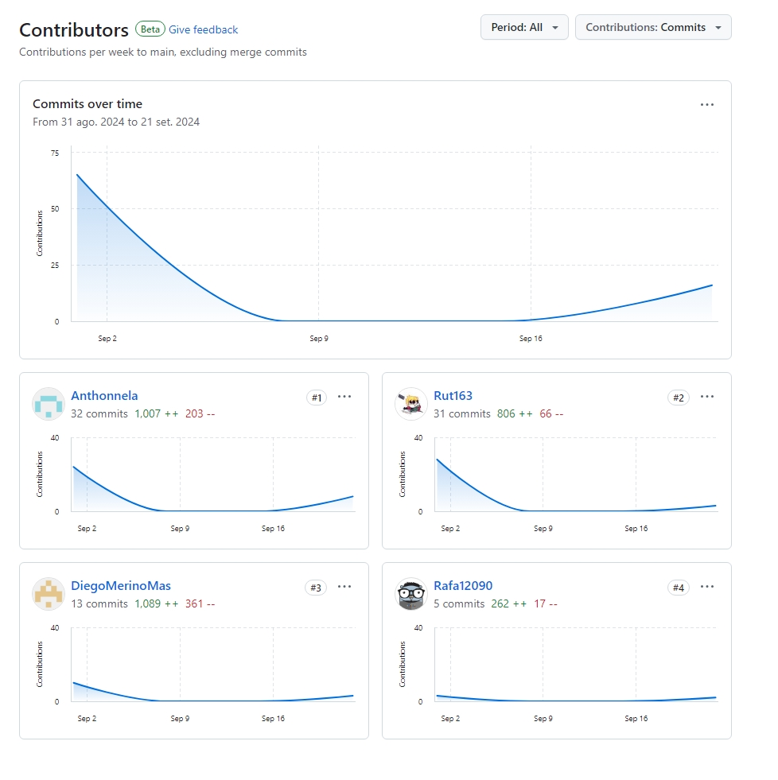
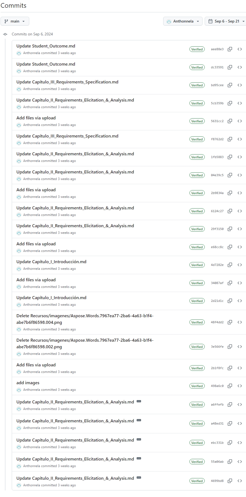
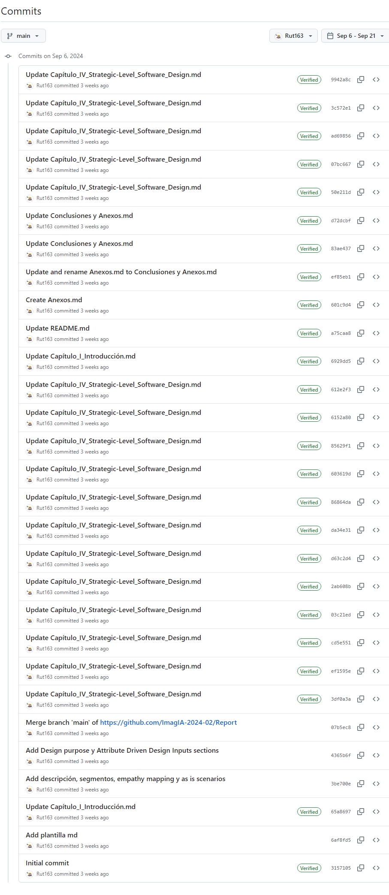
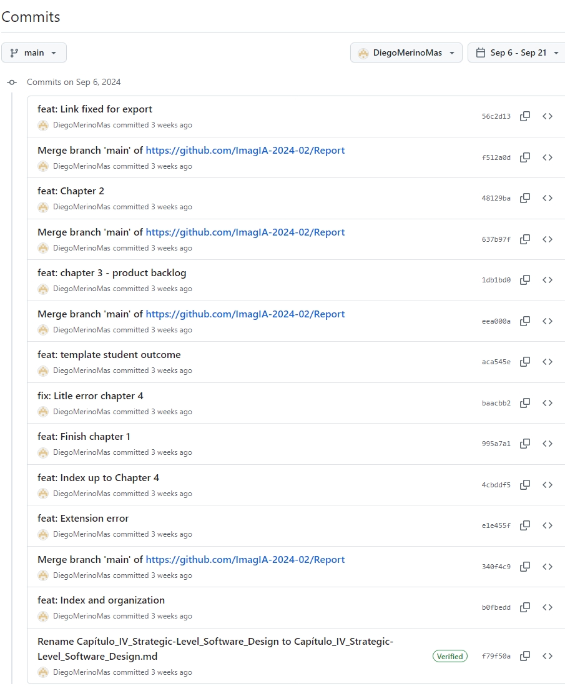
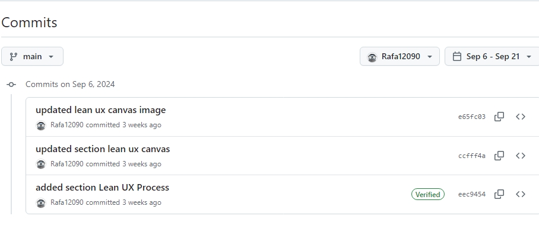
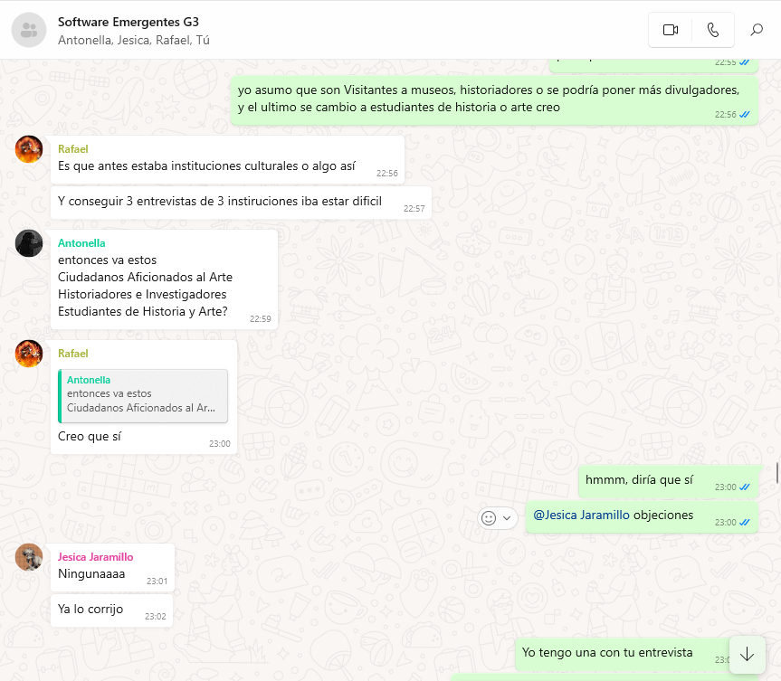
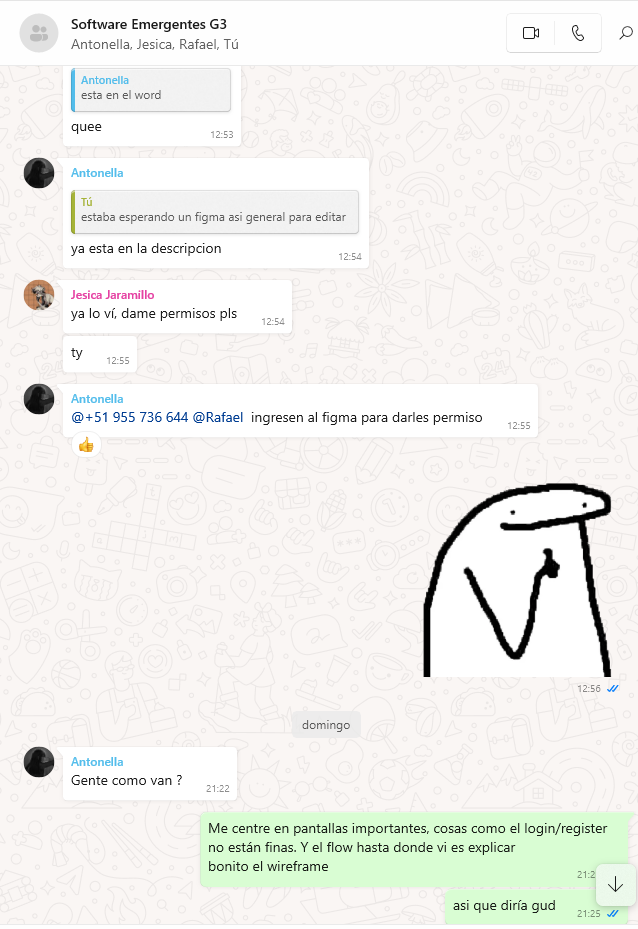

**Universidad Peruana de Ciencias Aplicadas**

**Ingeniería de Software**

Curso: Arquitecturas De Software Emergentes

Sección: WS82

Profesor: Royer Edelwer Rojas Malasquez

Ciclo: 2024-2

---

# TechSolutions

## ChapaTuBus

### Team Members

| Integrante                      | Código     |
| ------------------------------- | ---------- |
| Gonzales Gomez, Antonella Frida | u20211c403 |
| Jaramillo Almora, Jesica Rut    | u20201c163 |
| Merino Mas, Diego Martín        | U202111473 |
| Primo Estrada, Rafael Wimmer    | U202023137 |

Setiembre 2024

### Registro de Versiones del Informe

| Versión | Fecha      | Autor | Descripción de modificación                                                                                                                                                      |
| ------- | ---------- | ----- | -------------------------------------------------------------------------------------------------------------------------------------------------------------------------------- |
| 1.0     | 06/09/2024 | Todos | Se pasaron las secciones trabajadas en el word borrador al github. Se realizó una revisión grupal final y agregaron el link del video de entrevistas y exposición en los anexos. |

### Project Report Collaboration Insights

Link de la organizacion: https://github.com/ImagIA-2024-02

Link al documento en el repositorio de la organizacion: https://github.com/ImagIA-2024-02/Report

#### Entregas

El equipo se reunió por discord para hacer las primeras coordinaciones y posteriormente todo el desarrollo y reuniones de avance lo realizamos mediante Discord. En cuanto al desarrollo del informe, se realizó una repartición de manera aleatoria mediante una ruleta. Sin embargo, todos los participantes dieron ideas sobre el Lean UX y para la formación de Bounded Context.

Evidencias de colaboración y commits - Github:

- Contributors Image of Github Insights

     

#### Entrega TB1

- Commits realizados por integrante

  - Antonella Frida Gonzales Gomez

     

- Jesica Rut Jaramillo Almora

     

- Diego Martin Merino Mas

     

- Rafael Wimmer Primo Estrada

     

- Evidencias de colaboración - otras herramientas
  - Discord: Utilizado como medio de reuniones y para dejar preguntas y comentarios asi como guardar los links

     

#### Entrega TP1

- Commits realizados por integrante

  - Antonella Frida Gonzales Gomez

     

- Jesica Rut Jaramillo Almora

     

  - Diego Martin Merino Mas

     

  - Rafael Wimmer Primo Estrada
  

     

- Evidencias de colaboración - otras herramientas
  - Zoom: Utilizado como medio de reunion para elaborar en conjunto los videos respectivos.
  - Whatsapp: Principal medio de comunicación para preguntar el estado y avance del proyecto.

     

### Tabla de contenidos

[Tabla de contenidos](./Tabla_de_contenidos.md)
